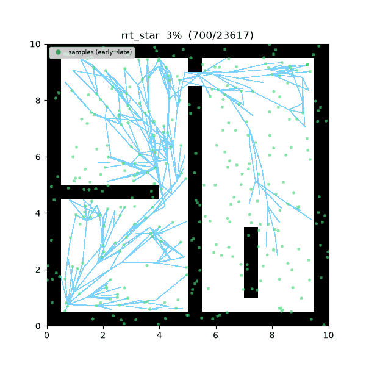
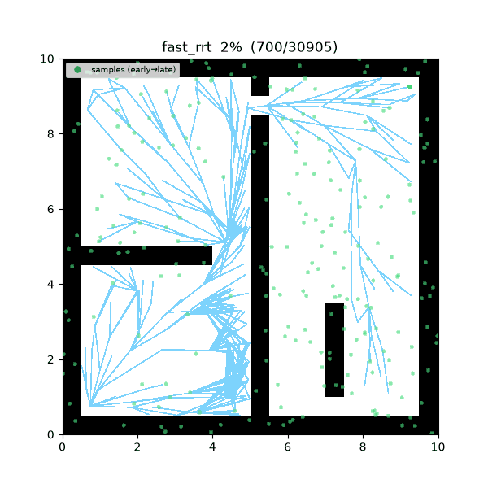
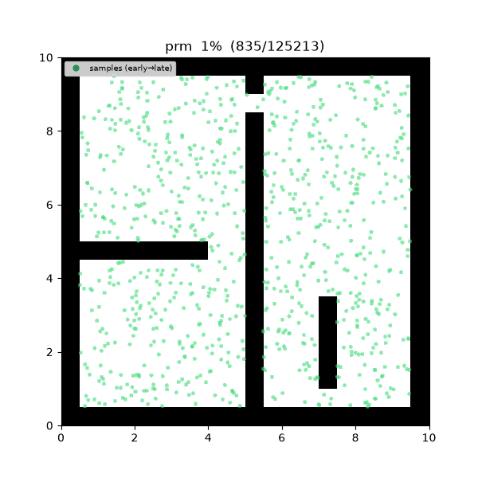
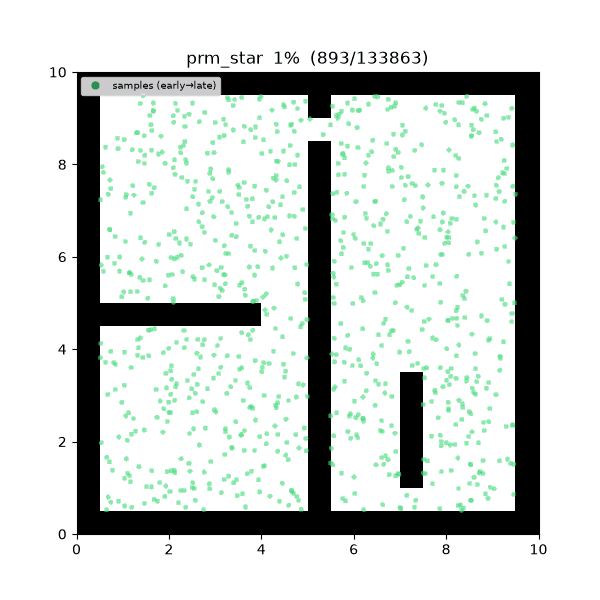
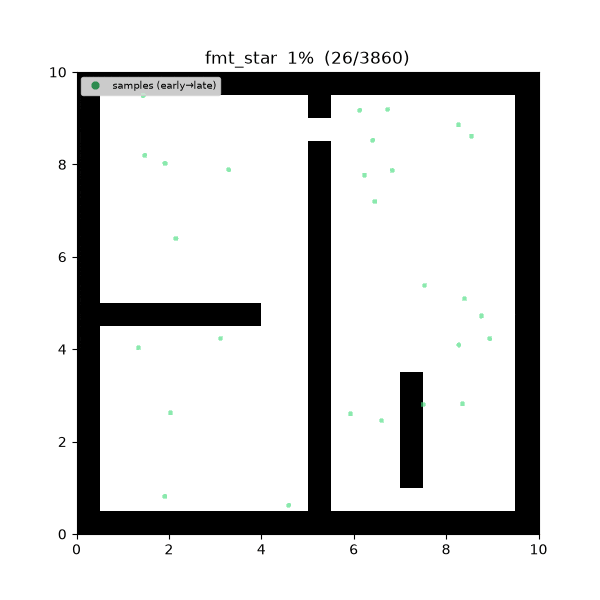
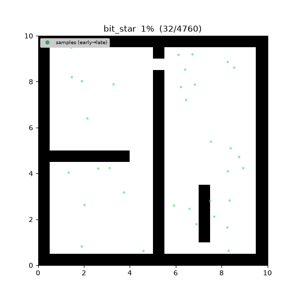

<div align="center">

# 🤖 navigation study

### 🌐 [robotics-study.github.io/navigation_basic](https://robotics-study.github.io/navigation_basic/)

문서 사이트가 라이브입니다 — 아래 알고리즘 링크는 모두 호스팅된 페이지로 연결됩니다. (한국어/English 토글 내장)

**로봇 navigation planning 알고리즘 — C++ / Python 독립 이중 구현 스터디**

같은 추상화 설계를 두 언어로 미러링하고, 언어 공용 trace 포맷으로 탐색 과정을 재생하며,<br>
(map × algorithm × language) 매트릭스로 벤치마크한다.

*Robot navigation planning algorithms, mirrored in C++20 and Python — with step-by-step
visualization, interactive in-browser demos, and a benchmark matrix.*


| A* (1968) | RRT* (2011) | Fast-RRT (2021) |
|:---:|:---:|:---:|
|  |  |  |

| PRM (1996) | PRM* (2011) | FMT* (2015) | BIT* (2015) |
|:---:|:---:|:---:|:---:|
|  |  |  |  |

*같은 미로, 여러 탐색. 색 = 시간 순서 (expanded: 노랑→갈색 · tree: 하늘색 · path: 보라→빨강).*

</div>

---

## ✨ 특징

- **📐 공통 추상화** — 모든 planner 는 `GlobalPlanner`/`LocalPlanner`/`MultiAgentPlanner` 를 상속하고, 구체 맵이 아닌 **capability 인터페이스**(`DiscreteSpace` · `SamplingSpace` · `ObstacleQuery`)만 요구한다. 새 맵 타입을 추가해도 알고리즘 코드는 바뀌지 않는다.
- **🪞 언어 미러링** — C++ 과 Python 이 같은 설계·같은 파라미터·같은 trace 이벤트를 각자 idiomatic 하게 구현한다. 공유 계약(`spec/`)·파라미터(`configs/`)·맵(`maps/`)은 언어 밖에 두고 양쪽에서 로드한다.
- **🎬 Trace 기반 시각화** — 알고리즘은 탐색 진행을 JSON Lines 이벤트로 방출하고, 재생기는 언어당 하나가 아니라 **하나**(`tools/viz/replay.py`)다. GIF 애니메이션 + 중간 과정 PNG 스냅샷을 만든다.
- **📊 벤치마크 매트릭스** — `tools/bench/run_matrix.py` 가 (scenario × algorithm) 전 조합을 실행해 성공 여부·runtime·path cost·expanded/samples 를 수집하고 리포트를 쓴다. C++ vs Python 비교 포함.
- **🌐 인터랙티브 문서 사이트** — 알고리즘마다 유도·성질·증명·라이브 데모(벽 그리기, start/goal 드래그, 파라미터 슬라이더)·실제 구현 소스를 한 페이지에 담는다. 브라우저 데모 엔진은 저장소 구현과 같은 trace 이벤트를 방출하고, 같은 seed 에서 표본·트리까지 일치함을 parity 스크립트로 검증한다.

## 📚 문서 사이트

**[📖 robotics-study.github.io/navigation_basic](https://robotics-study.github.io/navigation_basic/)** — 우상단 토글로 한국어/English 전환.

알고리즘별 페이지: 개념 유도 + 성질(완전성·최적성·복잡도) 증명 + pseudocode 해설 +
인터랙티브 데모 + 실제 C++/Python 소스 + **원 논문 레퍼런스(DOI)**.

| | | |
|---|---|---|
| [BFS](https://robotics-study.github.io/navigation_basic/algo/bfs) — Moore 1959 | [Dijkstra](https://robotics-study.github.io/navigation_basic/algo/dijkstra) — Dijkstra 1959 | [A*](https://robotics-study.github.io/navigation_basic/algo/astar) — Hart et al. 1968 |
| [JPS](https://robotics-study.github.io/navigation_basic/algo/jps) — Harabor & Grastien 2011 | [Theta*](https://robotics-study.github.io/navigation_basic/algo/theta_star) — Nash et al. 2007 | [Lazy Theta*](https://robotics-study.github.io/navigation_basic/algo/lazy_theta_star) — Nash, Koenig & Tovey 2010 |
| [Visibility A*](https://robotics-study.github.io/navigation_basic/algo/visibility_astar) — cell-centre any-angle | [Anya](https://robotics-study.github.io/navigation_basic/algo/anya) — Harabor et al. 2016 | [D* Lite](https://robotics-study.github.io/navigation_basic/algo/dstar_lite) — Koenig & Likhachev 2002 |
| [ARA*](https://robotics-study.github.io/navigation_basic/algo/ara_star) — Likhachev, Gordon & Thrun 2003 | [AD*](https://robotics-study.github.io/navigation_basic/algo/ad_star) — Likhachev et al. 2005 | [Hybrid A*](https://robotics-study.github.io/navigation_basic/algo/hybrid_astar) — Dolgov et al. 2008 |
| [PRM](https://robotics-study.github.io/navigation_basic/algo/prm) — Kavraki et al. 1996 | [PRM*](https://robotics-study.github.io/navigation_basic/algo/prm_star) — Karaman & Frazzoli 2011 | [RRT](https://robotics-study.github.io/navigation_basic/algo/rrt) — LaValle 1998 |
| [RRT-Connect](https://robotics-study.github.io/navigation_basic/algo/rrt_connect) — Kuffner & LaValle 2000 | [RRT*](https://robotics-study.github.io/navigation_basic/algo/rrt_star) — Karaman & Frazzoli 2011 | [Informed RRT*](https://robotics-study.github.io/navigation_basic/algo/informed_rrt_star) — Gammell et al. 2014 |
| [Fast-RRT](https://robotics-study.github.io/navigation_basic/algo/fast_rrt) — Wu et al. 2021 | [FMT*](https://robotics-study.github.io/navigation_basic/algo/fmt_star) — Janson et al. 2015 | [BIT*](https://robotics-study.github.io/navigation_basic/algo/bit_star) — Gammell et al. 2015 |
| [ABIT*](https://robotics-study.github.io/navigation_basic/algo/abit_star) — Strub & Gammell 2020 | [AIT*](https://robotics-study.github.io/navigation_basic/algo/ait_star) — Strub & Gammell 2020 | [EIT*](https://robotics-study.github.io/navigation_basic/algo/eit_star) — Strub & Gammell 2022 |
| [FCIT*](https://robotics-study.github.io/navigation_basic/algo/fcit_star) — Wilson et al. 2025 | [SST](https://robotics-study.github.io/navigation_basic/algo/sst) — Li, Littlefield & Bekris 2016 | [Kinodynamic RRT*](https://robotics-study.github.io/navigation_basic/algo/kinodynamic_rrt_star) — Webb & van den Berg 2013 |
| [LQR-RRT*](https://robotics-study.github.io/navigation_basic/algo/lqr_rrt_star) — Perez et al. 2012 | | |

> 사이트 소스는 `document/` (React + Vite SPA). `main` 에 push 되면 GitHub Actions 가
> 빌드해 GitHub Pages 로 배포한다 (`.github/workflows/deploy.yml`).
>
> ```bash
> cd document && yarn install && yarn dev    # 로컬 개발 서버
> yarn build                                 # 배포 번들 (prerender + sitemap 포함)
> node scripts/check-engine-parity.mjs       # 브라우저 데모 엔진 ↔ python trace parity 검증
> ```

## 🗺️ 구현 현황 (parity)

| 카테고리 | 알고리즘 | C++ | Python | 원 논문 |
|---|---|:---:|:---:|---|
| global_planning | BFS | ✅ | ✅ | Moore (1959) |
| global_planning | Dijkstra | ✅ | ✅ | Dijkstra (1959) |
| global_planning | A* | ✅ | ✅ | Hart, Nilsson & Raphael (1968) |
| global_planning | ARA* | ✅ | ✅ | Likhachev, Gordon & Thrun (2003) |
| global_planning | AD* | ✅ | ✅ | Likhachev, Ferguson, Gordon, Stentz & Thrun (2005) |
| global_planning | JPS | ✅ | ✅ | Harabor & Grastien (2011) |
| global_planning | D* Lite | ✅ | ✅ | Koenig & Likhachev (2002) |
| global_planning | Theta* | ✅ | ✅ | Nash, Daniel, Koenig & Felner (2007) |
| global_planning | Lazy Theta* | ✅ | ✅ | Nash, Koenig & Tovey (2010) |
| global_planning | Visibility A* (cell-centre any-angle) | ✅ | ✅ | visibility-graph A* (Lozano-Pérez & Wesley 1979) |
| global_planning | Anya (optimal any-angle) | ✅ | ✅ | Harabor, Grastien, Öz & Aksakalli (2016) |
| global_planning | Hybrid A* | ✅ | ✅ | Dolgov, Thrun, Montemerlo & Diebel (2008) |
| global_planning | RRT | ✅ | ✅ | LaValle (1998) |
| global_planning | RRT-Connect | ✅ | ✅ | Kuffner & LaValle (2000) |
| global_planning | RRT* | ✅ | ✅ | Karaman & Frazzoli (2011) |
| global_planning | LQR-RRT* | ✅ | ✅ | Perez, Platt, Konidaris, Kaelbling & Lozano-Pérez (2012) |
| global_planning | Kinodynamic RRT* | ✅ | ✅ | Webb & van den Berg (2013) |
| global_planning | Informed RRT* | ✅ | ✅ | Gammell et al. (2014) |
| global_planning | PRM | ✅ | ✅ | Kavraki et al. (1996) |
| global_planning | PRM* | ✅ | ✅ | Karaman & Frazzoli (2011) |
| global_planning | FMT* | ✅ | ✅ | Janson et al. (2015) |
| global_planning | BIT* | ✅ | ✅ | Gammell et al. (2015) |
| global_planning | ABIT* | ✅ | ✅ | Strub & Gammell (2020) |
| global_planning | SST | ✅ | ✅ | Li, Littlefield & Bekris (2016) |
| global_planning | AIT* | ✅ | ✅ | Strub & Gammell (2020/2022) |
| global_planning | EIT* | ✅ | ✅ | Strub & Gammell (2022) |
| global_planning | FCIT* | ✅ | ✅ | Wilson, Thomason, Kingston, Kavraki & Gammell (2025) |
| global_planning | Fast-RRT | ✅ | ✅ | Wu et al. (2021) |
| local_planning | DWA | ⬜ | ⬜ | Fox, Burgard & Thrun (1997) |
| local_planning | Pure Pursuit | ⬜ | ⬜ | Coulter (1992) |
| local_planning | VFH | ⬜ | ⬜ | Borenstein & Koren (1991) |
| local_planning | MPC | ⬜ | ⬜ | — |
| multi_agent | Prioritized A* | ⬜ | ⬜ | Erdmann & Lozano-Pérez (1987) |
| multi_agent | Joint-space A* | ⬜ | ⬜ | — |
| multi_agent | CBS | ⬜ | ⬜ | Sharon et al. (2015) |

⬜ planned · 🔶 in progress · ✅ done — 논문 전체 서지는 각 알고리즘 페이지의 References 절 참고.

## 🚀 빠른 시작

```bash
# Python (>= 3.10) — navigation 패키지 + viz/dev extras
cd python && pip install -e ".[dev,viz]" && cd ..
pytest python/tests            # 652 tests

# C++ (C++20, CMake >= 3.20, GoogleTest 는 FetchContent 자동)
cmake -S cpp -B cpp/build -DCMAKE_BUILD_TYPE=Release
cmake --build cpp/build -j
ctest --test-dir cpp/build     # 114 tests
```

### 데모 실행 — 두 언어가 동일한 CLI 인자

```bash
# Python
python python/demos/demo_astar.py \
  --map maps/grid/maze01.yaml --scenario maps/scenarios/maze01_s1.yaml \
  --params configs/global_planning/astar.yaml --trace out/astar.jsonl

# C++ (동일 인자)
./cpp/build/demos/demo_astar \
  --map maps/grid/maze01.yaml --scenario maps/scenarios/maze01_s1.yaml \
  --params configs/global_planning/astar.yaml --trace out/astar.jsonl
```

stdout 에 한 줄 JSON metric, `--trace` 경로에 step-by-step JSONL trace 가 남는다.
옵션: `[--seed N] [--connectivity 4|8]`

### 시각화 — C++/Python trace 를 같은 도구로 재생

```bash
python tools/viz/replay.py out/astar.jsonl                    # interactive 재생
python tools/viz/replay.py out/astar.jsonl --gif out/astar.gif --snapshots out/snaps/
```

### 벤치마크

```bash
python tools/bench/run_matrix.py --out out/report.md
```

실측 요약 (maze01, seed 1):

| algorithm | path cost | 탐색량 | 특성 |
|---|---|---|---|
| BFS | 28.73 | 221 expanded | 간선 수 최소 |
| Dijkstra | 28.73 | 211 expanded | 비용 최적 |
| A* | 28.73 | **108 expanded** | 비용 최적 + heuristic |
| RRT | 18.41 | 229 samples | 첫 feasible 해 |
| RRT* | **13.46** | 8,000 samples | anytime 최적 수렴 |
| Fast-RRT | 13.47 | 8,000 samples | + shortcut (waypoint 5개) |

## 📁 저장소 구조

```
├── spec/          # 언어 공용 계약 — trace/param 스키마, 맵 포맷 (single source of truth)
├── maps/          # 벤치마크 맵 (grid/graph/topology/continuous) + start/goal 시나리오
├── configs/       # 알고리즘별 파라미터 yaml — C++/Python 이 같은 파일을 읽는다
├── cpp/           # C++20 구현 (include + src + demos + GoogleTest)
├── python/        # Python 구현 (navigation 패키지 + demos + pytest)
├── tools/         # viz(trace 재생기) · bench(매트릭스 러너) · web_export(사이트용 trace)
└── document/      # 문서 사이트 (React + Vite SPA → GitHub Pages)
```

아키텍처 원칙(의존 방향, capability 모델, trace 계약)은 [CLAUDE.md](CLAUDE.md) 참고.

## 🧭 새 알고리즘 추가

1. `configs/<category>/<algo>.yaml` 파라미터 선언 → 2. 두 언어 구현 (`required_capabilities()` 포함)
→ 3. trace 이벤트 방출 → 4. 두 언어 demo → 5. 단위 테스트 (최적성/no-path/param 검증)
→ 6. bench 매트릭스 통과 → 7. `replay.py --gif/--snapshots` 렌더 확인 → 8. parity 표 + 문서 사이트 페이지 갱신.

상세 체크리스트는 [CLAUDE.md](CLAUDE.md) 참고.
