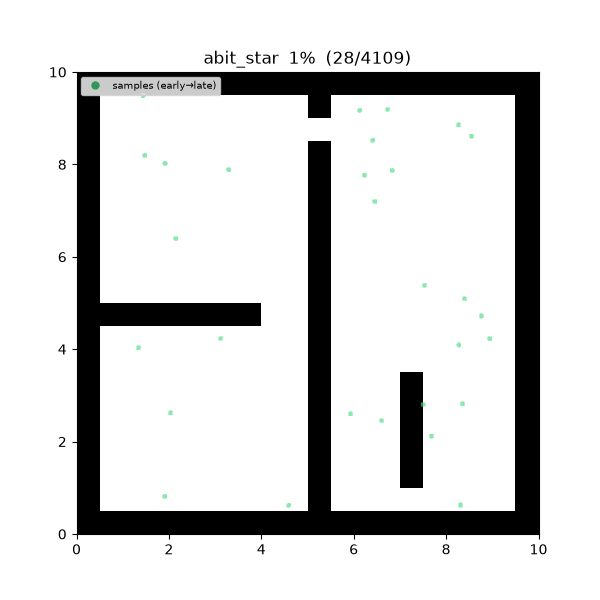
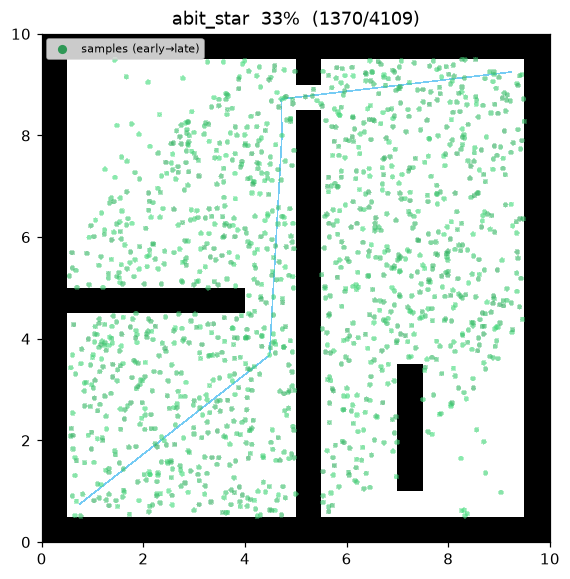
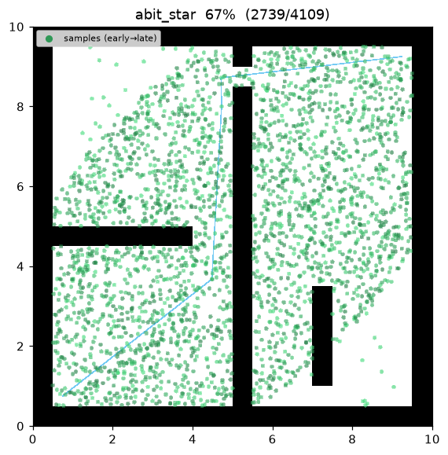
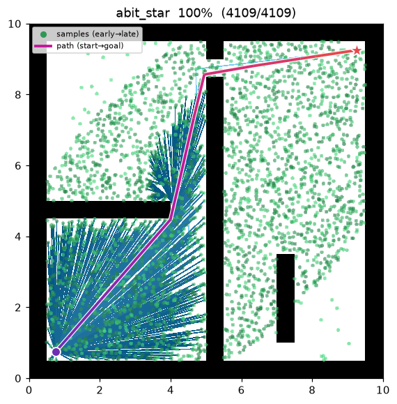
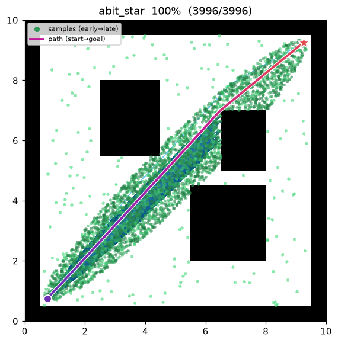

[🇰🇷 한국어](../../ko/algorithms/abit_star.md) | [🇬🇧 English](abit_star.md)

# ABIT\* (Advanced Batch Informed Trees)
{: .no_toc }

| Item | Description |
|---|---|
| Category | sampling-based, batch, anytime, almost-surely asymptotically optimal |
| Required capability | `SamplingSpace` |
| Completeness | probabilistically complete |
| Optimality | **almost-surely asymptotically optimal** — an inflation schedule that relaxes to 1 recovers the optimum |
| Complexity | best-first edge-queue processing per batch + lazy collision checks (with inflation + truncation) |
| Original paper | Strub & Gammell (2020) [^strub_abit] |

1. TOC
{:toc}

## Background

Strub & Gammell[^strub_abit] proposed ABIT\*, which keeps the whole BIT\*[^gammell_bit] machinery — **batch RGG
sampling**, the **vertex/edge queues**, **lazy collision checking**, **informed-ellipse sampling**,
pruning, and subtree cost propagation — and adds two ideas from the heuristic-search literature to
reach a first solution faster and spend less work per batch:

- **Inflation factor $\varepsilon_{\text{infl}}\ge1$** inflates the cost-to-go term of every queue
  key, turning each batch into a weighted-A\*/ARA\* pass over the RGG (Likhachev, Gordon &
  Thrun 2003[^ara]). Early batches order edges greedily toward the goal, so an initial (possibly
  suboptimal) solution appears after far fewer edge processings.
- **Truncation factor $\varepsilon_{\text{trunc}}\ge1$** stops a batch as soon as no remaining edge can
  improve the incumbent by more than a factor $\varepsilon_{\text{trunc}}$, skipping the (expensive)
  lazy collision checks on edges that could only shave the last sliver of cost.

Both factors are scheduled to decay monotonically per batch — $\varepsilon_{\text{infl}}$ from
`inflation_factor` to `inflation_final`, $\varepsilon_{\text{trunc}}$ from `truncation_factor` to
$1$ — so the last batch runs an admissible, untruncated search and the planner recovers BIT\*'s
almost-sure asymptotic optimality.

## How It Works

`maze01` — early, heavily inflated batches rush a first solution toward the goal; as the schedule
relaxes, later batches recover the admissible search and tighten the path to the optimum.



Intermediate search progress (left → right: inflated first batch / relaxing batch / final path):

| | | |
|:---:|:---:|:---:|
|  |  |  |

Final result on `open01` — nearly a straight line:



```
ABIT_STAR(start, goal):
    tree ← {start};  samples ← {goal};  c_best ← ∞
    for batch in 1..max_batches:
        ε_infl  ← decay(inflation_factor → inflation_final, batch)   # ARA*-style schedule
        ε_trunc ← decay(truncation_factor → 1, batch)
        samples ← prune(samples, c_best)                # admissible bound (un-inflated)
        samples ← samples ∪ draw(batch_size, c_best)    # informed batch once a solution exists
        r ← gamma · sqrt(log n / n);  N ← radius_neighbors(V, r)
        Q_V ← tree vertices (key g_T(v)+ε_infl·ĥ(v));  Q_E ← ∅
        loop:
            while best_v(Q_V) ≤ best_e(Q_E):            # expand vertices → candidate edges
                v ← pop(Q_V);  expand v into Q_E        # edge key g_T(v)+ĉ(v,x)+ε_infl·ĥ(x)
            (v, x) ← pop_min(Q_E)                        # best edge by inflated key
            if g_T(v)+ĉ(v,x)+ĥ(x) ≥ c_best/ε_trunc: break  # truncation → end batch
            if g_T(v)+‖v−x‖ ≥ g_T(x): continue           # no tree-cost improvement
            if not is_motion_valid(v, x): continue       # lazy collision check (only here)
            connect_or_rewire(x, parent=v)               # accept edge
            if goal in tree and g_T(goal) < c_best:
                c_best ← g_T(goal)                       # incumbent improved
    return path(goal)
```

$g_T(v)$ is the cost-to-come in the tree, $\hat h(x)=\lVert x-\text{goal}\rVert$ an admissible
cost-to-go heuristic, and $\hat g(x)=\lVert \text{start}-x\rVert$. The queue keys inflate only the
$\hat h$ term; the pruning and edge-acceptance tests stay **un-inflated**, so an accepted edge always
genuinely lowers $g_T(x)$ and the incumbent — inflation and truncation change *what work is done
first / skipped*, never the correctness of an accepted edge.

Measurements (Python, seed = 1, trace on):

| map | path cost | samples | expanded (accepted edges) |
|---|---|---|---|
| maze01 | 13.493 | 3,002 | 1,109 |
| open01 | 12.047 | — | — |

With $\varepsilon_{\text{infl}}=\varepsilon_{\text{trunc}}=1$ the search reduces exactly to BIT\*
(same 13.474 cost, 1,760 accepted edges on maze01); the default inflated schedule reaches a first
solution in far fewer edge processings and finishes with fewer accepted edges at a near-identical
cost. The C++ implementation mirrors the same scenario and produces matching results within the
variance of the two languages' random streams.

Reproduce:

```bash
python python/demos/demo_abit_star.py \
  --map maps/grid/maze01.yaml --scenario maps/scenarios/maze01_s1.yaml \
  --params configs/global_planning/abit_star.yaml --trace out/abit_star.jsonl
python tools/viz/replay.py out/abit_star.jsonl --gif out/abit_star.gif
```

## Properties

- **Completeness**: probabilistically complete[^strub_abit].
- **Optimality**: **almost-surely asymptotically optimal.** Each batch is a bounded-suboptimal
  (weighted) search, but the inflation and truncation schedules relax to $1$, so the final batch runs
  an admissible, untruncated BIT\* search; as batches accumulate ABIT\* converges to the optimum.
- **Anytime**: heavily inflated early batches produce a first solution quickly (bounded-suboptimal),
  and each later, less-inflated batch tightens it. On exhausting `max_batches` it returns the current
  best.
- **Cheaper batches**: truncation ends a batch before checking edges that cannot improve the incumbent
  beyond a factor $\varepsilon_{\text{trunc}}$, saving lazy collision checks compared with BIT\*.

## Inflation and Truncation

**Inflated edge-queue key.** BIT\* orders an edge $(v,x)$ by $g_T(v)+\hat c(v,x)+\hat h(x)$. ABIT\*
inflates the heuristic term,

$$
\text{key}(v,x)=g_T(v)+\hat c(v,x)+\varepsilon_{\text{infl}}\,\hat h(x),
$$

which is exactly the weighted-A\* key (Pohl 1970; ARA\*, Likhachev et al. 2003[^ara]) applied to the
implicit RGG. For $\varepsilon_{\text{infl}}>1$ the ordering favors edges that reach the goal sooner,
so a first solution is found after fewer expansions; the returned first solution is bounded by
$\varepsilon_{\text{infl}}$ times the optimum.

**Truncation.** Once an incumbent $c_{\text{best}}$ exists, ABIT\* stops a batch as soon as the best
admissible estimate of any remaining edge satisfies

$$
g_T(v)+\hat c(v,x)+\hat h(x)\ \ge\ \frac{c_{\text{best}}}{\varepsilon_{\text{trunc}}},
$$

i.e. no remaining edge can lower the incumbent by more than the factor $\varepsilon_{\text{trunc}}$.
Because $\varepsilon_{\text{trunc}}\ge1$ this threshold sits below $c_{\text{best}}$, so the batch ends
earlier than BIT\*'s $\ge c_{\text{best}}$ rule, skipping the collision checks on those edges. With
$\varepsilon_{\text{trunc}}=1$ the rule is exactly BIT\*'s.

**Schedule.** Both factors decay linearly with the batch index — $\varepsilon_{\text{infl}}$ from
`inflation_factor` down to `inflation_final`, $\varepsilon_{\text{trunc}}$ from `truncation_factor`
down to $1$ — so early batches trade a bounded, shrinking suboptimality gap for speed, and the final
batch is a full admissible BIT\* batch that closes the gap.

**Informed ellipse (Gammell et al. 2014).** As in BIT\*, once $c_{\text{best}}$ exists later batches
draw samples only inside the ellipse with foci at start/goal and transverse diameter
$c_{\text{best}}$[^gammell], concentrating samples where the incumbent can still improve.

## Parameters

| Name | Type | Default | Range | Description |
|---|---|---|---|---|
| `batch_size` | int | 200 | [1, 100000] | Number of new (informed) samples drawn per batch |
| `max_batches` | int | 15 | [1, 10000] | Maximum number of batches (anytime — current best returned when exhausted) |
| `gamma` | float | 30.0 | [0.01, 1000.0] | RGG connection-radius coefficient γ. r_n = γ·(log n / n)^(1/2) |
| `inflation_factor` | float | 10.0 | [1.0, 1e6] | Initial heuristic inflation ε_infl (≥1); larger = more exploitation, faster first solution |
| `inflation_final` | float | 1.0 | [1.0, 1e6] | ε_infl on the last batch (decays from `inflation_factor`; 1.0 fully recovers optimality) |
| `truncation_factor` | float | 2.0 | [1.0, 1e6] | Truncation factor ε_trunc (≥1); ends a batch early, decays to 1.0 |
| `seed` | int | 1 | [0, 2^31−1] | Random seed (reproducibility) |

## Emitted Trace Events

`planning_started` → `sample_drawn`\* → `edge_added`\* → `candidate_evaluated`\* → `path_found` → `planning_finished`

`sample_drawn` marks a per-batch sample, `edge_added` an accepted edge, and `candidate_evaluated` is
emitted each time the incumbent cost $c_{\text{best}}$ improves (a new best solution) — the same
feasible-time emission policy as BIT\*.

## References

[^strub_abit]: Strub, M. P., & Gammell, J. D. (2020). "Advanced BIT\* (ABIT\*): Sampling-based planning with advanced graph-search techniques." *Proc. IEEE ICRA*, 130–136. [doi:10.1109/ICRA40945.2020.9196580](https://doi.org/10.1109/ICRA40945.2020.9196580) · [PDF (arXiv)](https://arxiv.org/abs/2002.06589)
[^gammell_bit]: Gammell, J. D., Srinivasa, S. S., & Barfoot, T. D. (2015). "Batch Informed Trees (BIT\*): Sampling-based optimal planning via the heuristically guided search of implicit random geometric graphs." *Proc. IEEE ICRA*, 3067–3074. [doi:10.1109/ICRA.2015.7139620](https://doi.org/10.1109/ICRA.2015.7139620) · [PDF (arXiv)](https://arxiv.org/abs/1405.5848)
[^gammell]: Gammell, J. D., Srinivasa, S. S., & Barfoot, T. D. (2014). "Informed RRT\*: Optimal sampling-based path planning focused via direct sampling of an admissible ellipsoidal heuristic." *Proc. IEEE/RSJ IROS*, 2997–3004. [doi:10.1109/IROS.2014.6942976](https://doi.org/10.1109/IROS.2014.6942976) · [PDF (arXiv)](https://arxiv.org/abs/1404.2334)
[^ara]: Likhachev, M., Gordon, G., & Thrun, S. (2003). "ARA\*: Anytime A\* with provable bounds on sub-optimality." *Advances in Neural Information Processing Systems (NeurIPS)*, 16.
[^karaman]: Karaman, S., & Frazzoli, E. (2011). "Sampling-based algorithms for optimal motion planning." *The International Journal of Robotics Research*, 30(7), 846–894. [doi:10.1177/0278364911406761](https://doi.org/10.1177/0278364911406761) · [PDF (arXiv)](https://arxiv.org/abs/1105.1186)
