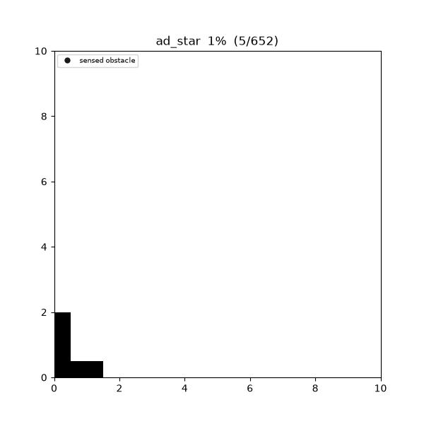
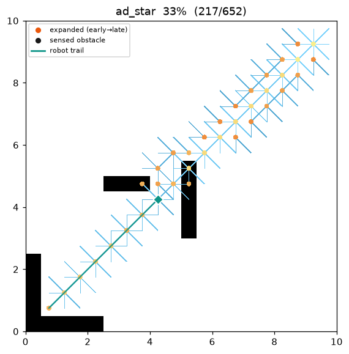
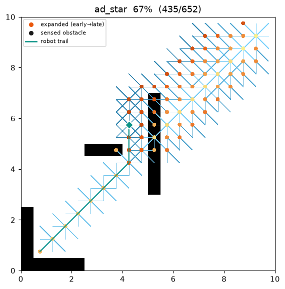
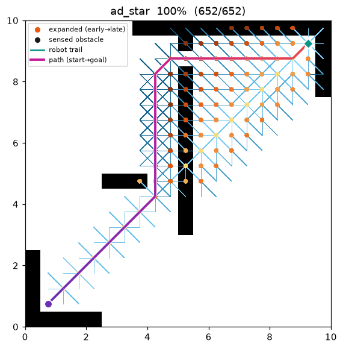
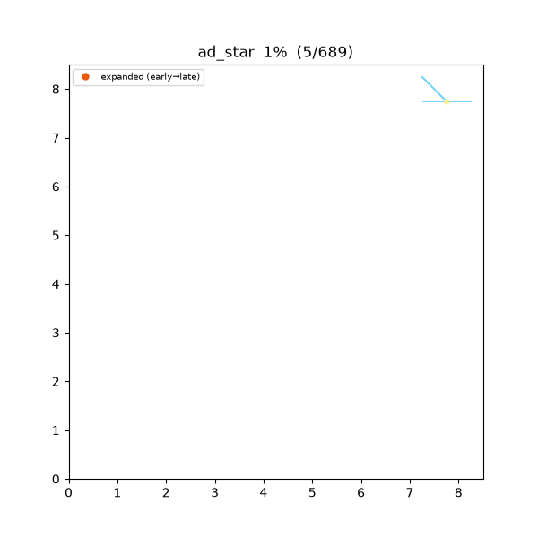

[🇰🇷 한국어](../../ko/algorithms/ad_star.md) | [🇬🇧 English](ad_star.md)

# AD* (Anytime Dynamic A*)
{: .no_toc }

| Item | Description |
|---|---|
| Category | anytime + incremental / dynamic replanning graph search |
| Required capability | `DynamicGridSpace` (`passable_neighbors` + `is_blocked`) |
| Completeness | complete (finite grids, non-negative costs) |
| Optimality | **anytime, belief-bounded-suboptimal** — each solution is ε-suboptimal for the current belief; ε → 1 gives the belief optimum |
| Complexity | ARA\*'s ε steps × D\* Lite's incremental repair. Prior search is reused both when ε is lowered and when an edge cost changes |
| Original paper | Likhachev, Ferguson, Gordon, Stentz & Thrun (2005) [^adstar] |

1. TOC
{:toc}

## Background

Two demands land on one robot at once. **(1) anytime**: there is no time budget, so
produce *some* solution fast and refine it as time allows — the problem ARA\*[^ara]
solves. **(2) dynamic replanning**: the robot starts with no map, moves while
**sensing only its surroundings**, and must repair its route when it meets an
unexpected obstacle — the problem D\* Lite[^dstar] solves. Solving either from scratch
(ARA\* restarts per ε; replanning restarts A\* per step) repeats most of the work.

**AD\***[^adstar] fuses the two into a **single search**. Like D\* Lite it keeps a
**backward** search rooted at the goal, storing `g` (computed cost-to-goal) and `rhs`
(one-step look-ahead) at each cell and prioritising by a heuristic toward `s_start`.
Onto that it grafts ARA\*'s two devices:

- **ε-inflated key** — only an *over-consistent* vertex's priority inflates its
  heuristic by ε (weighted A\*), fetching a first solution quickly. An
  *under-consistent* vertex is **not** inflated (the paper's `key(s)`), so a cost
  **increase** propagates on an admissible key.
- **INCONS list** — a vertex that becomes inconsistent again *after* it was expanded
  (is in CLOSED) is parked in INCONS instead of re-entering OPEN; when ε is lowered or
  an edge cost changes, **OPEN ∪ INCONS is reopened with keys recomputed** under the
  new ε, reusing prior work.

The robot steps only once ε has reached `eps_final` (the plan is **optimal** for the
current belief), so the executed trajectory matches D\* Lite's. `plan()` simulates the
whole improve → move → sense → repair loop internally and returns the **executed
trajectory**. The belief is planner-internal: the blocked set starts empty, so every
in-bounds cell is **assumed free**.

## How it works

`maze01`. The robot (cyan diamond) sets off assuming an empty map. At each position it
first produces a suboptimal solution fast under a large ε (anytime), lowers ε to the
belief optimum, then steps one cell along that belief-optimal path. Discovering a wall
(fogged in as a black cell) re-inflates ε for a fresh suboptimal solution, then refines
it again.



Search / motion in progress (left → right: early / middle / final trajectory):

| | | |
|:---:|:---:|:---:|
|  |  |  |

Because the search runs backward, the heuristic is `h(s_start, s)` (from a searched
vertex `s` to the **current robot position** `s_start`). As the robot moves, this
reference point shifts, so — as in D\* Lite — an offset `k_m` is accumulated to keep
queue keys monotone.

```
CalcKey(s):                                    # priority = [k1, k2] (lexicographic)
    if g(s) > rhs(s):                          # over-consistent → inflate by ε
        return [rhs(s) + ε·h(s_start, s) + k_m,  rhs(s)]
    else:                                      # under/consistent → NOT inflated
        return [g(s) +   h(s_start, s) + k_m,  g(s)]

UpdateState(u):
    if u ≠ s_goal:
        rhs(u) ← min over s' ∈ Succ(u) of ( c(u, s') + g(s') )
    remove u from OPEN·INCONS
    if g(u) ≠ rhs(u):
        if u ∉ CLOSED: OPEN.insert(u, CalcKey(u))     # not yet expanded → normal queue
        else:          INCONS.insert(u)               # already expanded → defer to reopen

ComputeOrImprovePath():
    while OPEN.top_key() < CalcKey(s_start) or rhs(s_start) ≠ g(s_start):
        u ← OPEN.pop_min()
        if g(u) > rhs(u):     g(u) ← rhs(u);  CLOSED ← CLOSED ∪ {u}   # over-consistent
                              for s ∈ Pred(u): UpdateState(s)
        else:                 g(u) ← ∞                                # under-consistent
                              for s ∈ Pred(u) ∪ {u}: UpdateState(s)

Main():
    s_last ← s_start;  Initialize();  ε ← ε0
    sense(s_start);  ComputeOrImprovePath();  publish()      # first (suboptimal) solution
    while s_start ≠ s_goal:
        if ε > eps_final:                                    # ── improve (anytime) ──
            ε ← max(eps_final, ε − eps_step)
            OPEN ← OPEN ∪ INCONS;  recompute keys;  CLOSED ← ∅   # reopen
            ComputeOrImprovePath();  publish();  continue
        if g(s_start) = ∞: return "no path"                  # ── belief-optimal → move ──
        s_start ← argmin over s' ∈ Succ(s_start) of ( c + g(s') )
        changed ← sense(s_start)                             # refresh belief in the sensor disk
        if changed ≠ ∅:                                      # ── change → replan ──
            k_m ← k_m + h(s_last, s_start);  s_last ← s_start
            for c ∈ changed: UpdateState(neighbours of c)
            ε ← ε0                                           # significant change: re-inflate ε
            OPEN ← OPEN ∪ INCONS;  recompute keys;  CLOSED ← ∅
            ComputeOrImprovePath();  publish()
```

Grid moves are symmetric (undirected), so `Succ = Pred = passable_neighbors` (neighbours
traversable under the belief). The robot steps to the min-`g` neighbour only at the
belief-optimal moment ε = `eps_final` — i.e. every move follows the **shortest path over
the known map** (as in D\* Lite).

### Sensing and belief — owned by the capability

Each step the robot queries true occupancy (`is_blocked`) over the **Euclidean disk** of
radius `sensor_radius` cells (`dr² + dc² ≤ r²`) around it. A blocked cell not yet in the
belief is added, an `obstacle_revealed` event is emitted, and only the neighbouring
vertices that route into it are repaired via `UpdateState`. Grid geometry (move table,
corner-cut rule) belongs to the map's `passable_neighbors`, not the algorithm, so AD\*
never touches coordinates.

### Heuristic — octile (backward, robot-referenced)

`h(a, b)` is the **octile distance** `(hi − lo) + √2·lo` (hi/lo = max/min of |Δrow|,
|Δcol|), admissible for 8-connected moves, computed in exactly the same operation order
as the map's A\* heuristic so C++/Python keys agree bit-for-bit.

## anytime — refine the solution as ε shrinks

A large ε inflates the heuristic, driving the search toward the robot to reach a first
solution **fast** (few expansions, suboptimal). Each time ε drops by `eps_step`, OPEN ∪
INCONS is reopened to **reuse** prior expansions while the solution is refined, converging
to the belief optimum at ε → 1. Every improved solution is emitted via `path_found`
(anytime).

Suboptimality in a backward search comes from early termination: the inflated key expands
the robot's neighbourhood first, so the path to `s_start` can be fixed over a **less-fully-
relaxed subgraph**, giving `g(s_start) ≤ ε·g*(s_start)`. When obstacles sit near
`s_start` (the robot), this early commitment can miss a detour and make the first solution
markedly longer.

Measured example (in-memory field, obstacles near the start, `eps_start = 4`,
`eps_step = 0.5`, sensor radius large so belief = truth):

| ε | 4.0 | 3.5 | 3.0 | 2.5 | 2.0 | 1.5 | 1.0 |
|---|---|---|---|---|---|---|---|
| emitted cost | 14.243 | 14.243 | 14.243 | 14.243 | 14.243 | 12.243 | **11.414** |

The first solution (14.243) is suboptimal; ε → 1 converges to the optimum (11.414), and
no solution is ever worse than the previous.

## dynamic — replan when a change appears

When the robot senses an obstacle absent from the belief, the edge cost into that cell
effectively rises to ∞. As in D\* Lite, only affected vertices are repaired via
`UpdateState` and `k_m += h(s_last, s_start)` preserves key monotonicity. The change is
treated as significant, so ε is raised back to `ε0` for a fast new suboptimal solution and
then refined down to ε → 1 — anytime and incremental interlock in the same queue.

`dstar_trap01` is a **C-shaped trap** whose mouth faces the robot. Assuming an empty map
the robot heads straight in, senses the back wall, then backs out and goes around.



Measurements (Python, `sensor_radius = 3`, `eps_start = 2.5`):

| map | AD\* executed cost | omniscient A\* cost | AD\* cumulative expanded | replans | obstacles found |
|---|---|---|---|---|---|
| maze01 | 28.728 | 28.728 | 159 | 20 | 41 |
| dstar_trap01 | 34.971 | 25.071 | 186 | 9 | 17 |

On `maze01` the discovered walls never block the optimal path, so the executed trajectory
matches the A\* optimum exactly. On `dstar_trap01` the robot only learns the back wall
after entering, so the executed cost is ~40 % higher — not a defect but the **nature of
replanning in an unknown environment** (every instantaneous decision was belief-optimal).

Reproduce:

```bash
python python/demos/demo_ad_star.py \
  --map maps/grid/maze01.yaml --scenario maps/scenarios/maze01_s1.yaml \
  --params configs/global_planning/ad_star.yaml --trace out/ad_star.jsonl
python tools/viz/replay.py out/ad_star.jsonl --gif out/ad_star.gif --snapshots out/ad_snaps/
```

## Properties

- **Completeness**: complete on finite grids with non-negative costs. If a path exists in
  the true map the robot reaches the goal; otherwise `g(s_start) = ∞` reports unreachable.
- **Anytime bounded-suboptimal**: at `ComputeOrImprovePath` termination `g(s_start) ≤
  ε·g*(s_start)` for the current belief; ε → 1 gives the belief optimum, and each improved
  solution is no worse than the previous.
- **Optimality (execution)**: the robot moves only at the belief-optimal moment ε =
  `eps_final`, so every executed step is optimal for the belief then held. Detouring around
  freshly seen obstacles can make the executed cost exceed omniscient A\* (`executed cost ≥
  A\* cost`).
- **Incrementality**: prior search is reused both when ε is lowered (reopen INCONS ∪ OPEN)
  and when an edge cost changes (`k_m` + repairing only affected vertices) — avoiding both
  ARA\*'s per-ε restart and naïve per-step replanning.

## Correctness: over/under-consistency · ε key · INCONS reuse · $k_m$

**Local consistency.** Each vertex carries $g(s)$ and the look-ahead

$$
rhs(s)=
\begin{cases}
0 & s=s_\text{goal}\\[2pt]
\displaystyle\min_{s'\in\text{Succ}(s)}\bigl(c(s,s')+g(s')\bigr) & \text{otherwise.}
\end{cases}
$$

A vertex with $g(s)=rhs(s)$ is locally consistent; if all are, $g\equiv g^\ast$ (the unique
fixed point of the belief graph's Bellman optimality equation).

**Over/under-consistent handling.** A popped $u$ is inconsistent in one of two ways.

- **over-consistent** $g(u)>rhs(u)$: the look-ahead is better → set $g(u)\leftarrow rhs(u)$,
  add $u$ to CLOSED, and propagate to $\text{Pred}(u)$.
- **under-consistent** $g(u)<rhs(u)$: a blocked edge left the old $g$ underestimating →
  invalidate with $g(u)\leftarrow\infty$ and re-evaluate $u\cup\text{Pred}(u)$. This branch
  absorbs the cost **increases** of dynamic changes.

**Why ε is not applied to under-consistent keys.** ε-inflation gives a bounded-suboptimality
guarantee only to the cost-**decreasing** over-consistent propagation. Inflating the keys of
cost-**increasing** under-consistent vertices would break admissibility and could fail to
reach a vertex that needs raising. Hence the paper's `key(s)` inflates only over-consistent
keys, leaving under-consistent ones at pure $g(u)+h$.

**INCONS reuse.** Lowering ε (or a changed edge cost) makes some CLOSED vertices improvable
again. Re-expanding them immediately every time would erase ARA\*'s savings, so a vertex made
inconsistent after expansion is collected in INCONS and moved back into OPEN in bulk at the
next reopen — the crux of each step reusing the previous one's expansions.

**$k_m$ offset.** Being a backward search, the heuristic's reference point is the robot
$s_\text{start}$. When the robot moves $s_\text{old}\to s_\text{new}$, the octile metric's
triangle inequality bounds how much smaller any vertex's key can look by
$h(s_\text{old},s_\text{new})$. Accumulating exactly that into later keys
($k_m\mathrel{+}=h(s_\text{old},s_\text{new})$) preserves the monotone lower bound on
priorities without re-sorting the whole queue.

## Parameters

| Name | Type | Default | Range | Description |
|---|---|---|---|---|
| `eps_start` | float | 2.5 | [1, 10] | ε0 for the first improvement (applied to over-consistent keys only). Larger = faster but more suboptimal first solution |
| `eps_final` | float | 1.0 | [1, 10] | Target ε the improvement converges to. 1.0 = belief optimum. The robot moves only once ε reaches this |
| `eps_step` | float | 0.5 | [0.01, 10] | Amount ε drops per improvement (ε ← max(eps_final, ε − eps_step)) |
| `sensor_radius` | int | 3 | [1, 50] | Sensor radius (cells). Senses cells with `dr² + dc² ≤ r²` each step |
| `max_expansions` | int | 2000000 | [1, 10⁸] | Cumulative node-expansion cap over the whole simulation (safety) |

## Emitted trace events

`planning_started` → ( `node_expanded`, `candidate_evaluated`, `edge_added`, `path_found`, `robot_moved`, `obstacle_revealed` )\* → `path_found` → `planning_finished`

- `path_found` — emitted for every improved (anytime) solution and after each replan.
- `robot_moved` (state = robot's new executed cell) — publishes the trajectory one step at a time.
- `obstacle_revealed` (state = newly sensed blocked cell) — the moment the sensor finds an obstacle absent from the belief.

With `robot_moved`/`obstacle_revealed` present, `replay.py` lays the background all-free
(belief), fogs in discovered obstacles as black cells over time, and draws the robot's trail.

`planning_finished.metrics`: `path_cost` (executed trajectory cost) · `expanded_nodes`
(cumulative) · `replan_count` · `sensed_cells` · `final_eps` · `runtime_sec`.

## References

[^adstar]: Likhachev, M., Ferguson, D., Gordon, G., Stentz, A., & Thrun, S. (2005). "Anytime Dynamic A\*: An Anytime, Replanning Algorithm." *Proc. Int. Conf. on Automated Planning and Scheduling (ICAPS)*, 262–271.
[^ara]: Likhachev, M., Gordon, G., & Thrun, S. (2003). "ARA\*: Anytime A\* with Provable Bounds on Sub-Optimality." *Advances in Neural Information Processing Systems (NIPS)* 16.
[^dstar]: Koenig, S., & Likhachev, M. (2002). "D\* Lite." *Proc. AAAI Conference on Artificial Intelligence*, 476–483. [PDF](https://www.aaai.org/Papers/AAAI/2002/AAAI02-072.pdf)
