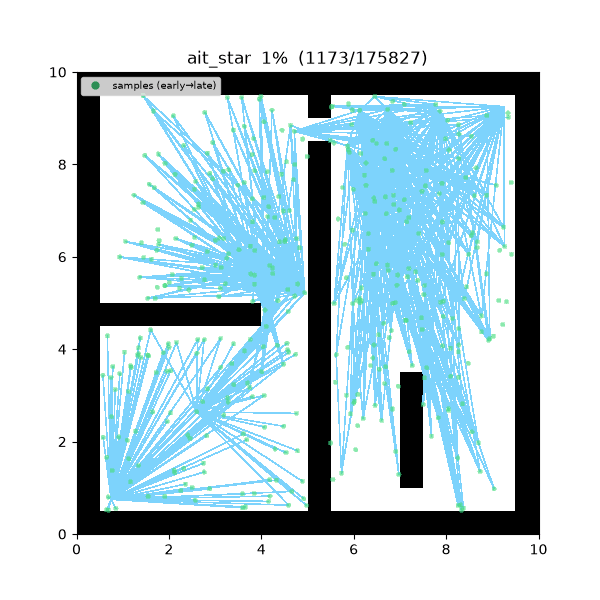
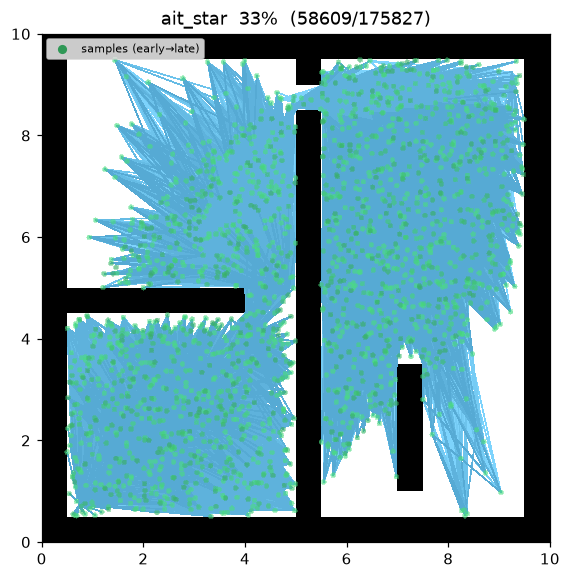
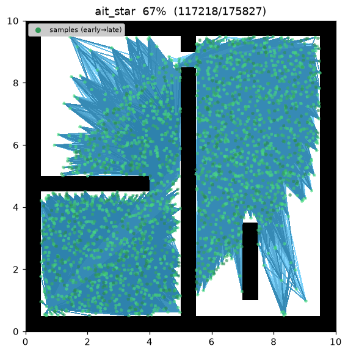
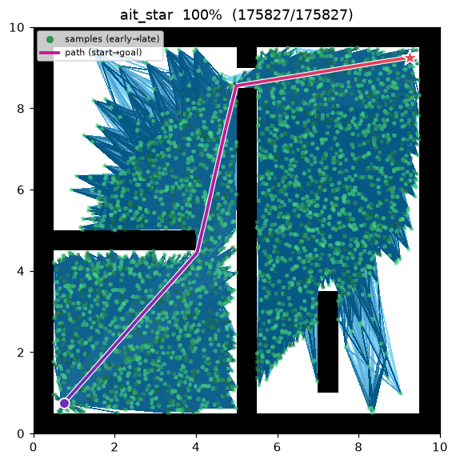
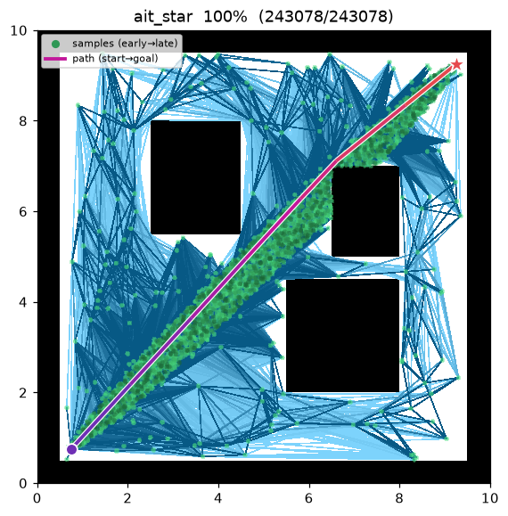

[🇰🇷 한국어](../../ko/algorithms/ait_star.md) | [🇬🇧 English](ait_star.md)

# AIT\* (Adaptively Informed Trees)
{: .no_toc }

| Item | Description |
|---|---|
| Category | sampling-based, batch, anytime, asymptotically optimal |
| Required capability | `SamplingSpace` |
| Completeness | probabilistically complete |
| Optimality | **almost-surely asymptotically optimal** — same class as BIT\* |
| Key idea | cost-to-go heuristic from a **reverse search** over the graph + invalid-edge feedback |
| Original paper | Strub & Gammell (2020, ICRA; extended IJRR 2022) [^strub_ait] |

1. TOC
{:toc}

## Background

BIT\*[^gammell_bit] uses the straight-line distance $\hat h(x)=\lVert x-\text{goal}\rVert$ as its
cost-to-go heuristic. That value ignores obstacles, so on maps that require a detour (a maze wall)
it badly underestimates the true cost-to-go. Strub & Gammell[^strub_ait] proposed AIT\*, which
replaces this heuristic with a **reverse search over the current RGG**:

- **Informed.** Running a reverse Dijkstra from the goal along the graph yields an $\hat h$ that
  follows the graph's actual connectivity (the detour around a wall) rather than a straight line
  through it.
- **Adaptive.** Any edge the forward search finds invalid (in collision) during validation is
  **permanently excluded** from the graph every future reverse search runs over. The heuristic
  therefore self-corrects as obstacles are discovered.

The two searches feed each other — the reverse search guides the forward search, and the forward
search's invalid-edge discoveries tighten the graph the next reverse search runs over.

## How it works

Search on `maze01`. The reverse search's obstacle-aware heuristic lets the forward search flow
around the maze walls batch by batch instead of stalling on a straight-line estimate that ignores
them.



Intermediate search progress (left → right: early / middle / final path):

| | | |
|:---:|:---:|:---:|
|  |  |  |

Final result on `open01` — with no detours to route around, the reverse heuristic already matches
the straight-line distance, so the search connects quickly:



Each batch performs:

```
AIT_STAR(start, goal):
    points ← [start, goal];  invalid ← ∅;  c_best ← ∞
    for batch in 1..max_batches:
        points ← points ∪ draw(batch_size, c_best)      # informed batch (once a solution exists)
        r ← gamma · sqrt(log n / n);  N ← radius_neighbors(points, r)

        # (reverse) adaptive heuristic: Dijkstra from goal over the graph minus invalid
        h_hat ← reverse_dijkstra(goal, N \ invalid)      # no collision checks (optimistic)

        # (forward) A* keyed on g + h_hat, each edge lazily validated
        g[start] ← 0;  open ← {(h_hat[start], start)}
        while open:
            v ← pop_min(open)                            # skip stale entries
            for x in N[v] \ invalid:
                emit candidate_evaluated(x, g[v]+‖v−x‖)
                if not is_motion_valid(v, x):
                    invalid ← invalid ∪ {(v,x)}          # adaptive feedback
                    continue
                if g[v]+‖v−x‖ < g[x]:                     # connect or rewire
                    g[x] ← g[v]+‖v−x‖;  parent[x] ← v
                    push (g[x]+h_hat[x], x) to open
                    if x = goal and g[x] < c_best: c_best ← g[x]
    return path(goal)
```

$g[v]$ is the forward tree's cost-to-come and $\hat h[v]$ is the cost-to-go supplied by the reverse
search above. The forward search is a standard A\* that pops the vertex minimising
$f[v]=g[v]+\hat h[v]$, and it collision-checks an edge **only at the moment it relaxes it** (lazy).
Edges found invalid accumulate in `invalid` and drop out of subsequent reverse searches, so the
heuristic grows more accurate batch over batch.

The reverse search is an **optimistic** estimate that does not validate edges — actual validation is
the forward search's job, and its results correct the next batch's reverse graph. This interplay
between an optimistic reverse search and a validating forward search is AIT\*'s defining property.

Once a $c_{\text{best}}$ exists, later batches draw from the **informed ellipse** (Gammell et al.
2014[^gammell]), concentrating samples in the region that can still improve the incumbent — the same
anytime semantics as BIT\*/Informed RRT\*.

## Implementation simplification

The original paper[^strub_ait] runs a **single incremental bidirectional LPA\*-based search** that
locally repairs the reverse tree and reuses the forward $g$ values across events. This implementation
deliberately scopes that down:

- Each batch **recomputes from scratch** the reverse search and the forward $g$/`parent` over all
  accumulated samples (the LPA\* incrementality is not implemented).

This simplification removes only an optimisation of *how* the searches are updated (LPA\*
incrementality) while preserving AIT\*'s **defining behaviour** — a forward search guided by an
obstacle-aware, self-correcting reverse heuristic that adapts to invalid edges. The informed and
adaptive properties, and the asymptotic-optimality guarantee, are therefore retained while keeping
the implementation tractable. Full incremental LPA\* is left as a future extension.

## Properties

- **Completeness**: probabilistically complete[^strub_ait].
- **Optimality**: **almost-surely asymptotically optimal** — same class as BIT\*. As batches
  accumulate the RGG densifies and the reverse heuristic sharpens, converging to the optimum.
- **Adaptivity**: invalid edges are permanently removed from the reverse graph, so on maps that need
  a detour AIT\* wastes less search than a straight-line heuristic (BIT\*).
- **Anytime**: once the first batch finds a solution, later batches keep tightening the path; when
  `max_batches` is exhausted the current best solution is returned.

## Parameters

| Name | Type | Default | Range | Description |
|---|---|---|---|---|
| `batch_size` | int | 200 | [1, 100000] | number of new (informed) samples drawn per batch |
| `max_batches` | int | 15 | [1, 10000] | maximum number of batches (anytime — returns current best when exhausted) |
| `gamma` | float | 30.0 | [0.01, 1000.0] | RGG connection-radius coefficient γ. r_n = γ·(log n / n)^(1/2) |
| `seed` | int | 1 | [0, 2^31−1] | RNG seed (reproducibility) |

## Emitted trace events

`planning_started` → `sample_drawn`\* → `candidate_evaluated`\* → (`edge_added` | `rewire`)\* → `path_found`\* → `planning_finished`

`sample_drawn` per batched sample, `candidate_evaluated` for each candidate the forward search
evaluates before relaxing, `edge_added` for a first connection, `rewire` for improving the parent of
an already-connected vertex, and `path_found` each time the goal cost improves.

## References

[^strub_ait]: Strub, M. P., & Gammell, J. D. (2020). "Adaptively Informed Trees (AIT\*): Fast Asymptotically Optimal Path Planning through Adaptive Heuristics." *Proc. IEEE ICRA*, 3191–3198. [doi:10.1109/ICRA40945.2020.9197338](https://doi.org/10.1109/ICRA40945.2020.9197338) · Extended: Strub, M. P., & Gammell, J. D. (2022). "AIT\* and EIT\*: Asymptotically optimal path planning through adaptively and exactly informed sampling-based algorithms." *The International Journal of Robotics Research*, 41(4), 390–417. [doi:10.1177/02783649211069572](https://doi.org/10.1177/02783649211069572) · [PDF (arXiv)](https://arxiv.org/abs/2111.01877)
[^gammell_bit]: Gammell, J. D., Srinivasa, S. S., & Barfoot, T. D. (2015). "Batch Informed Trees (BIT\*): Sampling-based optimal planning via the heuristically guided search of implicit random geometric graphs." *Proc. IEEE ICRA*, 3067–3074. [doi:10.1109/ICRA.2015.7139620](https://doi.org/10.1109/ICRA.2015.7139620) · [PDF (arXiv)](https://arxiv.org/abs/1405.5848)
[^gammell]: Gammell, J. D., Srinivasa, S. S., & Barfoot, T. D. (2014). "Informed RRT\*: Optimal sampling-based path planning focused via direct sampling of an admissible ellipsoidal heuristic." *Proc. IEEE/RSJ IROS*, 2997–3004. [doi:10.1109/IROS.2014.6942976](https://doi.org/10.1109/IROS.2014.6942976) · [PDF (arXiv)](https://arxiv.org/abs/1404.2334)
