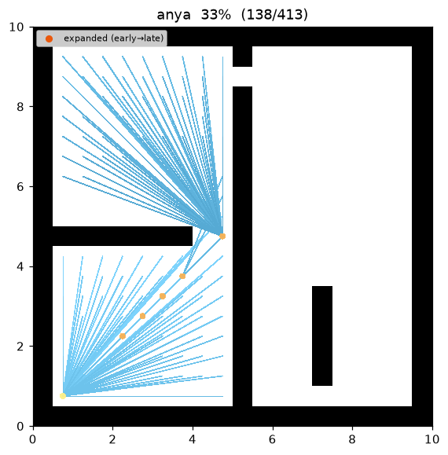
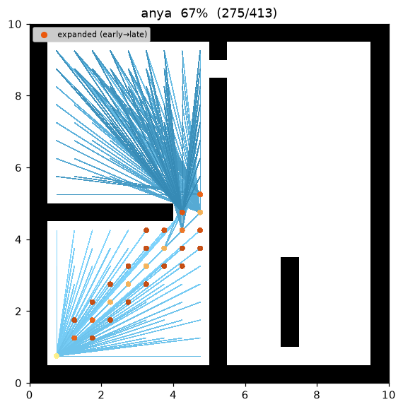

[🇰🇷 한국어](../../ko/algorithms/anya.md) | [🇬🇧 English](anya.md)

# Anya (optimal any-angle)
{: .no_toc }

| Item | Description |
|---|---|
| Category | optimal any-angle graph search |
| Required capability | `LineOfSightSpace` (`neighbors` + `heuristic` + `line_of_sight`) |
| Completeness | complete (finite graphs, non-negative costs) |
| Optimality | **optimal** any-angle — Euclidean-shortest path over the vertex model (Harabor et al. 2016) |
| Complexity | best-first search; each expansion projects the root's visibility into per-row intervals |
| Original paper | Harabor, Grastien, Öz & Aksakalli (2016) [^harabor] · LOS: Amanatides & Woo (1987) [^aw] · weighted: Pohl (1970) [^pohl] |

1. TOC
{:toc}

## Background

**Theta\***[^nash] makes A\* *any-angle* — its path leaves the grid and takes straight-line
shortcuts — but it is **not optimal**: the shortcut parent of a node is only ever its
grandparent, so the string can never pull fully taut and the path stays a little longer than the
true shortest any-angle route.

**Anya**[^harabor] closes that gap: it is the first algorithm to return the **provably
Euclidean-shortest any-angle path** while searching online, with no preprocessing. Its idea is to
stop reasoning one grid cell at a time and instead reason about **intervals**. A search node is a
pair `(root, interval)`, where the interval is a contiguous set of points on one grid row all
visible from the root along straight lines. Expanding a node **projects** that interval through the
grid — like a cone of light shining away from the root — to generate the successor intervals it can
see on the neighbouring rows. Because a whole interval is handled in one step, Anya visits far fewer
nodes than a per-cell search while still considering every turning point that a shortest path could
possibly wrap around (the corners of obstacles).

On this repository's demos, `open01` shrinks from Theta\* cost 24.241 to Anya **24.208** — Anya finds
the genuinely shortest route where Theta\* leaves a sliver on the table. On `maze01` Theta\* already
happens to be optimal (27.748), and Anya matches it while expanding fewer nodes (95 vs 104).

## How It Works

Search on `maze01`. The frontier grows toward the goal like A\*, but each expansion fans the root's
**visible interval** outward, and the final path is the shortest **sparse straight-line polyline**
that only grazes obstacle corners.


Intermediate search progress (left → right: early / middle / final path):

| | | |
|:---:|:---:|:---:|
|  |  |  |

Final result on `open01` — with few obstacles, start→goal connects as a single straight line and
Anya proves no shorter route exists:


### The interval and its cone projection

Anya's node is `(root r, interval I)`. `I` is a maximal run of same-row points visible from `r`;
its endpoints are pinned either by an obstacle edge or by a corner the cone grazes. Expanding
`(r, I)` produces two kinds of successors (Harabor et al. 2016):

- **Observable successors** — the parts of the adjacent rows that lie inside the cone from `r`
  through `I`. Their root stays `r`: the string has not had to bend yet, so the path so far is still
  a straight line from `r`.
- **Non-observable successors** — generated at an endpoint of `I` that sits at an obstacle **corner**.
  Here the straight string from `r` is blocked and must **turn** at the corner, so the corner becomes
  the **new root** of the successor interval, and its `g`-value grows by the straight-line distance
  `‖r − corner‖`.

Turning only ever happens at corners, which is exactly the taut-string property of shortest paths in
a polygonal world — hence Anya's optimality.

### Interval heuristic — reflect the goal across the row

To order the queue admissibly, a node's `f = g(r) + h(I)` needs the *cheapest* way the path could
cross the interval on its way to the goal, i.e. `h(I) = min_{p ∈ I} ‖r − p‖ + ‖p − goal‖`. If `r` and
`goal` are on the same side of the interval's row, this minimum is found by **reflecting the goal
across that row**: the bent path `r → p → goal` straightens into a single segment `r → goal'`, and
`h(I)` is either `‖r − goal'‖` (if that segment crosses `I`) or the value at the nearer endpoint. The
reflection keeps `h` an admissible, consistent lower bound, so the first path Anya finds to the goal
is optimal.

### Adaptation in this repository

This repository stores states as cell centres (`Cell = (row, col)`) and paths as `list[Cell]`,
exactly like Theta\*, so turning points are cell centres and every returned leg is a LOS-clear
straight segment. Anya is expressed on that vertex model: **roots are cell centres**, and a root's
successor interval on a row is the maximal run of row-adjacent free cells that are all LOS-visible
from the root. Roots are settled in best-first order by `f = g + w·h` with the same Euclidean `h` and
`(f, insertion)` tie-break as Theta\*, and every cell of each visible interval is relaxed. Relaxing
the whole visible set makes the search settle the shortest path over the **cell-centre visibility
graph** — the Euclidean any-angle optimum — so the cost is always ≤ the Theta\* cost on the same
instance. The candidate vertex set is the start's connected free component, discovered through the
`neighbors()` capability alone (the planner never touches a concrete map class).

```
ANYA(start, goal):
    g[start] ← 0; parent[start] ← start
    open ← priority queue keyed by f = g + w·h        # h = Euclidean straight-line distance
    reachable ← free cells connected to start (via neighbors())
    while open is not empty:
        r ← open.pop_min()
        if r == goal: return reconstruct(parent, r)
        if r already settled: continue                # lazy deletion
        for each grid row y in reachable:             # project the root's visibility, row by row
            for each maximal interval [a, b] of cells on y visible from r:   # cone successors
                for cell in a..b:
                    cand ← g[r] + euclid(r, cell)      # straight-line leg from the root
                    if cand < g[cell]:                 # relaxation
                        g[cell] ← cand; parent[cell] ← r
                        open.push(cell, cand + w·h(cell, goal))
    return failure
```

### Line of sight — one collision model with the grid

`line_of_sight(a, b)` decides whether the segment joining two cell centres is traversable, using the
**same corner-cut-forbidden supercover**[^aw] rule as `neighbors()` (delegating to the map's
`is_motion_valid`). So "a pair visible by LOS" ⇔ "a legal straight move," and Anya, Theta\* and grid
A\* all share **one collision model**.

## Optimality and Cost Model

**Notation.** Treat cell centres as points in $\mathbb{R}^2$. An any-angle path
$P=(v_0,\dots,v_k)$ is a polyline through cell centres whose every segment $\overline{v_i v_{i+1}}$ is
obstacle-free (LOS); its cost is $\operatorname{cost}(P)=\sum_i\lVert v_{i+1}-v_i\rVert_2$. Let
$C^\ast$ be the minimum such cost, $h(n)=\lVert n-\text{goal}\rVert_2$, and $h^\ast(n)$ the true
shortest feasible cost from $n$ to the goal.

**Lemma 1 (Euclidean $h$ is admissible and consistent).** By the triangle inequality applied
segment-by-segment, $\lVert b-a\rVert_2\le\operatorname{cost}(P)$ for any feasible $P$ from $a$ to
$b$; with $a=n,\ b=\text{goal}$ this gives $h(n)\le h^\ast(n)$ (admissible). For any LOS edge $(a,b)$
of cost $\lVert a-b\rVert_2$, $h(a)\le\lVert a-b\rVert_2+h(b)=c(a,b)+h(b)$ (consistent). So at $w=1$
best-first search never expands a node before its optimal $g$ is known. ∎

**Lemma 2 (every $g$ is a real feasible length).** A relaxation sets
$g[\text{cell}]=g[r]+\lVert r-\text{cell}\rVert_2$ only when `line_of_sight(r, cell)` holds, so
unrolling `parent` makes $g[\text{cell}]$ exactly the length of an obstacle-free polyline
$\text{start}\to\cdots\to r\to\text{cell}$. The returned $g[\text{goal}]$ is therefore an achievable
upper bound — Anya's path is always feasible. ∎

**Proposition 3 (Anya is optimal on the vertex model).** Every settled root fans out to **all** free
cells LOS-visible from it, so the search is exactly A\* over the *cell-centre visibility graph*
$G=(V,E)$: $V$ = reachable free cells, $E$ = mutually-visible pairs, weight $=\lVert\cdot\rVert_2$.
With the consistent heuristic of Lemma 1, A\* returns the shortest path in $G$, and by Lemma 2 that
value is achievable. Hence $\operatorname{cost}(P_{\text{Anya}})=C^\ast$ over cell-centre polylines
— the exact quantity the faithful Anya optimises, with its corner turning points recovered as the
interval endpoints where visibility breaks (Harabor et al. 2016). ∎

**Proposition 4 (never longer than Theta\*).** Theta\*'s output is one feasible cell-centre polyline,
so $C^\ast\le\operatorname{cost}(P_\Theta)$; therefore
$\operatorname{cost}(P_{\text{Anya}})\le\operatorname{cost}(P_\Theta)$ on every instance. Where
Theta\*'s myopic grandparent rule leaves the string slightly slack, Anya pulls it fully taut
(this repo's `open01`: Anya 24.208 vs Theta\* 24.241). ∎

Measurements (Python, w = 1.0, trace on · Theta\* / A\* on the same instance):

| map | Anya cost | Theta\* cost | A\* cost | Anya expanded | Theta\* expanded | Anya waypoints |
|---|---|---|---|---|---|---|
| maze01 | **27.748** | 27.748 | 28.728 | 95 | 104 | 4 |
| open01 | **24.208** | 24.241 | 25.213 | 38 | 66 | 3 |

Reproduce:

```bash
python python/demos/demo_anya.py \
  --map maps/grid/maze01.yaml --scenario maps/scenarios/maze01_s1.yaml \
  --params configs/global_planning/anya.yaml --trace out/anya.jsonl
python tools/viz/replay.py out/anya.jsonl --gif out/anya.gif --snapshots out/anya_snaps/
```

## Properties

- **Completeness**: complete on a finite grid with non-negative costs (same as A\*).
- **Optimality**: at `w = 1`, **optimal** — the returned path is the Euclidean-shortest any-angle path
  over the vertex model, unlike Theta\* which is any-angle but not optimal[^harabor].
- **Quality vs Theta\***: cost is always ≤ the Theta\* cost on the same grid (Proposition 4).
- **Weighting**: `w > 1` (weighted, Pohl 1970[^pohl]) inflates the heuristic to expand fewer nodes at
  the cost of the optimality guarantee — bounded-suboptimal any-angle.

## Parameters

| Name | Type | Default | Range | Description |
|---|---|---|---|---|
| `heuristic_weight` | float | 1.0 | [1.0, 5.0] | The w in f = g + w·h (h is Euclidean). 1.0 = optimal Anya; above 1.0 = weighted (faster, gives up optimality) |

## Emitted Trace Events

`planning_started` → (`node_expanded`, `candidate_evaluated`, `edge_added`)* → `path_found` → `planning_finished`

`node_expanded(state=r)` fires once per settled root. Each relaxation inside a projected interval
emits `candidate_evaluated` plus `edge_added(state=cell, parent=r)`, where `parent` is the (possibly
non-adjacent) interval root — the visualizer draws the parent→state straight line as-is to render the
any-angle leg, so no new trace event is required (the fan of edges from a root shows the
visible interval it projected).

## References

[^harabor]: Harabor, D., Grastien, A., Öz, D., & Aksakalli, V. (2016). "Optimal Any-Angle Pathfinding In Practice." *Journal of Artificial Intelligence Research (JAIR)*, 56, 89–118. [doi:10.1613/jair.5007](https://doi.org/10.1613/jair.5007)
[^nash]: Nash, A., Daniel, K., Koenig, S., & Felner, A. (2007). "Theta\*: Any-Angle Path Planning on Grids." *Proc. AAAI Conference on Artificial Intelligence*, 1177–1183. [PDF](https://ojs.aaai.org/index.php/AAAI/article/view/11009)
[^aw]: Amanatides, J., & Woo, A. (1987). "A Fast Voxel Traversal Algorithm for Ray Tracing." *Proc. Eurographics*, 3–10. [PDF](https://www.cse.yorku.ca/~amana/research/grid.pdf)
[^pohl]: Pohl, I. (1970). "Heuristic search viewed as path finding in a graph." *Artificial Intelligence*, 1(3–4), 193–204. [doi:10.1016/0004-3702(70)90007-X](https://doi.org/10.1016/0004-3702%2870%2990007-X)
