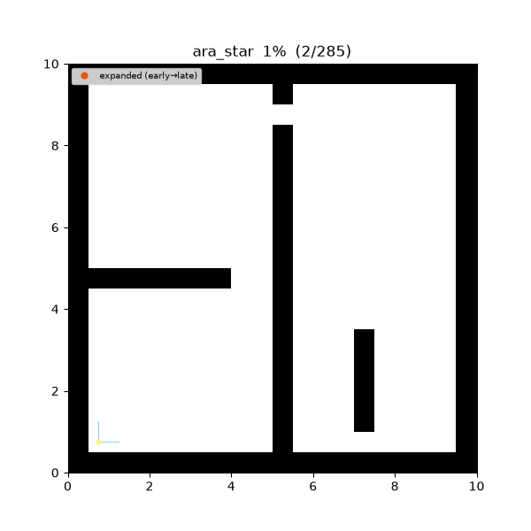
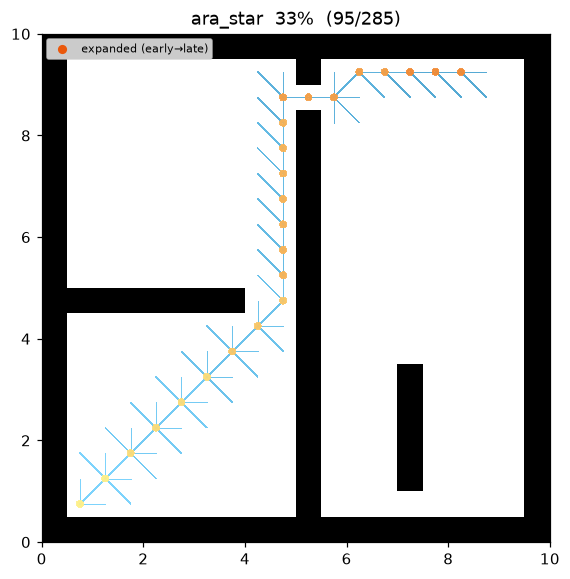
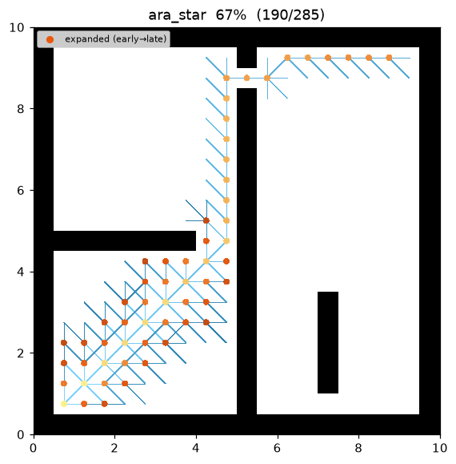
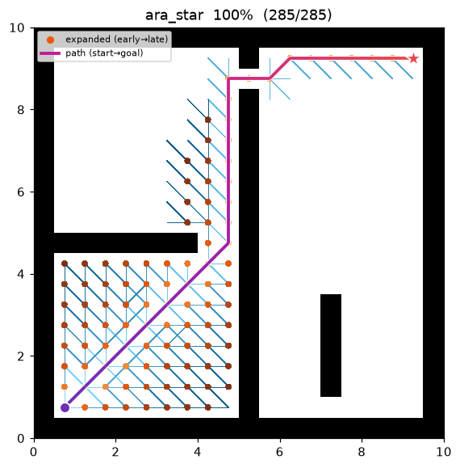

[🇰🇷 한국어](../../ko/algorithms/ara_star.md) | [🇬🇧 English](ara_star.md)

# ARA* (Anytime Repairing A*)
{: .no_toc }

| Item | Description |
|---|---|
| Category | anytime informed graph search |
| Required capability | `DiscreteSpace` (`neighbors` + `heuristic`) |
| Completeness | complete (finite graphs, non-negative costs) |
| Optimality | **anytime bounded-suboptimal** — each solution is ε-suboptimal; ε → 1 is optimal |
| Complexity | weighted-A* iterations × number of ε steps; reuses prior search, cheaper than restarting |
| Original paper | Likhachev, Gordon & Thrun (2003) [^ara] |

1. TOC
{:toc}

## Background

A robot on a time budget is usually better served by "produce a usable path fast, then keep
improving while time remains" than by "slow but optimal." **ARA\***[^ara] adds exactly this anytime
behavior on top of A\*.

The core idea is to run weighted A\*[^pohl] **repeatedly with a shrinking ε**. With f = g + ε·h
(ε ≥ 1), a large ε yields a first solution quickly (at the price of being suboptimal, cost ≤ ε·C\*).
ARA\*'s contribution is to make each subsequent, smaller-ε search **reuse the previous one's work**
rather than restart A\* from scratch — a naive restart would re-expand the same nodes wastefully.

Two mechanisms make the reuse work.

1. **The INCONS list.** If a state s has its g lowered *after* it was already expanded (CLOSED), it
   is collected in INCONS instead of being reinserted into OPEN — i.e., it is not re-expanded during
   the current ε iteration.
2. **Reopening for the next iteration.** When ε shrinks, set `OPEN ← OPEN ∪ INCONS`, recompute all
   keys under the new ε, and clear CLOSED. Only the states that were "improved but deferred" seed the
   next round, so the search repairs locally just the parts that changed.

## How It Works

Search on `maze01`, the frontier regrowing as ε decreases:



Intermediate progress (left → right: early large ε / middle / final ε = 1 path):

| | | |
|:---:|:---:|:---:|
|  |  |  |

```
IMPROVE-PATH(ε):                              # one weighted-A* pass
    while g(goal) > min key in OPEN:          # stop once goal is the min key -> ε-suboptimal
        s ← OPEN.pop_min()                    # key(s) = g(s) + ε·h(s)
        CLOSED ← CLOSED ∪ {s}
        for (s', c) in neighbors(s):
            if g(s) + c < g(s'):              # relaxation
                g(s') ← g(s) + c; parent(s') ← s
                if s' ∉ CLOSED: OPEN.push(s', key(s'))
                else:           INCONS ← INCONS ∪ {s'}   # defer instead of re-expanding

ARA*(start, goal):
    g(start) ← 0; ε ← ε0
    OPEN ← {start}; INCONS ← CLOSED ← ∅
    IMPROVE-PATH(ε); publish(path, bound = ε)             # first solution (anytime)
    while ε > 1:
        ε ← max(1, ε − Δε)
        OPEN ← OPEN ∪ INCONS; recompute keys; CLOSED ← ∅  # reopen
        IMPROVE-PATH(ε); publish(path, bound = ε)         # improved solution (anytime)
    return the last (most optimal) path
```

The termination test `g(goal) ≤ min key in OPEN` is the crux: if OPEN's minimum key is no smaller
than the goal's cost, no shorter path can remain, so g(goal) at that moment is provably ε-suboptimal.
This implementation uses a lazy heap — an old entry for a state whose key was lowered and reinserted
is skipped on pop (no separate decrease-key structure). Both languages return the same path and cost;
the expansion order can differ by a handful of nodes when equal-key states are reopened, since the
insertion-order seed then depends on unordered-set iteration, which is not identical across languages.

The heuristic is the same 8-connected **octile distance** as A\*, supplied by the `DiscreteSpace`
capability — the algorithm knows nothing about the motion model.

## Properties

- **Completeness**: complete on finite graphs with non-negative costs.
- **Anytime**: emits a first solution quickly at `eps_start`, then a **no-worse** solution on every
  ε-shrinking iteration. Interrupted at any point, it knows the suboptimality bound (the current ε)
  of the best solution so far.
- **Per-solution bound**: the path returned by an ε iteration has cost ≤ ε · C\* [^pohl].
- **Convergence**: with `eps_final = 1.0` the final iteration equals admissible A\* — the **optimum**.
- **Efficiency**: thanks to INCONS reuse, each state is expanded at most once per ε iteration, and the
  total expansions are fewer than restarting A\* at every ε[^ara].

## Suboptimality-bound Proof

Notation: $f(n)=g(n)+\varepsilon\,h(n)$, $h$ admissible ($0\le h\le h^\ast$), $C^\ast$ the optimal cost.

**Theorem (each IMPROVE-PATH is ε-suboptimal).** When `IMPROVE-PATH(ε)` terminates, the returned path
cost satisfies $g(\text{goal})\le \varepsilon\,C^\ast$.

*Proof.* At termination $g(\text{goal})\le \min_{s\in\text{OPEN}} key(s)$. Some node $n$ on an optimal
path is in OPEN (the optimal path from the expanded prefix to the goal crosses the frontier). For that
$n$, $g(n)\le g^\ast(n)$, and by admissibility

$$
key(n)=g(n)+\varepsilon\,h(n)\;\le\;\varepsilon\bigl(g^\ast(n)+h^\ast(n)\bigr)=\varepsilon\,C^\ast
$$

(using $\varepsilon\ge1$ so $g(n)\le\varepsilon\,g(n)$). Hence

$$
g(\text{goal})\;\le\;\min_{s}key(s)\;\le\;key(n)\;\le\;\varepsilon\,C^\ast. \qquad\blacksquare
$$

With $\varepsilon=1$ the bound tightens to $C^\ast$, i.e., optimal (equivalent to A\*'s Theorem 1).
Because ε decreases monotonically, the emitted solution costs are non-increasing and the last one is
the most optimal. ∎

## Parameters

| Name | Type | Default | Range | Description |
|---|---|---|---|---|
| `eps_start` | float | 2.5 | [1.0, 10.0] | ε0 of the first iteration; larger = faster, more suboptimal first solution |
| `eps_final` | float | 1.0 | [1.0, 10.0] | final ε; 1.0 returns the optimum |
| `eps_step` | float | 0.5 | [0.01, 10.0] | ε decrement per iteration (ε ← max(eps_final, ε − eps_step)) |
| `max_expansions` | int | 2000000 | [1, 1e8] | cumulative expansion cap across iterations (divergence guard) |

Setting `eps_start` equal to `eps_final` degenerates ARA\* into a single weighted A\*; both at 1.0 give A\*.

## Emitted Trace Events

`planning_started` → (`node_expanded`, `candidate_evaluated`, `edge_added`)* → `path_found`
(one per ε iteration, anytime) → … → `path_found` (final) → `planning_finished`

## References

[^ara]: Likhachev, M., Gordon, G., & Thrun, S. (2003). "ARA\*: Anytime A\* with Provable Bounds on Sub-Optimality." *Advances in Neural Information Processing Systems (NIPS)* 16.
[^pohl]: Pohl, I. (1970). "Heuristic search viewed as path finding in a graph." *Artificial Intelligence*, 1(3–4), 193–204. [doi:10.1016/0004-3702(70)90007-X](https://doi.org/10.1016/0004-3702%2870%2990007-X)
