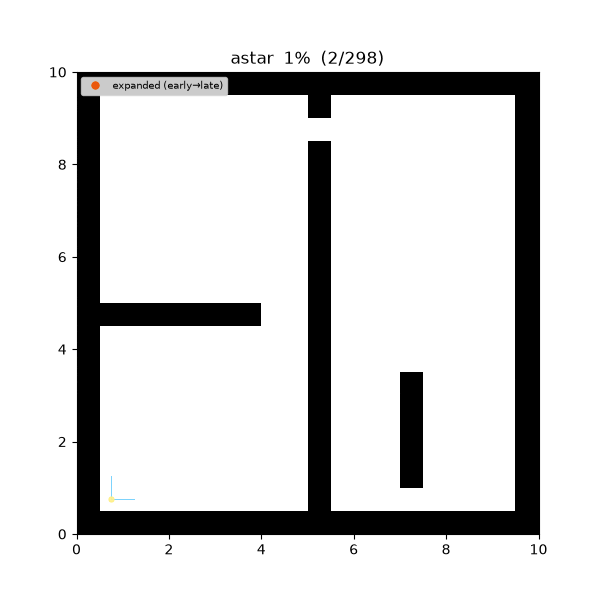
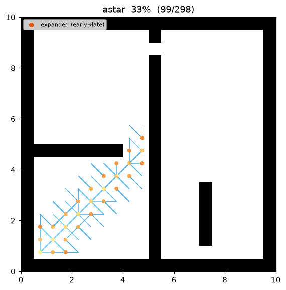
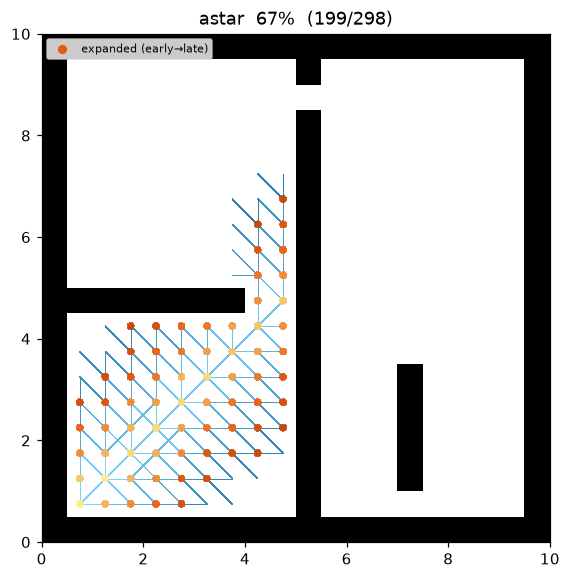
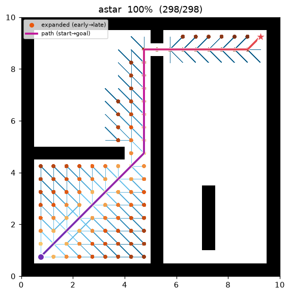
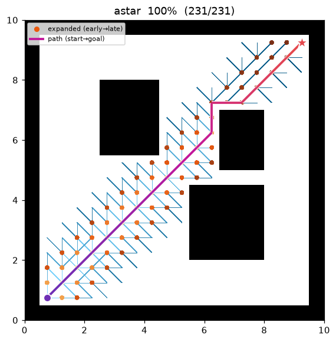

[🇰🇷 한국어](../../ko/algorithms/astar.md) | [🇬🇧 English](astar.md)

# A* (A-star)
{: .no_toc }

| Item | Description |
|---|---|
| Category | informed graph search |
| Required capability | `DiscreteSpace` (`neighbors` + `heuristic`) |
| Completeness | complete (finite graphs, non-negative costs) |
| Optimality | **cost-optimal** — when the heuristic is admissible (w = 1.0) |
| Complexity | worst case O(b^d) time/space, governed by heuristic quality |
| Original paper | Hart, Nilsson & Raphael (1968) [^hart] · weighted variant: Pohl (1970) [^pohl] |

1. TOC
{:toc}

## Background

A*[^hart] was born out of SRI's Shakey robot project, making it the path-search algorithm most deeply tied to robotics. It expands nodes in order of **f(n) = g(n) + h(n)**, adding an estimate of the remaining cost to the goal, h(n), to Dijkstra's accumulated cost g(n). When h never overestimates the true remaining cost (i.e., is admissible), A* guarantees an optimal path while expanding far fewer nodes than Dijkstra — it is "optimally efficient" in the sense that no admissible algorithm using the same information can expand fewer nodes[^hart] [^hart72].

Pohl's weighted A*[^pohl] inflates the heuristic as **f = g + w·h (w > 1)**, biasing the search more aggressively toward the goal. Optimality relaxes to bounded suboptimality (within a factor of w), but the number of expanded nodes drops sharply, which is why it is widely used for real-time replanning.

## How It Works

```
ASTAR(start, goal):
    g[start] ← 0; open ← priority queue keyed by f = g + w·h
    while open is not empty:
        v ← open.pop_min()                    # minimum f
        if v == goal: return reconstruct(v)
        if v already settled: continue        # lazy deletion
        for (u, c) in neighbors(v):
            if g[v] + c < g[u]:               # relaxation (same as Dijkstra)
                g[u] ← g[v] + c; parent[u] ← v
                open.push(u, g[u] + w·h(u, goal))
    return failure
```

The difference from Dijkstra is **a single line** — the priority key. With h ≡ 0 it degenerates exactly into Dijkstra.

### Heuristic — octile distance

The grids in this repository are 8-connected (orthogonal 1.0, diagonal √2 × resolution), so the heuristic is the **octile distance**:

```
h(a, b) = (max(Δrow, Δcol) − min(Δrow, Δcol)) + √2 · min(Δrow, Δcol)
```

It exactly equals the true movement cost in the complete absence of obstacles, so it is admissible and consistent. (Heuristic computation is part of the `DiscreteSpace` capability and is **provided by the map adapter** — the algorithm knows nothing about the motion model.)

## Properties

- **Completeness**: complete on finite graphs with non-negative costs.
- **Optimality**: admissible h + w = 1.0 → optimality guaranteed. With a consistent h, each node is expanded at most once. w > 1 → returned path cost ≤ w × optimal (bounded suboptimal)[^pohl].
- **Complexity**: depends on heuristic quality, ranging from Dijkstra-like (uninformative h) down to straight-line behavior (perfect h).

## Parameters

| Name | Type | Default | Range | Description |
|---|---|---|---|---|
| `heuristic_weight` | float | 1.0 | [1.0, 5.0] | The w in f = g + w·h. 1.0 = admissible optimal, above = weighted A* |

## Optimality & Proofs

Notation: $f(n)=g(n)+h(n)$, where $g$ is the actual cost from the start, $h$ the estimate to the
goal, $h^*(n)$ the true remaining optimal cost, and $C^*$ the optimal solution cost.

- **Admissible:** $0\le h(n)\le h^*(n)\;\;\forall n$ — never overestimates.
- **Consistent:** $h(n)\le c(n,n')+h(n')$ for every edge $(n,n')$, and $h(\text{goal})=0$.

**Theorem 1 (admissible $\Rightarrow$ optimal).** If $h$ is admissible, the path A\* returns is
cost-optimal.

*Proof.* Suppose A\* selects for expansion a goal $G_2$ with $g(G_2)>C^*$. As a goal, $h(G_2)=0$,
so $f(G_2)=g(G_2)>C^*$. At that moment some node $n$ on an optimal path is in the open set (the path
from the expanded prefix to the goal crosses the frontier). By admissibility,

$$
f(n)=g(n)+h(n)\;\le\;g(n)+h^*(n)\;=\;C^*.
$$

Thus $f(n)\le C^*<f(G_2)$, so A\* would expand $n$ before $G_2$ — contradiction. Hence any goal it
selects has $g=C^*$. ∎

**Theorem 2 (consistent $\Rightarrow$ admissible & no re-expansion).** If $h$ is consistent then
(i) it is admissible, and (ii) $f$ is non-decreasing along any path, so each node is expanded at
most once.

*Proof.* (i) Telescoping $h(n)\le c(n,n')+h(n')$ along an optimal path to the goal gives
$h(n)\le h^*(n)$. (ii) For an edge $(n,n')$, $f(n')=g(n)+c(n,n')+h(n')\ge g(n)+h(n)=f(n)$. ∎

**Bounded suboptimality of weighted A\*.** With $f=g+w\,h,\;w\ge1$, the returned cost is
$\le w\cdot C^*$.

*Proof sketch.* When $G_2$ is selected, for an open node $n$ on an optimal path,
$f(G_2)=g(G_2)\le g(n)+w\,h(n)\le w\bigl(g(n)+h^*(n)\bigr)=w\,C^*$ (the second inequality uses
$w\ge1$ and admissibility). ∎

## Implementation Notes

- C++: `cpp/src/global_planning/astar.cpp`, Python: `python/navigation/global_planning/astar.py`
- Shares the best-first skeleton with Dijkstra (only the priority key is overridden). Both languages use the same operation order down to tie-breaking, so their results match exactly.

## Emitted Trace Events

`planning_started` → (`node_expanded`, `edge_added`)* → `path_found` → `planning_finished`

## Demo

Search on `maze01`. Unlike Dijkstra, the frontier visibly **leans toward the goal** as it grows.



Intermediate search progress (left → right: early / middle / final path):

| | | |
|:---:|:---:|:---:|
|  |  |  |

Final result on `open01` — with few obstacles, expansion follows an almost straight diagonal:



Measurements (Python, w = 1.0, trace on):

| map | path cost | expanded nodes | ref: Dijkstra expanded |
|---|---|---|---|
| maze01 | 28.728 (optimal, same as Dijkstra) | **108** | 211 |
| open01 | 25.213 (optimal) | **71** | 267 |

Reproduce:

```bash
python python/demos/demo_astar.py \
  --map maps/grid/maze01.yaml --scenario maps/scenarios/maze01_s1.yaml \
  --params configs/global_planning/astar.yaml --trace out/astar.jsonl
python tools/viz/replay.py out/astar.jsonl --gif out/astar.gif --snapshots out/astar_snaps/
```

## References

[^hart]: Hart, P. E., Nilsson, N. J., & Raphael, B. (1968). "A Formal Basis for the Heuristic Determination of Minimum Cost Paths." *IEEE Transactions on Systems Science and Cybernetics*, 4(2), 100–107. [doi:10.1109/TSSC.1968.300136](https://doi.org/10.1109/TSSC.1968.300136)
[^hart72]: Hart, P. E., Nilsson, N. J., & Raphael, B. (1972). "Correction to 'A Formal Basis for the Heuristic Determination of Minimum Cost Paths'." *SIGART Newsletter*, 37, 28–29. [doi:10.1145/1056777.1056779](https://doi.org/10.1145/1056777.1056779)
[^pohl]: Pohl, I. (1970). "Heuristic search viewed as path finding in a graph." *Artificial Intelligence*, 1(3–4), 193–204. [doi:10.1016/0004-3702(70)90007-X](https://doi.org/10.1016/0004-3702%2870%2990007-X)
