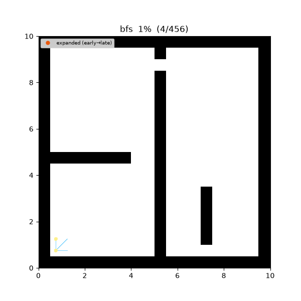
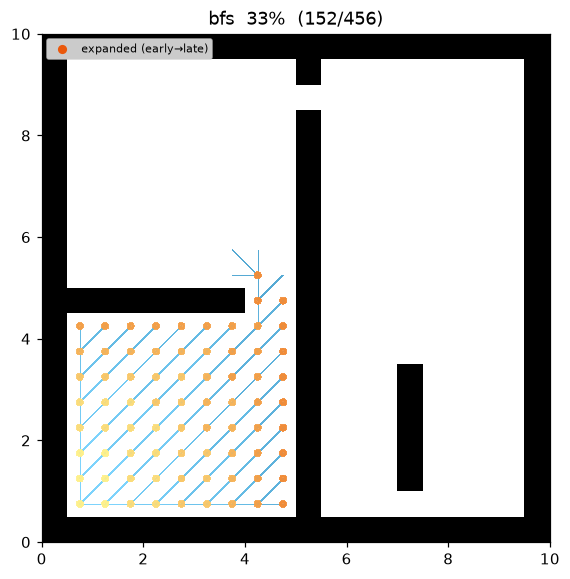
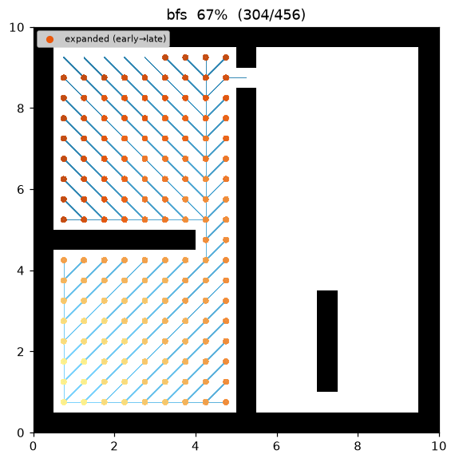
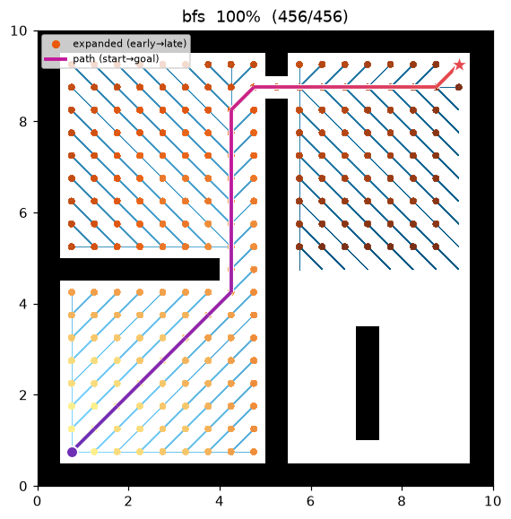
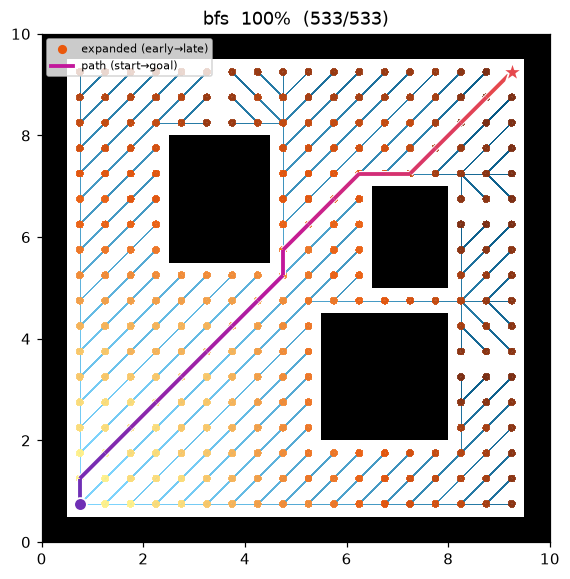
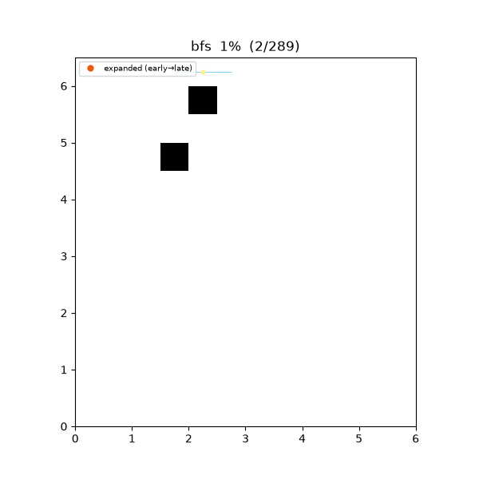
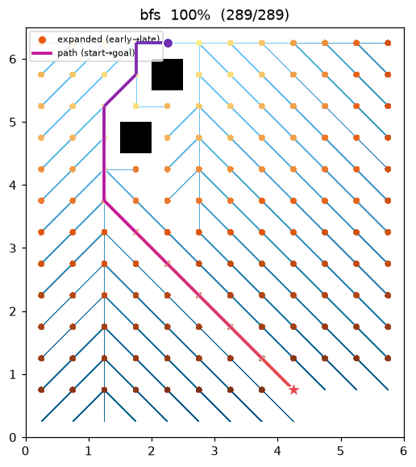
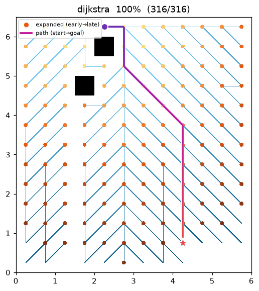

[🇰🇷 한국어](../../ko/algorithms/bfs.md) | [🇬🇧 English](bfs.md)

# BFS — Breadth-First Search
{: .no_toc }

| Item | Description |
|---|---|
| Category | uninformed graph search |
| Required capability | `DiscreteSpace` |
| Completeness | complete (finite graphs) |
| Optimality | **fewest edges** — cost-optimal only on unit-cost graphs |
| Complexity | time O(V + E), space O(V) |
| Origins | Moore (1959) [^moore], Lee (1961) [^lee] |

1. TOC
{:toc}

## Background

BFS is the most fundamental graph search: it grows the frontier outward from the start node in order of proximity (measured in edge count). As a path-finding algorithm it traces back to Moore's maze-search work[^moore] and to the Lee algorithm[^lee], which independently applied the same idea to circuit routing. It is the baseline for understanding Dijkstra and A*, and **on grids with uniform edge cost it remains a valid shortest-path algorithm to this day**.

## How It Works

Search progress on `maze01` (20×20, narrow-passage maze). The frontier can be seen spreading uniformly, independent of cost.



Intermediate search progress (left → right: early / middle / final path):

| | | |
|:---:|:---:|:---:|
|  |  |  |

Final result on `open01` (open field):



It runs on a single FIFO queue. A node popped from the queue is settled (expanded), and every not-yet-visited neighbor is pushed onto the queue. Every node at edge count k is settled before any node at edge count k+1, so the path at the moment the goal is first reached is a minimum-edge-count path.

```
BFS(start, goal):
    queue ← [start]; visited ← {start}; parent ← {}
    while queue is not empty:
        v ← queue.pop_front()                # FIFO — this single line defines BFS
        if v == goal: return reconstruct(parent, goal)
        for (u, _cost) in neighbors(v):      # cost is ignored
            if u ∉ visited:
                visited.add(u); parent[u] = v
                queue.push_back(u)
    return failure
```

{: .warning }
> The grids in this repository are 8-connected, with diagonal moves costing √2. In other words, **costs are not uniform**, so a BFS path minimizes only the edge count and may not be optimal in world distance. When the demo shows BFS and Dijkstra producing the same path cost, that is a coincidence of these map structures, not a guarantee.

Measurements (Python, trace on):

| map | path cost | expanded nodes | path len |
|---|---|---|---|
| maze01 | 28.728 | 221 | 26 |
| open01 | 25.213 | 267 | 20 |

On the same maps, [A*](astar.md) expands only 108 / 71 nodes respectively, thanks to its heuristic.

Reproduce:

```bash
python python/demos/demo_bfs.py \
  --map maps/grid/maze01.yaml --scenario maps/scenarios/maze01_s1.yaml \
  --params configs/global_planning/bfs.yaml --trace out/bfs.jsonl
python tools/viz/replay.py out/bfs.jsonl --gif out/bfs.gif --snapshots out/bfs_snaps/
```

## Properties

- **Completeness**: on a finite graph, if a solution exists it is always found.
- **Optimality**: shortest in edge count (hop count). Cost-optimal only when edge costs are uniform.
- **Complexity**: time O(V + E), space O(V) — the entire frontier is kept in memory.

## Why It's Shortest — Proof

Notation: let $\delta(s,v)$ be the **minimum number of edges** (hops) on any $s\to v$ path, and let
$d[v]$ be the depth recorded when BFS dequeues $v$.

**Lemma (two-depth queue invariant).** At any moment during BFS the depths of the queued nodes take
at most **two consecutive values** $k,\,k{+}1$, with the depth-$k$ nodes ahead of the depth-$(k{+}1)$
ones. Hence the dequeued $d$ values are non-decreasing.

*Proof.* Induction on the number of queue operations. Initially the queue is $[s]$ with depth set
$\{0\}$ — holds. In one step we pop a front depth-$k$ node $v$ and append its unvisited neighbors
(depth $k{+}1$). If depth-$k$ nodes remain at the front the state is still $\{k,k{+}1\}$; once the
last $k$ is popped the state becomes $\{k{+}1,k{+}2\}$ with $k{+}1$ at the front. FIFO makes insertion
order = extraction order, so the front/back arrangement is preserved. ∎

**Theorem (hop-optimal).** At the moment $v$ is dequeued, $d[v]=\delta(s,v)$.

*Proof.* Induction on $\delta$. $d[s]=0=\delta(s,s)$. Take $u$ with $\delta(s,u)=k{+}1$. The node $v$
just before $u$ on some minimum-hop path has $\delta(s,v)=k$, and by the induction hypothesis $v$ is
dequeued at $d[v]=k$. If $u$ is unvisited then, it is fixed to $d[u]:=k{+}1$; if already visited, the
lemma says that visit happened at depth $\le k{+}1$. Either way $d[u]=k{+}1=\delta(s,u)$ (the lemma
rules out $d[u]<\delta(s,u)$ — no shallower path reaches $u$). Hence the path found when the goal is
first reached is hop-minimal. ∎

**BFS is unit-cost Dijkstra.** The FIFO queue is really a **bucket priority queue** keyed by the
integer depth. When every edge costs $1$, a node's minimum hop count equals its minimum accumulated
cost, so BFS's dequeue order coincides exactly with [Dijkstra](dijkstra.md)'s extract-min order. The
hop-optimality above is thus the **unit-cost specialization** of Dijkstra's optimality proof — BFS
obtains it with an $O(1)$ queue instead of a $\log V$ heap.

**Cost-optimality caveat.** With edge weights $w_e$, a path costs $\sum_e w_e$. Hop-minimal equals
cost-minimal **only when all $w_e$ are equal**. This repo's 8-connected grid has $w\in\{1,\sqrt2\}$
and is not uniform: a single diagonal step (cost $\sqrt2\approx1.414$) is counted as the same 1 hop
as an orthogonal step (cost $1$), so BFS may pick a diagonal-heavy path that has fewer hops yet is
longer in world distance (its match with Dijkstra in the demo is a coincidence of this map's shape).

**Complexity.** Each vertex is enqueued/dequeued exactly once ($O(V)$); each adjacency list is
scanned once, so $\sum_v\deg(v)=2E$ — total $O(V+E)$. With no heap, Dijkstra's $\log V$ factor
disappears.

## Counterexample: fewest hops ≠ cheapest cost

BFS minimizes only the **edge count (hops)**, so on an 8-connected grid where a diagonal costs
$\sqrt2$ it can pick a path that is **more expensive in world distance** even at the same hop count.
In `bfs_hopcost01` an obstacle right below the start pushes BFS's search (orthogonal-first → it claims
the left cell) into a **left-leaning diagonal detour**, so BFS and Dijkstra take **the same 12 hops**
yet differ in cost:

| | BFS (fewest hops) | Dijkstra (cheapest) |
|---|---|---|
| path cost | **14.899** | **13.243** |
| hops | 12 | 12 |
| route | bulges left, then diagonals back | leans straight toward the goal |



| BFS route — cost 14.90 | Dijkstra optimum — cost 13.24 |
|:---:|:---:|
|  |  |

The two routes round the same obstacles on **opposite sides**. BFS trades cheap orthogonal moves for
$\sqrt2$ diagonals and pays $14.899-13.243\approx1.66$ more — the hops are equal, the cost is not.

```bash
python python/demos/demo_bfs.py --map maps/grid/bfs_hopcost01.yaml \
  --scenario maps/scenarios/bfs_hopcost01_s1.yaml --params configs/global_planning/bfs.yaml \
  --trace out/bfs_ce.jsonl   # rerun with Dijkstra to get 13.243 (cheaper)
```

## Emitted Trace Events

`planning_started` → (`node_expanded`, `edge_added`)* → `path_found` → `planning_finished`

## References

[^moore]: Moore, E. F. (1959). "The shortest path through a maze." *Proceedings of the International Symposium on the Theory of Switching*, Harvard University Press, 285–292.
[^lee]: Lee, C. Y. (1961). "An algorithm for path connections and its applications." *IRE Transactions on Electronic Computers*, EC-10(3), 346–365. [doi:10.1109/TEC.1961.5219222](https://doi.org/10.1109/TEC.1961.5219222)
