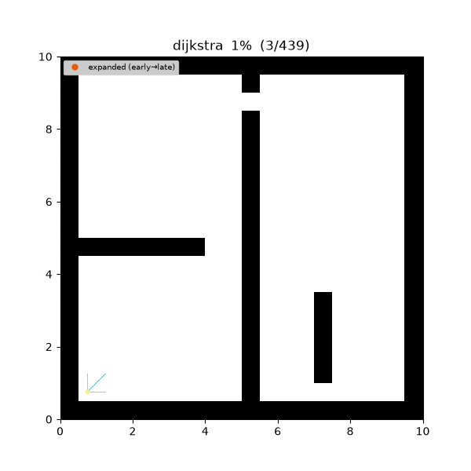
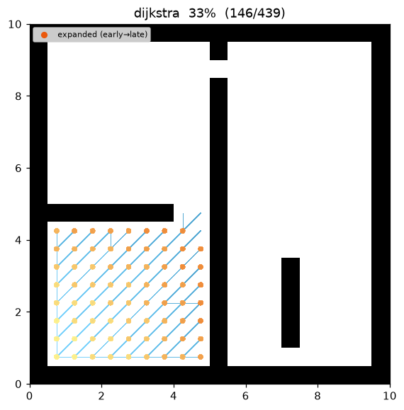
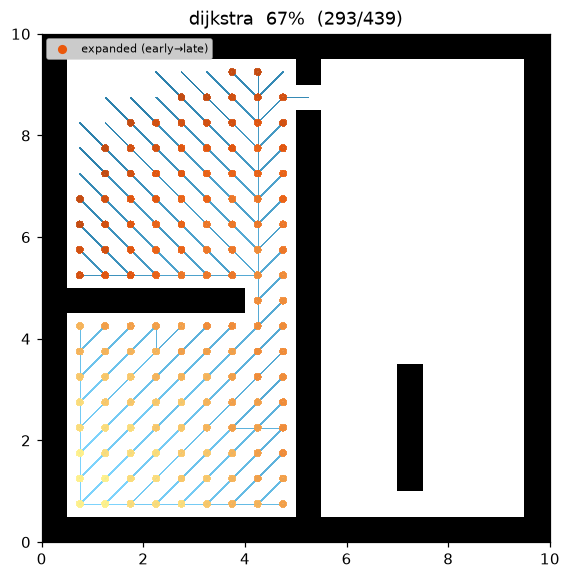
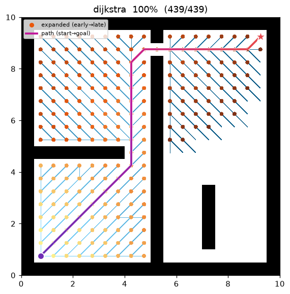
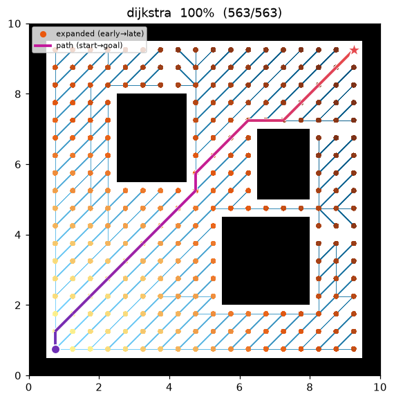

[🇰🇷 한국어](../../ko/algorithms/dijkstra.md) | [🇬🇧 English](dijkstra.md)

# Dijkstra
{: .no_toc }

| Item | Description |
|---|---|
| Category | uninformed graph search (uniform-cost) |
| Required capability | `DiscreteSpace` |
| Completeness | complete (finite graphs, non-negative costs) |
| Optimality | **cost-optimal** |
| Complexity | time O((V+E) log V) (binary heap), space O(V) |
| Original paper | Dijkstra (1959) [^dijkstra] |

1. TOC
{:toc}

## Background

Dijkstra's algorithm[^dijkstra] finds single-source shortest paths on graphs with non-negative edge costs. Published in 1959 as a three-page paper, it has been the root of every cost-based path search since. Where BFS grows the frontier in order of "edge count", Dijkstra grows it in order of "accumulated cost g" — it is an uninformed search in that it uses no information (heuristic) pointing toward the goal, and [A*](astar.md) is what you get by adding a heuristic to it (A* with h ≡ 0 is exactly Dijkstra).

## How It Works

The node with the smallest g value is popped from a priority queue and settled. With non-negative costs, the g value at the moment of settling is guaranteed to be the shortest cost to that node (the justification of the greedy choice — the paper's central argument). Relaxation toward each neighbor updates g whenever a shorter path is discovered.

```
DIJKSTRA(start, goal):
    g[start] ← 0; open ← priority queue keyed by g
    while open is not empty:
        v ← open.pop_min()                    # minimum g — v's shortest cost is settled here
        if v == goal: return reconstruct(v)
        if v already settled: continue        # lazy deletion (see implementation notes)
        for (u, c) in neighbors(v):
            if g[v] + c < g[u]:               # relaxation
                g[u] ← g[v] + c; parent[u] ← v
                open.push(u, g[u])
    return failure
```

## Properties

- **Completeness**: on a finite graph with non-negative costs, a solution is found if one exists.
- **Optimality**: the returned path is cost-optimal. (This does not hold with negative edges — that is Bellman-Ford territory.)
- **Complexity**: O((V+E) log V) with a binary heap. The Fibonacci-heap theoretical bound is O(E + V log V), but in practice a binary heap with lazy deletion is the norm.

## Optimality Proof (correctness at settle time)

Assume non-negative weights $w(u,v)\ge 0$. Let $\delta(s,u)$ be the shortest **cost** from $s$ to $u$.

**Theorem.** When the priority queue extracts $u$ (as the minimum $g$) and settles it,
$g[u]=\delta(s,u)$.

*Proof (contradiction).* Let $u$ be the **first** node settled with $g[u]>\delta(s,u)$ ($u\ne s$
since $g[s]=0=\delta(s,s)$). Take a shortest path $P:s\rightsquigarrow u$; let $y$ be the first
not-yet-settled node on $P$ and $x$ its predecessor (settled, $g[x]=\delta(s,x)$). Relaxing edge
$(x,y)$ when $x$ was settled gives

$$
g[y]\;\le\;g[x]+w(x,y)\;=\;\delta(s,x)+w(x,y)\;=\;\delta(s,y).
$$

Since $y$ precedes $u$ on $P$ and the remaining sub-path has non-negative cost,
$\delta(s,y)\le\delta(s,u)$. Combining,

$$
g[y]\;\le\;\delta(s,y)\;\le\;\delta(s,u)\;<\;g[u].
$$

Then the queue would extract $y$ before $u$ — contradiction. Hence $g[u]=\delta(s,u)$.
Non-negativity is essential at the step $\delta(s,y)\le\delta(s,u)$ (with negative edges it fails —
Bellman–Ford territory). ∎

**Complexity.** Binary heap: $V$ extract-mins $O(V\log V)$ plus $E$ pushes on relaxation
$O(E\log V)$ → $O((V+E)\log V)$.

## Implementation Notes

- C++: `cpp/src/global_planning/dijkstra.cpp`, Python: `python/navigation/global_planning/dijkstra.py`
- Dijkstra and A* **differ only in the priority key** (f = g vs f = g + w·h). Both languages share a common best-first skeleton (`discrete_search` / `_bestfirst`) to make this relationship explicit in the code.
- Instead of a decrease-key data structure, a **lazy queue** is used: the same node may be inserted into the queue multiple times, and nodes already settled at pop time are skipped. The heap grows somewhat larger, but the implementation is simpler and faster.
- No parameters (`configs/global_planning/dijkstra.yaml` is an empty declaration). It is deterministic, so the C++ and Python results match exactly.

## Emitted Trace Events

`planning_started` → (`node_expanded`, `edge_added`)* → `path_found` → `planning_finished`

## Demo

Search on `maze01`. Unlike BFS, the frontier spreads along **accumulated-cost contours** (reflecting the √2 diagonal cost).



Intermediate search progress (left → right: early / middle / final path):

| | | |
|:---:|:---:|:---:|
|  |  |  |

Final result on `open01`:



Measurements (Python, trace on):

| map | path cost | expanded nodes | path len |
|---|---|---|---|
| maze01 | 28.728 | 211 | 26 |
| open01 | 25.213 | 267 | 20 |

The path cost is identical to [A*](astar.md) (both are optimal), while the number of expanded nodes is roughly 2–4× that of A* — with no heuristic, the search spreads evenly, even away from the goal.

Reproduce:

```bash
python python/demos/demo_dijkstra.py \
  --map maps/grid/maze01.yaml --scenario maps/scenarios/maze01_s1.yaml \
  --params configs/global_planning/dijkstra.yaml --trace out/dijkstra.jsonl
python tools/viz/replay.py out/dijkstra.jsonl --gif out/dijkstra.gif
```

## References

[^dijkstra]: Dijkstra, E. W. (1959). "A note on two problems in connexion with graphs." *Numerische Mathematik*, 1, 269–271. [doi:10.1007/BF01386390](https://doi.org/10.1007/BF01386390)
