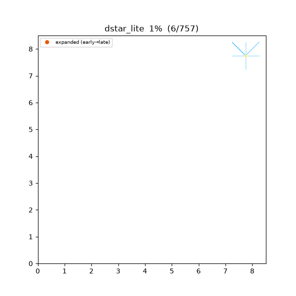
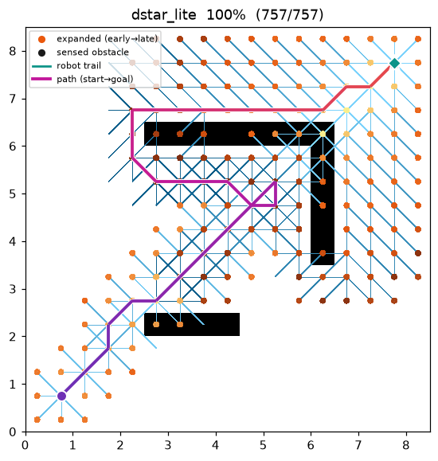
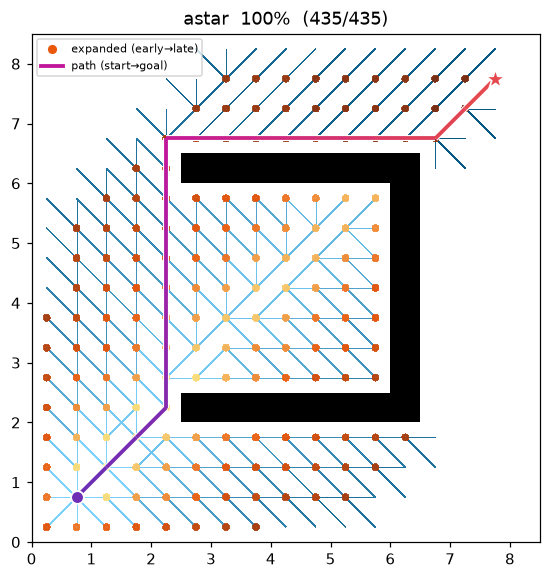

[🇰🇷 한국어](../../ko/algorithms/dstar_lite.md) | [🇬🇧 English](dstar_lite.md)

# D* Lite (dynamic replanning)
{: .no_toc }

| Item | Description |
|---|---|
| Category | incremental / dynamic replanning graph search |
| Required capability | `DynamicGridSpace` (`passable_neighbors` + `is_blocked`) |
| Completeness | complete (finite grids, non-negative costs) |
| Optimality | **optimal for the current belief** — every step follows the shortest path over the known map |
| Complexity | first search is A\* level; each replan repairs only the neighbourhood of a change (far cheaper than a from-scratch search) |
| Original paper | Koenig & Likhachev (2002) [^koenig] · built on LPA\*: Koenig, Likhachev & Furcy (2004) [^lpastar] |

1. TOC
{:toc}

## Background

A\*[^hart] assumes the map is **fully known in advance**. A real robot, however, starts with no map,
**sees only its surroundings through a sensor**, and must re-plan when it meets an unexpected obstacle.
Re-running A\* from scratch every step (naïve replanning) repeats almost all of the work.

**D\* Lite**[^koenig] solves this with **incremental search**. It maintains a **backward** search rooted
at the goal and keeps two values per cell: `g` (the cost-to-goal computed so far) and `rhs` (a one-step
look-ahead value). Only vertices where the two disagree are "inconsistent" and go on a priority queue.
When the sensor finds a cell that contradicts the belief, only **a few vertices around that cell** are
re-queued and the previous search is *repaired* — not restarted.

Here the belief is **planner-internal state**: the blocked set starts empty, so **every in-bounds cell is
assumed free** (the freespace assumption). `plan()` simulates the whole move → sense → repair loop
internally until the goal is reached or proven unreachable, and returns the **executed trajectory** (not
a from-start plan).

## How It Works

`maze01`. The robot (teal diamond) starts assuming an empty map and re-plans by local repair as it
discovers the walls one by one (fogged in as black cells). On this instance the discovered walls never
push it off the optimal path, so the realized trajectory equals the (omniscient) A\* optimum exactly.


Intermediate search / motion progress (left → right: early / middle / final trajectory):

| | | |
|:---:|:---:|:---:|
|  |  |  |

Final result on `open01`:


Because the search is backward, the heuristic is `h(s_start, s)` — from a search vertex `s` to the
**current robot position** `s_start`. As the robot moves, this reference point shifts, so an offset `k_m`
is accumulated to keep the keys already on the queue monotone (this is what lets the queue be reused
instead of rebuilt).

```
CalcKey(s):                                   # priority = [k1, k2] (lexicographic)
    k2 ← min(g(s), rhs(s))
    return [k2 + h(s_start, s) + k_m,  k2]

Initialize():
    U ← ∅;  k_m ← 0
    for all s: rhs(s) = g(s) = ∞
    rhs(s_goal) ← 0                            # goal is the root of the backward search
    U.insert(s_goal, CalcKey(s_goal))

UpdateVertex(u):
    if u ≠ s_goal:
        rhs(u) ← min over s' ∈ Succ(u) of ( c(u, s') + g(s') )
    remove u from U
    if g(u) ≠ rhs(u): U.insert(u, CalcKey(u))  # only inconsistent vertices sit on U

ComputeShortestPath():
    while U.top_key() < CalcKey(s_start) or rhs(s_start) ≠ g(s_start):
        (k_old, u) ← U.pop_min()
        if k_old < CalcKey(u):        U.insert(u, CalcKey(u))   # stale key: refresh
        else if g(u) > rhs(u):        g(u) ← rhs(u)             # over-consistent: relax
                                      for s ∈ Pred(u): UpdateVertex(s)
        else:                         g(u) ← ∞                  # under-consistent: raise
                                      for s ∈ Pred(u) ∪ {u}: UpdateVertex(s)

Main():
    s_last ← s_start;  Initialize();  sense(s_start);  ComputeShortestPath()
    while s_start ≠ s_goal:
        if g(s_start) = ∞: return "no path"
        s_start ← argmin over s' ∈ Succ(s_start) of ( c(s_start, s') + g(s') )   # take one step
        changed ← sense(s_start)                      # scan the sensor disk, update the belief
        if changed ≠ ∅:
            k_m ← k_m + h(s_last, s_start);  s_last ← s_start
            for c ∈ changed: UpdateVertex the vertices around it
            ComputeShortestPath()                     # local incremental repair
```

Grid motion is symmetric (undirected), so `Succ = Pred = passable_neighbors` (the belief-passable
neighbours). Each step the robot moves to the neighbour with the smallest `g` — i.e. it follows the
**shortest path over the map it currently knows**.

### Sensing and belief — owned by the capability

Every step the robot queries real occupancy (`is_blocked`) for the cells inside a **Euclidean disk** of
radius `sensor_radius` (cells) around itself (`dr² + dc² ≤ r²`). A blocked cell not yet in the belief is
added, an `obstacle_revealed` event is emitted, and only the neighbour vertices that used to route *into*
that cell are repaired with `UpdateVertex`. The **grid geometry (move table + corner-cut rule)** is owned
by the map's `passable_neighbors`, not the algorithm, so D\* Lite never touches raw coordinates.

### Heuristic — octile (backward, toward the robot)

`h(a, b)` is the **octile distance**, admissible for 8-connected motion:

```
h(a, b) = (hi − lo) + √2 · lo,   hi = max(|Δrow|, |Δcol|),  lo = min(|Δrow|, |Δcol|)
```

It is computed in **exactly the same operation order** as the map's A\* heuristic, so the C++ and Python
keys match bit-for-bit.

Measurements (Python, `sensor_radius = 3`, trace on · A\* comparison on the same instance):

| map | D\* Lite realized cost | A\* cost | D\* Lite cumulative expanded | A\* expanded | replans | obstacles found |
|---|---|---|---|---|---|---|
| maze01 | 28.728 | 28.728 | 247 | 108 | 20 | 41 |
| open01 | 25.213 | 25.213 | 69 | 71 | 11 | 35 |

The realized cost equals A\*'s (the discovered obstacles never blocked the optimal path), but the
cumulative expanded count is larger — the price of catching up to an unknown map by incremental repair.
Unlike A\*, which is handed the whole true map, D\* Lite **earns that knowledge as it moves**.

Reproduce:

```bash
python python/demos/demo_dstar_lite.py \
  --map maps/grid/maze01.yaml --scenario maps/scenarios/maze01_s1.yaml \
  --params configs/global_planning/dstar_lite.yaml --trace out/dstar_lite.jsonl
python tools/viz/replay.py out/dstar_lite.jsonl --gif out/dstar_lite.gif --snapshots out/dstar_snaps/
```

## Properties

- **Completeness**: complete on a finite grid with non-negative costs. If a path exists in the true map
  the robot reaches the goal; otherwise it reports unreachability via `g(s_start) = ∞`.
- **Optimality**: each move is **optimal for the belief at that instant**. Detouring around a
  first-seen obstacle can make the executed trajectory longer than the (omniscient) A\* optimum — hence
  the **realized cost ≥ the A\* cost on the same instance**. When the belief matches the true map closely
  enough, the two coincide (the maze01 / open01 demos below are such cases).
- **Incrementality**: it reuses LPA\*'s[^lpastar] g/rhs values and inconsistency queue, and the `k_m`
  offset lets the previous search survive robot motion. Each replan repairs only the neighbourhood of a
  change, which is cheaper than a naïve full replan.

## Correctness: Local Consistency and the $k_m$ Offset

**Local consistency.** Each vertex carries a computed value $g(s)$ and a one-step look-ahead value

$$
rhs(s)=
\begin{cases}
0 & s=s_\text{goal}\\[2pt]
\displaystyle\min_{s'\in\text{Succ}(s)}\bigl(c(s,s')+g(s')\bigr) & \text{otherwise.}
\end{cases}
$$

A vertex with $g(s)=rhs(s)$ is **locally consistent**.

**Theorem (globally consistent $\Rightarrow$ shortest distances).** If every vertex is locally
consistent then $g(s)=g^\ast(s)$ — the true shortest cost from $s$ to $s_\text{goal}$ in the belief
graph.

*Proof sketch.* If $g(s)=\min_{s'}(c(s,s')+g(s'))$ at every vertex with $g(s_\text{goal})=0$, this is
exactly the **Bellman optimality equation** for shortest paths with its boundary condition. With
non-negative costs its fixed point is unique, so $g\equiv g^\ast$. ∎

Making every vertex consistent costs one full Dijkstra. D\* Lite's saving is that it **need not**: the
robot only uses the $g$ of vertices on the shortest path to $s_\text{start}$, so it processes only
until that path is settled. `ComputeShortestPath`'s termination —
$U.\text{top\_key}\ge\text{CalcKey}(s_\text{start})$ with $rhs(s_\text{start})=g(s_\text{start})$ —
is exactly that minimal stopping point, the same pruning as A\* halting once it pops the goal.

**Over/under-consistent processing.** A vertex $u$ popped from the queue is inconsistent in one of two
ways only.

- **over-consistent** $g(u)>rhs(u)$: the look-ahead is better → lowering $g(u)\leftarrow rhs(u)$ makes
  $u$ consistent, and the improvement is propagated to its predecessors $\text{Pred}(u)$ (ordinary
  relaxation, cost going down).
- **under-consistent** $g(u)<rhs(u)$: a blocked edge (etc.) makes the old $g$ an underestimate → it is
  invalidated with $g(u)\leftarrow\infty$ and $u\cup\text{Pred}(u)$ are re-evaluated, dropping back to
  over-consistent on a later pop if needed.

The under-consistent branch is precisely what absorbs dynamic changes where cost **increases** as
obstacles appear — the half that static Dijkstra/LPA\* lack.

**The $k_m$ offset — why it is needed.** Because the search runs backward, the heuristic is
$h(s_\text{start},s)$ from a vertex $s$ to the **robot position** $s_\text{start}$. When the robot
moves, that reference point changes and keys already in the queue risk becoming invalid. As a metric,
the octile heuristic satisfies the triangle inequality

$$
h(s_\text{new},s)\;\ge\;h(s_\text{old},s)-h(s_\text{old},s_\text{new}),
$$

i.e. one robot step $s_\text{old}\to s_\text{new}$ can make **any vertex's key look smaller by at most**
$h(s_\text{old},s_\text{new})$. Accumulating exactly that amount into every subsequently computed key
($k_m\mathrel{+}=h(s_\text{old},s_\text{new})$) compensates the comparison between old and new keys, so
the monotone lower-bound property of the priority order is preserved **without recomputing or resorting
the whole queue**. This single $k_m$ device is what turns LPA\*[^lpastar] into an incremental search
for a moving robot. ∎

## Counterexample: the freespace-assumption trap

D\* Lite is **optimal for the current belief** every step, but detouring around a first-seen obstacle
can make the **executed trajectory longer than omniscient A\*** (the "realized cost ≥ A\* cost" property).
`dstar_trap01` is a **C-shaped trap** whose mouth faces the robot: assuming an empty map, the robot
believes the inside is the shortest way and drives straight into the mouth, then senses the back wall
from within, backs out, and goes around.

| | D\* Lite (executed trajectory) | omniscient A\* |
|---|---|---|
| cost | **34.971** | **25.071** |
| expanded (cumulative) | 284 (9 replans) | 160 |



| D\* Lite executed — includes entering & backing out | omniscient A\* optimum |
|:---:|:---:|
|  |  |

Omniscient A\* avoids the trap entirely and rounds it from above, but D\* Lite has to **earn its
knowledge by moving**, so it only learns of the back wall after stepping into the trap once — a
realized cost about 40 % higher ($34.971/25.071\approx1.39$). This is not a defect but **the essence of
replanning in an unknown environment**: every single decision was belief-optimal.

```bash
python python/demos/demo_dstar_lite.py --map maps/grid/dstar_trap01.yaml \
  --scenario maps/scenarios/dstar_trap01_s1.yaml \
  --params configs/global_planning/dstar_lite.yaml --trace out/dstar_ce.jsonl
```

## Parameters

| Name | Type | Default | Range | Description |
|---|---|---|---|---|
| `sensor_radius` | int | 3 | [1, 50] | Sensor radius (cells). Each step senses cells with `dr² + dc² ≤ r²`. A larger radius spots obstacles from further away, so fewer replans are needed |

## Emitted Trace Events

`planning_started` → ( `node_expanded`, `candidate_evaluated`, `edge_added`, `robot_moved`, `obstacle_revealed` )\* → `path_found` → `planning_finished`

- `robot_moved` (state = the robot's new executed cell) — emits the trajectory one step at a time.
- `obstacle_revealed` (state = a newly sensed blocked cell) — the moment the sensor finds an obstacle not
  yet in the belief.

When these two events are present, `replay.py` paints the background **all-free (the belief)**, fogs the
discovered obstacles in as black cells as the search progresses, and draws the robot's trail. Renders for
existing planners (no such events) are unchanged.

`planning_finished.metrics`: `path_cost` (realized trajectory cost) · `expanded_nodes` (cumulative) ·
`replan_count` · `sensed_cells` (obstacle cells discovered) · `runtime_sec`. The common metric schema is
reused unchanged.

## References

[^koenig]: Koenig, S., & Likhachev, M. (2002). "D\* Lite." *Proc. AAAI Conference on Artificial Intelligence*, 476–483. [PDF](https://www.aaai.org/Papers/AAAI/2002/AAAI02-072.pdf)
[^lpastar]: Koenig, S., Likhachev, M., & Furcy, D. (2004). "Lifelong Planning A\*." *Artificial Intelligence*, 155(1–2), 93–146. [doi:10.1016/j.artint.2003.12.001](https://doi.org/10.1016/j.artint.2003.12.001)
[^hart]: Hart, P. E., Nilsson, N. J., & Raphael, B. (1968). "A Formal Basis for the Heuristic Determination of Minimum Cost Paths." *IEEE Transactions on Systems Science and Cybernetics*, 4(2), 100–107. [doi:10.1109/TSSC.1968.300136](https://doi.org/10.1109/TSSC.1968.300136)
