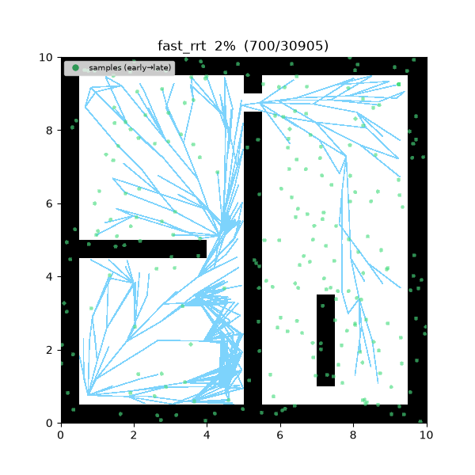
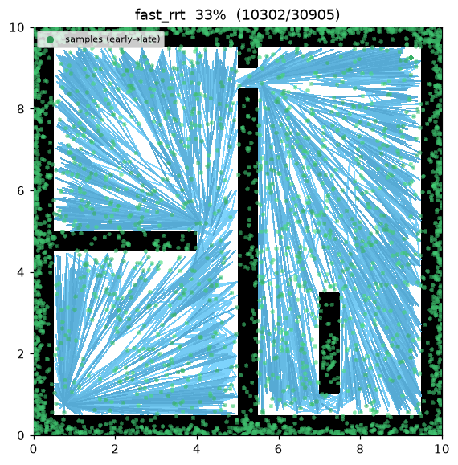
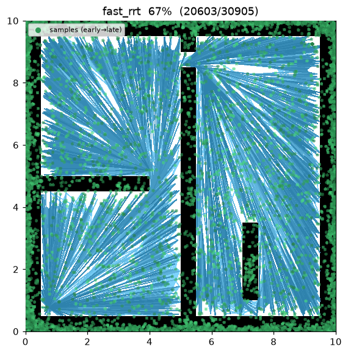
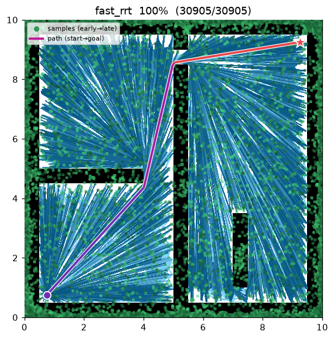
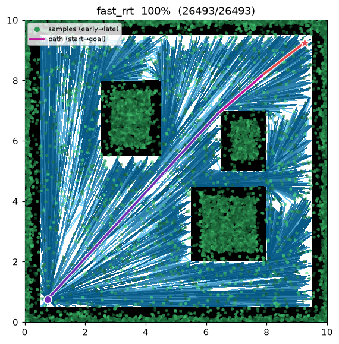

[🇰🇷 한국어](../../ko/algorithms/fast_rrt.md) | [🇬🇧 English](fast_rrt.md)

# Fast-RRT
{: .no_toc }

| Item | Description |
|---|---|
| Category | sampling-based, single-query, anytime |
| Required capability | `SamplingSpace` |
| Completeness | probabilistically complete |
| Optimality | near-optimal — a refinement aimed at faster convergence than RRT* |
| Original paper | Wu, Meng, Zhao & Wu (2021) [^wu] |

1. TOC
{:toc}

## Background

Fast-RRT[^wu] is a 2021 refinement targeting two practical weaknesses of RRT/RRT*: (1) samples keep being wasted on already-explored regions, making the initial solution slow to find and high in variance, and (2) RRT*'s convergence to the optimum is slow. The paper proposes a two-module structure — **Improved-RRT** (fast, stable initial-solution search) and **Fast-Optimal** (fusing initial solutions into a near-optimal path) — and reports finding optimal paths more than an order of magnitude faster than RRT*[^wu].

The implementation in this repository layers the paper's key ideas on top of an RRT*-style tree:

1. **Fast-Sampling** — a sample that falls within `reached_radius` of an existing tree node is treated as "already reached space" and rejected. Sampling concentrates on unexplored space, reducing the variance of search time[^wu].
2. **Random Steering** — when the straight extension toward the sample is blocked by an obstacle, up to `steering_attempts` retries in random directions take the first collision-free step. This raises the narrow-passage traversal rate[^wu].
3. **Fast-Optimal (shortcut)** — once a feasible path exists, triangle-inequality-based shortcut pruning strips out waypoints: a waypoint is removed if the segment bypassing it is collision-free. Like RRT*, the best path is maintained in anytime fashion.

## How It Works

```
FAST_RRT(start, goal):
    T ← {start}
    for i in 1..max_iterations:
        repeat:                                        # Fast-Sampling
            x_rand ← (goal with prob. goal_bias) else sample()
        until min_{x ∈ T} distance(x, x_rand) > reached_radius  (or goal sample)
        x_near ← nearest(T, x_rand)
        x_new  ← steer(x_near, x_rand, step_size)
        if blocked(x_near → x_new):                    # Random Steering
            for k in 1..steering_attempts:
                x_new ← x_near + step_size · random_direction()
                if is_motion_valid(x_near, x_new): break
        insert with choose-parent; rewire neighbors     # RRT* skeleton
        if x_new reaches goal:
            path ← SHORTCUT(path through x_new)         # Fast-Optimal
            best ← min(best, path)
    return best

SHORTCUT(path):                                         # triangle-inequality pruning
    for each waypoint w in path:
        if is_motion_valid(prev(w), next(w)): remove w
    return path
```

## Properties

- **Completeness**: probabilistically complete. Fast-Sampling rejection is confined to already-reached space, so coverage of unexplored space is preserved.
- **Optimality**: there is no formal proof of asymptotic optimality (with the RRT* skeleton + shortcut, measured convergence is on par with or faster than RRT*). Following the paper's characterization, it is classified as near-optimal[^wu].
- **Path shape**: because of the shortcut, the final path has an extremely small number of waypoints — in the demo below, the final path out of an 8,000-sample tree has just **5 points**.

## Parameters

| Name | Type | Default | Range | Description |
|---|---|---|---|---|
| `max_iterations` | int | 8000 | [1, 200000] | Iteration budget (anytime) |
| `step_size` | float | 0.5 | [0.01, 100.0] | Steer extension distance η (m) |
| `goal_bias` | float | 0.05 | [0.0, 1.0] | Probability of sampling the goal directly |
| `goal_tolerance` | float | 0.3 | [0.0, 100.0] | Goal-reached radius (m) |
| `neighbor_radius` | float | 1.5 | [0.01, 100.0] | Rewire neighborhood radius (m) |
| `reached_radius` | float | 0.4 | [0.0, 100.0] | Fast-Sampling rejection radius (m) [^wu] |
| `steering_attempts` | int | 10 | [1, 100] | Number of Random Steering retries [^wu] |
| `seed` | int | 1 | [0, 2^31−1] | Random seed (reproducibility) |

## Rationale: Fast-Sampling & Shortcut Monotonicity

**Fast-Sampling acceptance rule.** A sample $x_{rand}$ is accepted only when

$$
\min_{x\in T}\lVert x_{rand}-x\rVert>r_{\text{reached}},
$$

restricting the sampling domain to $X_{\text{free}}\setminus\bigcup_{x\in T}B(x,r_{\text{reached}})$
and concentrating probability mass on **unreached** space — which lowers the variance of the time to
a first solution.

**Cost monotonicity of the shortcut (triangle inequality).** For consecutive waypoints
$p_{i-1},p_i,p_{i+1}$ with $\overline{p_{i-1}p_{i+1}}\subset X_{\text{free}}$, removing $p_i$ changes
the cost by

$$
\Delta=\lVert p_{i-1}-p_{i+1}\rVert-\Bigl(\lVert p_{i-1}-p_i\rVert+\lVert p_i-p_{i+1}\rVert\Bigr)\le 0,
$$

non-positive by the triangle inequality. So every accepted shortcut **never increases** path cost;
iterating to a fixed point yields a locally taut path.

**Optimality.** The underlying tree is RRT\*-style (choose-parent + rewire), so it retains the
asymptotic optimality of [RRT*](rrt_star.md); Fast-Sampling and Random-Steering only reduce the time
to a first solution and its variance without weakening that guarantee (Wu et al. 2021).

## Implementation Notes

- C++: `cpp/src/global_planning/fast_rrt.cpp`, Python: `python/navigation/global_planning/fast_rrt.py`
- Choose-parent / rewire share common utilities with [RRT*](rrt_star.md) — only the paper's contributions (Fast-Sampling / Random Steering / shortcut) live in this class.
- The Fast-Sampling rejection check makes each iteration more expensive as the tree densifies — which is why, for the same 8,000 iterations, the tree is larger than RRT*'s (~7,970 vs ~5,915 nodes) and the run is slower.

## Emitted Trace Events

`planning_started` → (`sample_drawn`, `edge_added`, `rewire`*)* → `path_found`* → `planning_finished`

## Demo

`maze01` — thanks to Fast-Sampling, the tree fills empty space evenly, and the final path (red) is a set of long straight segments with only a few vertices left by the shortcut.



Intermediate search progress (left → right: early / middle / final path):

| | | |
|:---:|:---:|:---:|
|  |  |  |

Final result on `open01` — the path shrinks to a 4-point polyline:



Measurements (seed = 1, 8000 iterations, trace on):

| map | Language | path cost | path waypoints | ref: RRT* cost |
|---|---|---|---|---|
| maze01 | Python | 13.467 | **5** | 13.458 (18 wp) |
| maze01 | C++ | 13.544 | 4 | 13.471 |
| open01 | Python | 12.048 | **4** | 12.047 (14 wp) |
| open01 | C++ | 12.049 | 4 | 12.048 |

Path cost is on par with RRT*, but with fewer than a third of the waypoints — a shape that is easy to follow even without post-processing (smoothing).

Reproduce:

```bash
python python/demos/demo_fast_rrt.py \
  --map maps/grid/maze01.yaml --scenario maps/scenarios/maze01_s1.yaml \
  --params configs/global_planning/fast_rrt.yaml --trace out/fast_rrt.jsonl
python tools/viz/replay.py out/fast_rrt.jsonl --gif out/fast_rrt.gif
```

## References

[^wu]: Wu, Z., Meng, Z., Zhao, W., & Wu, Z. (2021). "Fast-RRT: A RRT-Based Optimal Path Finding Method." *Applied Sciences*, 11(24), 11777. [doi:10.3390/app112411777](https://doi.org/10.3390/app112411777) · [PDF (open access)](https://www.mdpi.com/2076-3417/11/24/11777)
