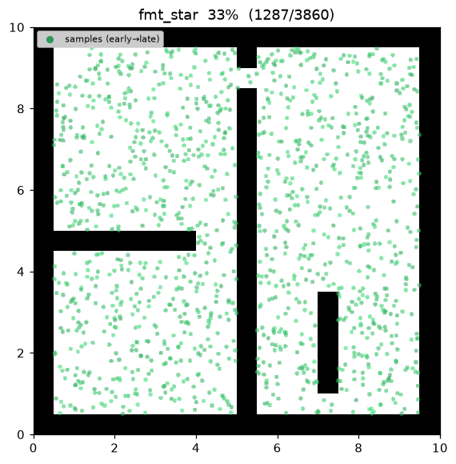
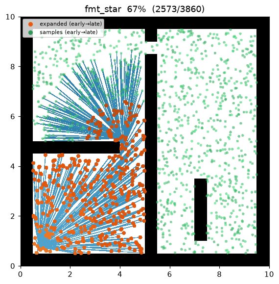
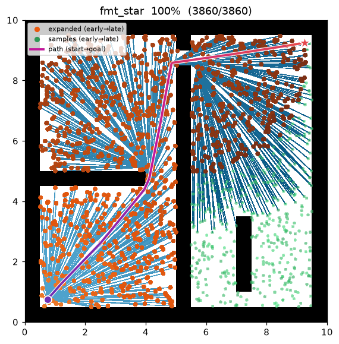
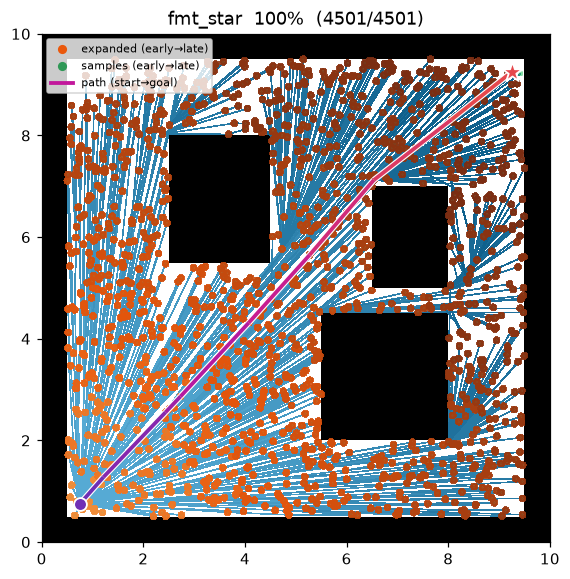

[🇰🇷 한국어](../../ko/algorithms/fmt_star.md) | [🇬🇧 English](fmt_star.md)

# FMT\* (Fast Marching Tree)
{: .no_toc }

| Item | Description |
|---|---|
| Category | sampling-based, batch, asymptotically optimal |
| Required capability | `SamplingSpace` |
| Completeness | probabilistically complete |
| Optimality | **asymptotically optimal** — converges to the optimal path with probability 1 as samples → ∞ |
| Complexity | single-batch one pass + lazy collision checks → fewer collision checks than PRM\*/RRT\* |
| Original paper | Janson, Schmerling, Clark & Pavone (2015) [^janson] |

1. TOC
{:toc}

## Background

Janson et al.[^janson] proposed FMT\*, which attains asymptotic optimality by "marching" a tree
outward in cost-to-come order over **one fixed batch of samples**, using lazy dynamic programming. It
neither rewires repeatedly like RRT\* nor connects all pairs up front like PRM\* — it computes the
optimal cost-to-come on the sampled graph in **a single pass**.

There are two ideas. (1) It pops the frontier (open) node $z$ with the **smallest cost-to-come** and
expands the unvisited samples near it — the same order as Dijkstra's wavefront. (2) When attaching a
sample $x$, it picks the open neighbor $y$ minimizing $\mathrm{cost}(y)+\lVert y-x\rVert$ and checks
collision on **only that one edge** (lazy). If it collides, $x$ stays unvisited and gets another
chance to attach from a later $z$.

The connection radius is the same shrinking radius $r_n=\gamma\sqrt{\log n/n}$ used by
[PRM\*](prm_star.md) and [BIT\*](bit_star.md).

## How It Works

`maze01` — the batch of samples is drawn, then the wavefront spreads outward from the start in
ascending cost order, growing the tree. The moment the wavefront reaches the goal, the optimal path is
fixed.


Intermediate search progress (left → right: early wavefront / spread / final path):

| | | |
|:---:|:---:|:---:|
|  |  |  |

Final result on `open01` — nearly a straight line:



```
FMT_STAR(start, goal):
    V ← {start, goal} ∪ sample_free(num_samples)    # single fixed batch
    r ← gamma · sqrt(log n / n)                      # shrinking radius (d = 2)
    N ← radius_neighbors(V, r)                        # near-neighbor graph, once per batch
    cost[start] ← 0;  open ← {start};  z ← start
    while true:
        for x in N[z] if x unvisited:
            y* ← argmin_{y ∈ N[x] ∩ open} cost[y] + ‖y − x‖   # locally optimal open parent
            if y* exists and is_motion_valid(y*, x):          # lazy: check only this edge
                parent[x] ← y*;  cost[x] ← cost[y*] + ‖y* − x‖
                open.add(x)                                   # promote to frontier
        open.remove(z)                                # z is now closed
        z ← min-cost node in open (min-heap pop)
        if open is empty: break                       # unreachable
        if z == goal: success; break
    return path(goal)
```

The frontier is a **min-heap** keyed by cost-to-come. FMT\* never lowers an open node's cost, so heap
entries stay valid and lazy membership via an `in_open` flag is enough.

Measurements (Python, seed = 1, trace on):

| map | path cost | samples | expanded (marched frontier nodes) |
|---|---|---|---|
| maze01 | 13.595 | 1,502 | 1,090 |
| open01 | 12.058 | — | — |

The C++ implementation mirrors the same scenario and produces matching results within the variance of
the two languages' random streams.

Reproduce:

```bash
python python/demos/demo_fmt_star.py \
  --map maps/grid/maze01.yaml --scenario maps/scenarios/maze01_s1.yaml \
  --params configs/global_planning/fmt_star.yaml --trace out/fmt_star.jsonl
python tools/viz/replay.py out/fmt_star.jsonl --gif out/fmt_star.gif
```

## Properties

- **Completeness**: probabilistically complete[^janson].
- **Optimality**: **asymptotically optimal.** The shrinking radius and the cost-to-come marching order
  alone recover the optimal cost-to-come on the sampled graph — one pass, no rewiring[^janson].
- **Cost**: **lazy collision checking** — only one locally optimal edge is tested per sample, so it
  performs fewer collision checks than PRM\*/RRT\*, which test candidate edges more broadly. This is
  especially valuable when collision checking is expensive.

## Marching Rule and Asymptotic Optimality

**Connection radius.** The same as [PRM\*](prm_star.md),

$$
r_n=\gamma\left(\frac{\log n}{n}\right)^{1/d},\qquad d=2,
$$

which keeps the expected neighbor count at $\Theta(\log n)$.

**Marching (dynamic programming).** Pop the min-cost-to-come node $z$ from the frontier $H$; for each
unvisited near sample $x\in N(z)$, attach via

$$
y^*=\arg\min_{y\in N(x)\cap H}\Bigl(\mathrm{cost}(y)+\lVert y-x\rVert\Bigr),\qquad
\mathrm{cost}(x)=\mathrm{cost}(y^*)+\lVert y^*-x\rVert,
$$

checking collision on **only the edge $(y^*,x)$** (lazy). Popping $z$ in ascending cost order matches
Dijkstra's wavefront, so once a node is closed its cost is final.

**Theorem (asymptotic optimality, Janson et al. 2015).** Under this radius the cost $Y_n$ returned by
FMT\* satisfies

$$
P\!\left[\lim_{n\to\infty}Y_n=c^*\right]=1.
$$

*Intuition.* An edge that lazy checking skips is not locally optimal and so does not contribute to the
optimal path cost. As samples densify, each optimal sub-path exists within the near-neighbor graph to
$\epsilon$ accuracy, and the marching order recovers it exactly.

**Why lazy checking does not break optimality.** For each unvisited $x$, only the single edge to its
lowest-cost candidate $y^*$ is checked. If $(y^*,x)$ is in collision, $x$ is simply not connected now
and reappears later at a higher cost. The other, unchecked edges $(y,x)$ have $y\in H$ with
$\mathrm{cost}(y)\ge\mathrm{cost}(y^*)$, so their paths are more expensive — had the optimal path
actually used one of them, that $y$ would have been picked as $y^*$ in the first place. Thus a single
collision check per node still preserves asymptotic optimality — why FMT\* performs fewer collision
checks (usually the dominant cost of planning) than RRT\*/PRM\* at the same samples.

## Parameters

| Name | Type | Default | Range | Description |
|---|---|---|---|---|
| `num_samples` | int | 1500 | [1, 200000] | Number of collision-free samples drawn in the single batch (start/goal excluded) |
| `gamma` | float | 30.0 | [0.01, 1000.0] | Marching connection-radius coefficient γ. r_n = γ·(log n / n)^(1/2) |
| `seed` | int | 1 | [0, 2^31−1] | Random seed (reproducibility) |

## Emitted Trace Events

`planning_started` → `sample_drawn`\* → (`edge_added`, `node_expanded`)\* → `path_found` → `planning_finished`

`sample_drawn` marks a batch sample, `edge_added` the edge used to attach a sample, and
`node_expanded` the moment the min-cost frontier node $z$ is popped during marching — the latter two
interleave as the wavefront expands.

## References

[^janson]: Janson, L., Schmerling, E., Clark, A., & Pavone, M. (2015). "Fast marching tree: A fast marching sampling-based method for optimal motion planning in many dimensions." *The International Journal of Robotics Research*, 34(7), 883–921. [doi:10.1177/0278364915577958](https://doi.org/10.1177/0278364915577958) · [PDF (arXiv)](https://arxiv.org/abs/1306.3532)
[^karaman]: Karaman, S., & Frazzoli, E. (2011). "Sampling-based algorithms for optimal motion planning." *The International Journal of Robotics Research*, 30(7), 846–894. [doi:10.1177/0278364911406761](https://doi.org/10.1177/0278364911406761) · [PDF (arXiv)](https://arxiv.org/abs/1105.1186)
