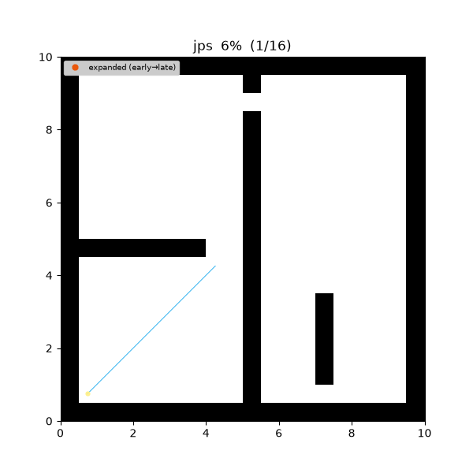
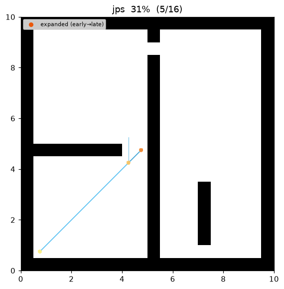
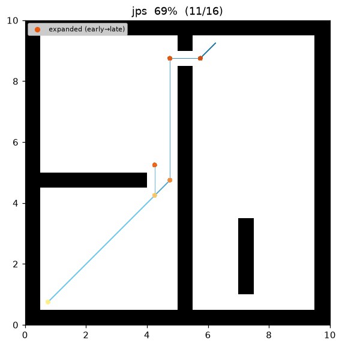
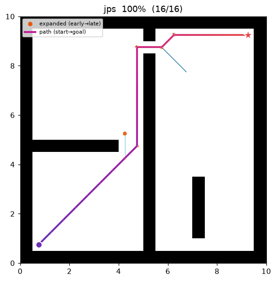
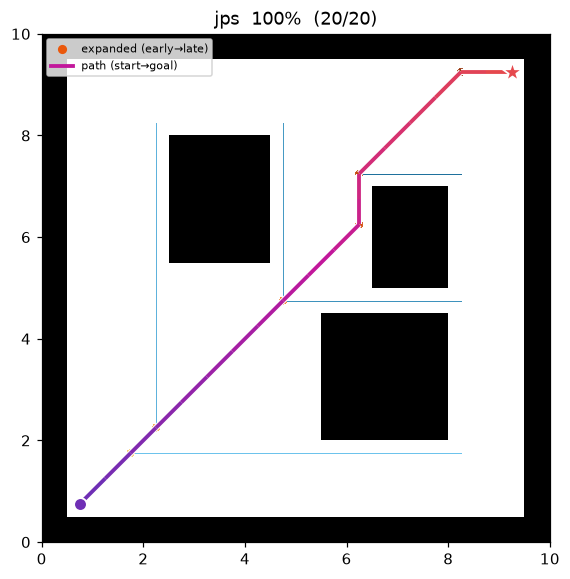

[🇰🇷 한국어](../../ko/algorithms/jps.md) | [🇬🇧 English](jps.md)

# JPS (Jump Point Search)
{: .no_toc }

| Item | Description |
|---|---|
| Category | informed graph search (grid symmetry breaking) |
| Required capability | `DiscreteSpace` + `DynamicGridSpace` (`is_blocked` as the jump oracle) |
| Completeness | complete (finite 8-connected grid) |
| Optimality | **cost-optimal** — identical paths to 8-connected A* |
| Complexity | same worst case as A*, but expands only jump points |
| Original paper | Harabor & Grastien (2011) [^harabor] |

1. TOC
{:toc}

## Background

On a **uniform-cost 8-connected grid**, A* wastes almost all of its work on *symmetry*: the many grid paths between two open cells that share the same length are all explored, even though they are interchangeable. Jump Point Search[^harabor] removes that redundancy without changing the result. It is a strict optimization of A* — same heuristic, same optimal path, same `g`/`f` machinery — that replaces "expand every neighbour" with "**jump** to the next cell that actually matters."

From a node, JPS scans a fixed direction and skips over every cell whose optimal path is just "keep going the same way." It stops only at a **jump point**: the goal, or a cell that has a *forced neighbour* — a neighbour that an adjacent obstacle makes reachable optimally **only** by turning here. Everything in between is provably not a decision point, so it never enters the open list. The result is the same path as 8-connected A* while expanding a tiny fraction of the nodes.

## How It Works

Search on `maze01`. Instead of a growing frontier of cells, only a handful of jump points (turning cells) are ever expanded — the long straight/diagonal runs between them are skipped.



Intermediate search progress (left → right: early / middle / final path):

| | | |
|:---:|:---:|:---:|
|  |  |  |

Final result on `open01` — with no obstacles there are no forced neighbours at all, so JPS jumps straight from start to the walls and the goal:



```
JPS(start, goal):
    g[start] ← 0; open ← priority queue keyed by f = g + h        # h = octile
    while open is not empty:
        u ← open.pop_min()
        if u == goal: return reconstruct(u)
        for d in pruned_directions(u, parent[u]):                 # natural + forced
            p ← jump(u, d)                                        # skip to next jump point
            if p is null: continue
            if g[u] + octile(u, p) < g[p]:                        # A* relaxation
                g[p] ← g[u] + octile(u, p); parent[p] ← u
                open.push(p, g[p] + octile(p, goal))
    return failure

jump(x, d):
    n ← step(x, d)                          # one grid step; null if blocked / corner-cut
    if n is null: return null
    if n == goal: return n
    if has_forced_neighbour(n, d): return n
    if d is diagonal:
        if jump(n, d.horizontal) or jump(n, d.vertical): return n   # a component jumps ⇒ n matters
    return jump(n, d)                        # keep scanning the same direction
```

The only line that differs from A* is the successor generator: A* pushes the ≤ 8 neighbours; JPS pushes the jump points. The `g`/`f`/open-list logic is unchanged, which is why the returned paths and costs are identical.

### Pruning and jumping — no corner cutting

The rules depend on the grid's diagonal policy. This repository's grid **forbids corner-cutting**: a diagonal step needs both shared orthogonal cells free (see `OccupancyGrid2D.neighbors`). The forced-neighbour rules are therefore the *no-corner-cutting* variant of Harabor & Grastien (2011):

- **Straight run** (say moving east from `x`): the only natural successor is "east." A **forced neighbour** appears when an obstacle sits **diagonally behind** the direction of travel and the side cell next to it is open — e.g. moving east, cell `(r-1, c-1)` is blocked but `(r-1, c)` is free. That side cell (and the diagonal past it) can be reached optimally only by turning at `x`, so `x` becomes a jump point.
- **Diagonal run**: a diagonal jump first scans its two **orthogonal components**. If either finds a jump point, the current diagonal cell is itself a jump point. Because corners may not be cut, a diagonal never opens a side cell that its orthogonal scans don't already cover, so it needs no separate forced-neighbour rule.
- **Cost of a jump.** A jump point is always reached by a *pure* straight or diagonal line, so the true traversed cost from `x` to jump point `p` is exactly the **octile distance**

$$
\text{octile}(x,p)=\bigl(\max(\Delta r,\Delta c)-\min(\Delta r,\Delta c)\bigr)+\sqrt2\cdot\min(\Delta r,\Delta c),
$$

  the same value 8-connected A* would accumulate step by step. This is why JPS's `g`-values, and hence the returned cost, match A* bit-for-bit.

The single-cell "is this blocked or out of bounds?" query the jump needs is exactly `DynamicGridSpace.is_blocked`, so JPS reuses that capability as its oracle and adds none of its own.

Measurements (Python, trace on):

| map | path cost | expanded nodes | ref: A\* expanded |
|---|---|---|---|
| maze01 | 28.728 (optimal, same as A\*) | **8** | 108 |
| open01 | 25.213 (optimal, same as A\*) | **8** | 71 |

Same optimal cost as A*, an order of magnitude fewer expansions.

Reproduce:

```bash
python python/demos/demo_jps.py \
  --map maps/grid/maze01.yaml --scenario maps/scenarios/maze01_s1.yaml \
  --params configs/global_planning/jps.yaml --trace out/jps.jsonl
python tools/viz/replay.py out/jps.jsonl --gif out/jps.gif --snapshots out/jps_snaps/
```

## Properties

- **Completeness**: complete on a finite 8-connected grid — the jump rules never skip a required turning point.
- **Optimality**: returns exactly the 8-connected A* optimum. JPS is a lossless successor-pruning of A*, not an approximation.
- **Complexity**: worst case matches A* (a maze of one-cell corridors degenerates to expanding every cell), but on open terrain the expansion count collapses because long runs are skipped in O(run length) scans that never touch the open list.

## Why the pruning is optimality-preserving

The invariant JPS maintains is: **for every optimal path there exists an optimal path that only turns at jump points.** A straight or diagonal run through a cell with no forced neighbour has a *symmetric* alternative that reaches the same successor at the same cost without stopping there — so that cell can be safely skipped. A forced neighbour is precisely the situation where the symmetric alternative is blocked by an obstacle, which is why those cells (and the goal) are kept as decision points. Since (i) every kept successor is reached by a legal, corner-cut-free line whose cost equals the octile distance, and (ii) no optimal turning point is ever skipped, running A* over jump points explores a subgraph that still contains an optimal solution. JPS therefore returns a path of cost exactly $C^\ast$, identical to 8-connected A*.

## Parameters

JPS has **no tunable parameters** — on a uniform-cost 8-connected grid the pruning is fully determined by the obstacles, and the octile heuristic with weight 1 is already optimal. `configs/global_planning/jps.yaml` declares an empty parameter set.

## Emitted Trace Events

`planning_started` → (`node_expanded`, `edge_added`)* → `path_found` → `planning_finished`

`node_expanded` fires once per expanded **jump point** and `edge_added` links a parent jump point to each jump-point successor (cost = octile distance of the jump), so the replay shows the sparse jump-point graph rather than a dense frontier. The reconstructed `path` is interpolated back to the full staircase of grid cells, matching how A* reports its path.

## References

[^harabor]: Harabor, D., & Grastien, A. (2011). "Online Graph Pruning for Pathfinding on Grid Maps." *Proc. AAAI Conference on Artificial Intelligence*, 1114–1119. [PDF](https://ojs.aaai.org/index.php/AAAI/article/view/7994)
