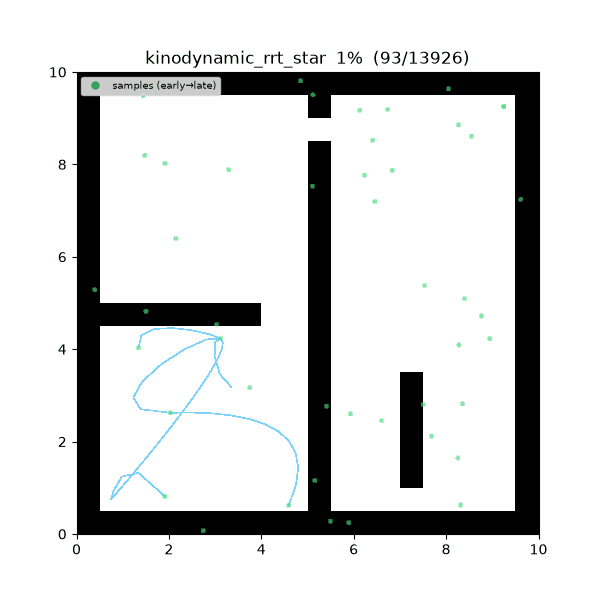
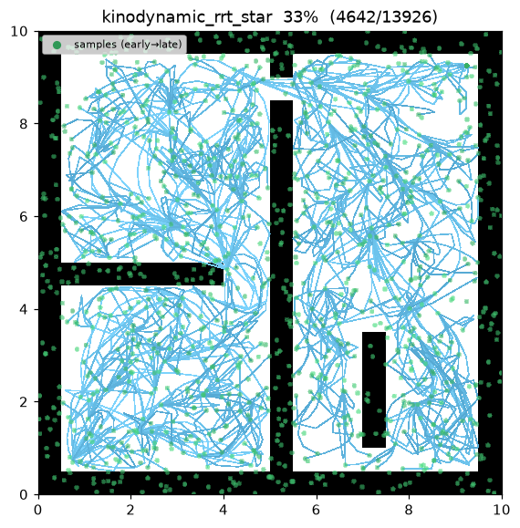
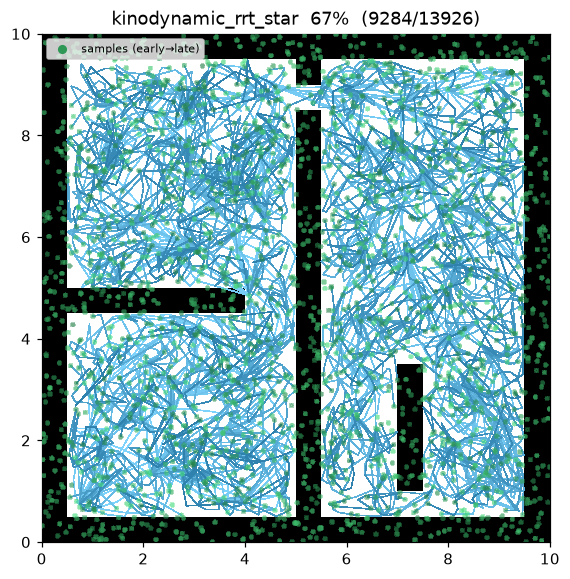
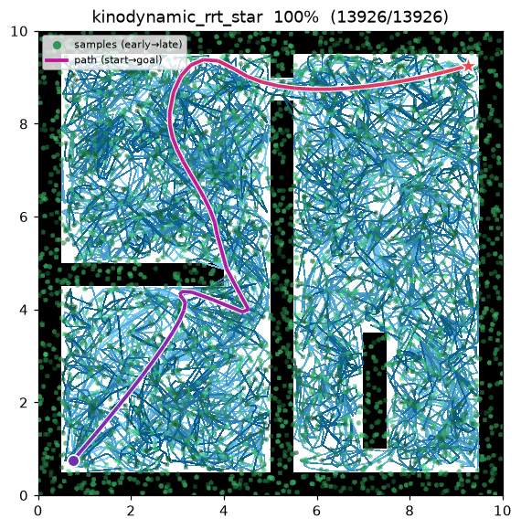
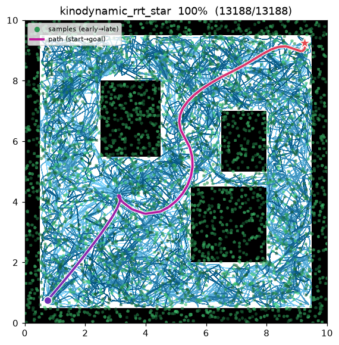

[🇰🇷 한국어](../../ko/algorithms/kinodynamic_rrt_star.md) | [🇬🇧 English](kinodynamic_rrt_star.md)

# Kinodynamic RRT*
{: .no_toc }

| Item | Description |
|---|---|
| Category | sampling-based, single-query, anytime, **kinodynamic** |
| Required capability | `SamplingSpace` |
| Completeness | probabilistically complete |
| Optimality | **asymptotically optimal** in the cost of the dynamics (Webb & van den Berg 2013) |
| Complexity | dominated by the optimal-steering solve (a quartic root) per near-neighbor per iteration |
| Original paper | Webb & van den Berg (2013) [^webb] |

1. TOC
{:toc}

## Background

Geometric RRT* connects nodes with **straight segments** and measures them by Euclidean distance. That is invalid for a robot with dynamics: a car or a quadrotor cannot instantaneously change velocity, so a straight line between two states is not a trajectory it can execute. Webb & van den Berg[^webb] extended RRT* to systems with **differential constraints** by replacing the straight edge and the Euclidean metric with the trajectory and cost of a **fixed-final-state, free-final-time optimal controller**.

For a controllable linear system $\dot{x}=Ax+Bu$ with running cost $J=\int_0^\tau\!\bigl(1+u^\top R\,u\bigr)\,dt$, there is a closed-form optimal arrival cost between any two states. Kinodynamic RRT* uses that cost as **both** the nearest-neighbor metric **and** the choose-parent / rewire cost — exactly the roles Euclidean distance plays in geometric RRT*. The tree therefore grows and straightens in the *cost geometry induced by the dynamics* rather than in Euclidean space.

This implementation owns a **2D double integrator**: state $(x, y, v_x, v_y)$, control = acceleration. It depends only on the `SamplingSpace` capability — the map answers `is_state_valid` / `is_motion_valid` on the $(x, y)$ projection and knows nothing about velocity. Start and goal are lifted to **rest** states (velocity 0).

## How It Works

`maze01` — the tree edges are curved (they are double-integrator trajectories, not straight lines); rewiring straightens the incumbent in cost space.



Intermediate search progress (left → right: early / middle / final path):

| | | |
|:---:|:---:|:---:|
|  |  |  |

Final result on `open01`:



```
KINODYNAMIC_RRT_STAR(start, goal):
    x_start ← (start, v=0);  x_goal ← (goal, v=0)      # lifted to rest states
    T ← {x_start}
    for i in 1..max_iterations:                        # anytime — runs the full budget
        x_rand ← (goal rest-state w.p. goal_bias) else (sample position, random velocity)
        x_near ← argmin_{x∈T} c*(x, x_rand)            # metric = optimal-control cost
        x_new  ← x_rand                                # optimal steering reaches it exactly
        N ← near(T, x_new, neighbor_radius)
        parent ← argmin_{x∈N∪{x_near}} cost(x) + c*(x, x_new)   # choose-parent (feasible edge)
        T.add(x_new, parent)                           # edge = optimal trajectory, collision-checked
        for x ∈ N:                                     # rewire
            if cost(x_new) + c*(x_new, x) < cost(x) and trajectory(x_new,x) free:
                x.parent ← x_new
        if ‖x_new − goal‖ ≤ goal_tolerance:
            best ← min(best, path through x_new to x_goal)
    return best
```

Here $c^*(a,b)$ is the optimal-control cost of the trajectory from $a$ to $b$, and every edge is **collision-checked by sampling the trajectory** and calling `is_motion_valid` on consecutive waypoints (the same validation geometric RRT* applies to a straight edge).

Measurements (Python, seed = 1, 4000 iterations, trace on):

| map | path cost | tree size | runtime |
|---|---|---|---|
| maze01 | 31.373 | 2,329 | ~3.1 s |
| open01 | 26.888 | 2,143 | ~3.2 s |

The C++ implementation is the identical algorithm (build with `cmake` and run `demo_kinodynamic_rrt_star`); random streams differ from Python so the exact cost differs slightly, as with the other planners.

Reproduce:

```bash
python python/demos/demo_kinodynamic_rrt_star.py \
  --map maps/grid/maze01.yaml --scenario maps/scenarios/maze01_s1.yaml \
  --params configs/global_planning/kinodynamic_rrt_star.yaml --trace out/kino.jsonl
python tools/viz/replay.py out/kino.jsonl --gif out/kino.gif
```

## Optimal Steering — Closed Form

The whole planner rests on one closed-form primitive: the optimal cost, arrival time, and trajectory between two states of the double integrator (Webb & van den Berg 2013)[^webb].

**System.** With position $p\in\mathbb{R}^2$ and velocity $v\in\mathbb{R}^2$, state $x=(p,v)$,

$$
A=\begin{bmatrix}0 & I_2\\ 0 & 0\end{bmatrix},\quad
B=\begin{bmatrix}0\\ I_2\end{bmatrix},\quad
R=r\,I_2 .
$$

$A$ is nilpotent ($A^2=0$), so $e^{At}=I+At$. The weighted controllability Gramian
$G(t)=\int_0^t e^{A(t-s)}BR^{-1}B^\top e^{A^\top(t-s)}\,ds$ decouples per axis into the $2\times2$ block

$$
G_{\text{axis}}(t)=\frac1r\begin{bmatrix}t^3/3 & t^2/2\\ t^2/2 & t\end{bmatrix}.
$$

**Cost.** With $d(t)=x_1-e^{At}x_0$, the cost-to-go for arrival time $t$ is $c(t)=t+d(t)^\top G(t)^{-1}d(t)$. Summed over the two axes, writing $a=p_1-p_0$ and $v_0,v_1$ the per-axis endpoint velocities,

$$
c(t)=t+r\!\left(\frac{C_3}{t^3}+\frac{C_2}{t^2}+\frac{C_1}{t}\right),\qquad
\begin{aligned}
C_3&=\textstyle\sum 12\,a^2,\\
C_2&=\textstyle\sum -12\,a\,(v_0+v_1),\\
C_1&=\textstyle\sum 4\,(v_0^2+v_0v_1+v_1^2).
\end{aligned}
$$

**Optimal arrival time.** Setting $c'(t)=0$ and clearing $t^4$ gives the (already depressed — no cubic term) quartic

$$
t^4-r\,C_1\,t^2-2r\,C_2\,t-3r\,C_3=0 ,
$$

whose positive real root minimizing $c(t)$ is $\tau^*$. (The implementation finds all four roots — `numpy.roots` in Python, Durand–Kerner in C++ — and keeps the positive real minimizer.)

**Optimal trajectory.** The position trajectory realizing $c(\tau^*)$ is, per axis, the unique **cubic** through $(p_0,v_0)$ at $t=0$ and $(p_1,v_1)$ at $t=\tau^*$ — the minimum-$\int\lVert u\rVert^2$ Hermite interpolant. It is sampled to collision-check the edge and to render the curved trajectory.

**Metric contract.** $c^*(x,x)=0$ and $c^*(x,y)>0$ for $x\ne y$; a larger control weight $r$ raises the cost of the same maneuver.

## Properties

- **Completeness**: probabilistically complete[^webb].
- **Optimality**: asymptotically optimal in the dynamics cost $J$ — the incumbent converges to the minimum-$J$ trajectory as samples → ∞[^webb].
- **Difference from geometric RRT***: the edge is a dynamically feasible trajectory and the metric is the control cost, so paths respect the robot's inertia. The price is a quartic solve per candidate edge instead of a Euclidean distance.
- **Practical notes**: this implementation uses a fixed `neighbor_radius` (a position prefilter) and caps the neighborhood / nearest-candidate set for tractability, a k-nearest RRT* variant (Karaman & Frazzoli 2011); the selection among candidates still uses the exact optimal cost.

## Parameters

| Name | Type | Default | Range | Description |
|---|---|---|---|---|
| `max_iterations` | int | 4000 | [1, 200000] | Iteration budget (anytime — current best is returned when exhausted) |
| `goal_bias` | float | 0.1 | [0.0, 1.0] | Probability of sampling the goal rest-state directly |
| `goal_tolerance` | float | 1.0 | [0.0, 100.0] | Position radius within which a goal connection is attempted (m) |
| `neighbor_radius` | float | 2.0 | [0.01, 100.0] | Choose-parent / rewire position neighborhood radius (m) |
| `control_weight` | float | 1.0 | [0.001, 1000.0] | Control cost weight $r$ in $J=\int 1+r\,u^\top u\,dt$ (Webb & van den Berg 2013) |
| `max_velocity` | float | 1.5 | [0.01, 100.0] | Per-axis sampled velocity range $[-v_{\max}, v_{\max}]$ (m/s) |
| `seed` | int | 1 | [0, 2^31−1] | Random seed (reproducibility) |

## Emitted Trace Events

`planning_started` → (`sample_drawn`, `candidate_evaluated`, `edge_added`, `rewire`*)* → `path_found`* → `planning_finished`

`path_found` can be emitted multiple times (each time the incumbent improves). Edges are emitted as a chain of chords along each optimal trajectory, so the viz renders the curve.

## References

[^webb]: Webb, D. J., & van den Berg, J. (2013). "Kinodynamic RRT*: Asymptotically Optimal Motion Planning for Robots with Linear Dynamics." *IEEE International Conference on Robotics and Automation (ICRA)*, 5054–5061. [doi:10.1109/ICRA.2013.6631299](https://doi.org/10.1109/ICRA.2013.6631299) · [PDF (arXiv)](https://arxiv.org/abs/1205.5088)
