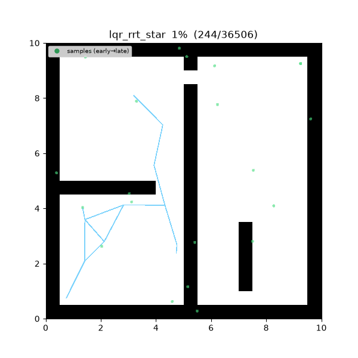
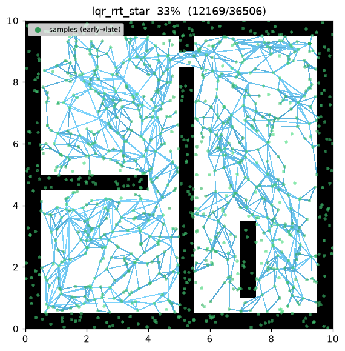
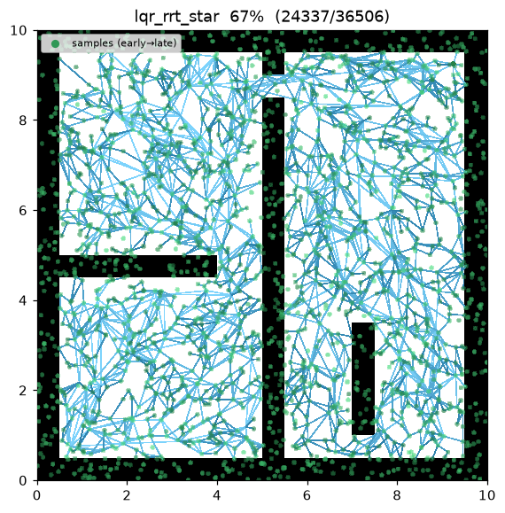
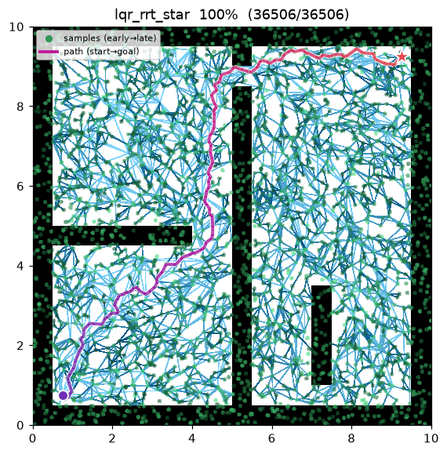
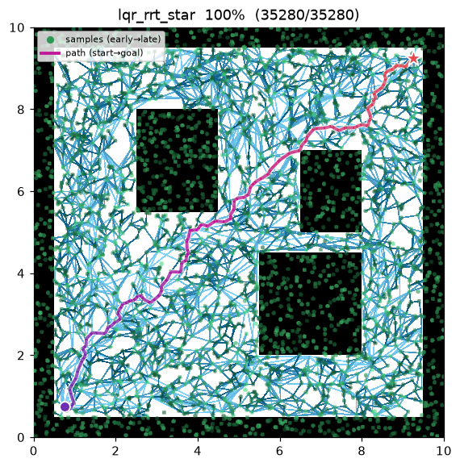

[🇰🇷 한국어](../../ko/algorithms/lqr_rrt_star.md) | [🇬🇧 English](lqr_rrt_star.md)

# LQR-RRT*
{: .no_toc }

| Item | Description |
|---|---|
| Category | sampling-based, single-query, anytime, **kinodynamic** |
| Required capability | `SamplingSpace` |
| Completeness | probabilistically complete |
| Optimality | asymptotically optimal in the LQR cost (Perez et al. 2012) |
| Complexity | dominated by an LQR feedback roll (integration) per near-neighbor per iteration; the metric/gain solve the Riccati equation **once** and are reused |
| Original paper | Perez, Platt, Konidaris, Kaelbling & Lozano-Pérez (2012) [^lqr] |

1. TOC
{:toc}

## Background

Applying RRT* to a system with dynamics needs two **extension heuristics**: a
**distance metric** between two states and a **steering** function that reaches
from one state toward another. Geometric RRT* gets both for free (Euclidean
distance, straight lines), but with dynamics both are hard to design by hand.
Kinodynamic RRT*[^webb] obtains them by solving a fixed-final-state OBVP exactly
(2013), but that closed form must be derived per system.

Perez et al.[^lqr] instead **derive both automatically from an LQR** (Linear-Quadratic
Regulator). Linearise the dynamics and pick a quadratic cost
$J=\int(x^\top Q x + u^\top R u)\,dt$; the LQR solution then supplies

- the **distance metric** $\mathrm{dist}(a,b)=(a-b)^\top S\,(a-b)$, where $S$ is the
  Riccati cost-to-go matrix, and
- **steering** — the LQR feedback policy $u=-K(x-x_\text{ref})$, with
  $K=(R+B^\top P B)^{-1}B^\top P A$, integrated forward.

No bespoke metric/steer is needed. It sits **between** geometric RRT* (2011, straight
edges / Euclidean metric) and Kinodynamic RRT* (2013, exact OBVP): the LQR gives a
cheap, general *feedback* extension at the price of being asymptotic rather than an
exact two-point solve.

This implementation owns the **same 2D double integrator** as this repo's Kinodynamic
RRT* — state $(x, y, v_x, v_y)$, control = acceleration — so the two compare on one
benchmark. It depends only on the `SamplingSpace` capability: the map answers
`is_motion_valid` on the $(x, y)$ projection and knows nothing of velocity.

## How It Works

`maze01` — tree edges are LQR feedback trajectories (curved). Nodes are rest states,
so each edge is a feasible smooth accelerate/decelerate trajectory from a parent to a
child rest state; rewiring straightens the incumbent in LQR-cost space.



Intermediate search progress (left → right: early / middle / final path):

| | | |
|:---:|:---:|:---:|
|  |  |  |

Final result on `open01`:



```
LQR_RRT_STAR(start, goal):
    S, K ← SOLVE_RICCATI(A, B, Q, R)                   # DARE once — derives metric/gain
    x_start ← (start, v=0);  x_goal ← (goal, v=0)      # lifted to rest states
    T ← {x_start}
    for i in 1..max_iterations:                        # anytime — runs the full budget
        x_rand ← (goal rest-state w.p. goal_bias) else (sample position, random velocity)
        x_near ← argmin_{x∈T} (x−x_rand)ᵀ S (x−x_rand)  # LQR metric
        x_new  ← rest waypoint step_size toward x_rand from x_near
        (edge, c) ← LQR_STEER(x_near, x_new)           # integrate u=−K(x−x_new), collision-check
        if edge = ∅: continue
        N ← near(T, x_new, neighbor_radius)
        parent ← argmin_{x∈N∪{x_near}} cost(x) + LQR_STEER(x, x_new).cost   # choose-parent
        T.add(x_new, parent)
        for x ∈ N:                                     # rewire
            if cost(x_new) + LQR_STEER(x_new, x).cost < cost(x): x.parent ← x_new
        if ‖x_new − goal‖ ≤ goal_tolerance:
            best ← min(best, path through x_new to x_goal)
    return best
```

`LQR_STEER(a,b)` integrates the feedback policy $u=-K(x-b)$ (clamped) from $a$ toward
the rest target $b$, yielding the trajectory and its realised LQR cost
$\sum(x^\top Q x + u^\top R u)\,dt$. Every trajectory is collision-checked by sampling
waypoints and calling `is_motion_valid` (the same validation geometric RRT* applies to
a straight edge).

Measurements (Python, seed = 1, 4000 iterations, trace on):

| map | path cost (LQR) | tree size | runtime |
|---|---|---|---|
| maze01 | 4.643 | 2,904 | ~1.9 s |
| open01 | 4.269 | 2,775 | ~1.8 s |

The cost scale differs from Kinodynamic RRT* by design — the LQR stage cost
$\int x^\top Q x + u^\top R u$ is a different functional than Webb's $\int 1+u^\top R u$.
The C++ implementation is the identical algorithm; its random stream differs from
Python so the exact cost differs slightly, as with the other planners.

Reproduce:

```bash
python python/demos/demo_lqr_rrt_star.py \
  --map maps/grid/maze01.yaml --scenario maps/scenarios/maze01_s1.yaml \
  --params configs/global_planning/lqr_rrt_star.yaml --trace out/lqr.jsonl
python tools/viz/replay.py out/lqr.jsonl --gif out/lqr.gif
```

## Automatically Derived Extension Heuristics — the LQR

**System.** With position $p\in\mathbb{R}^2$ and velocity $v\in\mathbb{R}^2$, state
$x=(p,v)$, the double integrator decouples per axis:

$$
A=\begin{bmatrix}0 & 1\\ 0 & 0\end{bmatrix},\quad
B=\begin{bmatrix}0\\ 1\end{bmatrix},\quad
Q=\mathrm{diag}(q_\text{pos}, q_\text{vel}),\quad
R=r_\text{ctrl}.
$$

**Riccati.** The infinite-horizon LQR cost-to-go matrix $S$ satisfies the algebraic
Riccati equation. In continuous time,

$$
A^\top S + S A - S B R^{-1} B^\top S + Q = 0,
$$

with optimal gain $K=R^{-1}B^\top S$. The implementation discretises over $dt$
($A_d=[[1,dt],[0,1]]$, $B_d=[[dt^2/2],[dt]]$) and takes the fixed point of the
**discrete Riccati recursion (DARE)**:

$$
P \leftarrow Q + A_d^\top P A_d - A_d^\top P B_d\,(R + B_d^\top P B_d)^{-1} B_d^\top P A_d,\qquad
K = (R + B_d^\top P B_d)^{-1} B_d^\top P A_d.
$$

The double integrator is controllable and $Q\succ0$, so the iteration from $P_0=Q$
converges to the unique stabilising solution. Because the system is LTI and $Q$ is
block-diagonal, $S$ and $K$ are **state-independent** — identical per axis and across
iterations — so they are solved **once** at planner start. (The decisive difference
from Kinodynamic RRT*: it has no Riccati solve — it roots a quartic for an exact
optimal arrival time per candidate edge. Here the metric/steer come from $S,K$.)

With defaults $q_\text{pos}=q_\text{vel}=r_\text{ctrl}=1$, $dt=0.2$:
$S\approx\begin{bmatrix}9.19 & 5.02\\ 5.02 & 9.23\end{bmatrix}$, $K\approx[0.841,\ 1.546]$.

**Distance metric.** Summed over the two axes,

$$
\mathrm{dist}(a,b)=(a-b)^\top S\,(a-b)
= S_{00}(\Delta p_x^2+\Delta p_y^2) + 2S_{01}(\Delta p_x \Delta v_x + \Delta p_y \Delta v_y)
+ S_{11}(\Delta v_x^2 + \Delta v_y^2).
$$

Zero iff $a=b$, else positive. Since samples carry a velocity, nearest-neighbour
selection reflects velocity direction as well as position (direction-aware, unlike
Euclidean). Changing $Q/R$ changes $S$, hence the cost of the same maneuver.

**Steering.** The feedback policy $u=-K(x-x_\text{ref})$ is integrated with step $dt$
(inputs clamped to $|u|\le u_\text{max}$). Lifting nodes to **rest** states makes rest
an equilibrium of the double integrator, so the closed loop $A-BK$ is Hurwitz — it
regulates onto the target with no steady-state offset. Every stored edge is therefore a
real, collision-free, dynamically-feasible trajectory that reaches its child, which
keeps the RRT* rewiring exact. Samples still carry a random velocity so the nearest
metric is full-state, while the extension steers to a rest waypoint at most `step_size`
away toward the sample.

## Properties

- **Completeness**: probabilistically complete[^lqr].
- **Optimality**: asymptotically optimal in the LQR cost where the linearisation is
  locally valid — the incumbent converges to the minimum-LQR-cost trajectory[^lqr].
- **Difference from Kinodynamic RRT***: the extension is an **LQR feedback** rather than
  an exact two-point OBVP — cheap (one Riccati solve + an integration per candidate) and
  general, but asymptotic. This implementation lifts nodes to rest states to make
  regulation reach exactly (rest→rest), at the price that the path comes to rest at each
  waypoint — a sequence of smooth accelerate/decelerate arcs, in contrast to Kinodynamic
  RRT* carrying momentum through waypoints.
- **Practical notes**: a fixed `neighbor_radius` (position prefilter) with the
  near/nearest candidate set capped for tractability (a k-nearest RRT* variant, Karaman
  & Frazzoli 2011); the selection among candidates still uses the exact LQR cost.

## Parameters

| Name | Type | Default | Range | Description |
|---|---|---|---|---|
| `max_iterations` | int | 4000 | [1, 200000] | Iteration budget (anytime — current best returned when exhausted) |
| `step_size` | float | 1.5 | [0.01, 100.0] | Extension cap $\eta$ (m): distance to the rest waypoint toward the sample |
| `goal_bias` | float | 0.1 | [0.0, 1.0] | Probability of sampling the goal rest-state directly |
| `goal_tolerance` | float | 1.0 | [0.0, 100.0] | Position radius within which a goal connection is attempted (m) |
| `neighbor_radius` | float | 2.0 | [0.01, 100.0] | Choose-parent / rewire position neighborhood radius (m) |
| `q_pos` | float | 1.0 | [0.001, 1000.0] | LQR position state weight $q_\text{pos}$ ($Q=\mathrm{diag}(q_\text{pos},q_\text{vel})$) |
| `q_vel` | float | 1.0 | [0.001, 1000.0] | LQR velocity state weight $q_\text{vel}$ |
| `r_ctrl` | float | 1.0 | [0.001, 1000.0] | LQR control weight $r$ ($R=r\,I$) |
| `lqr_dt` | float | 0.2 | [0.01, 10.0] | LQR discretisation / integration step (s) |
| `control_limit` | float | 10.0 | [0.01, 1000.0] | Per-axis control input clamp $|u|\le$ (m/s²) |
| `max_velocity` | float | 1.5 | [0.01, 100.0] | Sampled velocity range for the nearest metric $[-v_{\max}, v_{\max}]$ (m/s) |
| `seed` | int | 1 | [0, 2^31−1] | Random seed (reproducibility) |

## Emitted Trace Events

`planning_started` → (`sample_drawn`, `candidate_evaluated`, `edge_added`, `rewire`*)* → `path_found`* → `planning_finished`

`path_found` can be emitted multiple times (each time the incumbent improves). Edges are
emitted as a chain of chords along each LQR feedback trajectory, so the viz renders the
curve.

## References

[^lqr]: Perez, A., Platt, R., Konidaris, G., Kaelbling, L., & Lozano-Pérez, T. (2012). "LQR-RRT\*: Optimal Sampling-Based Motion Planning with Automatically Derived Extension Heuristics." *IEEE International Conference on Robotics and Automation (ICRA)*, 2537–2542. [doi:10.1109/ICRA.2012.6225177](https://doi.org/10.1109/ICRA.2012.6225177) · [PDF](https://lis.csail.mit.edu/pubs/perez-icra12.pdf)

[^webb]: Webb, D. J., & van den Berg, J. (2013). "Kinodynamic RRT\*: Asymptotically Optimal Motion Planning for Robots with Linear Dynamics." *IEEE International Conference on Robotics and Automation (ICRA)*, 5054–5061. [doi:10.1109/ICRA.2013.6631299](https://doi.org/10.1109/ICRA.2013.6631299) · [PDF (arXiv)](https://arxiv.org/abs/1205.5088)
