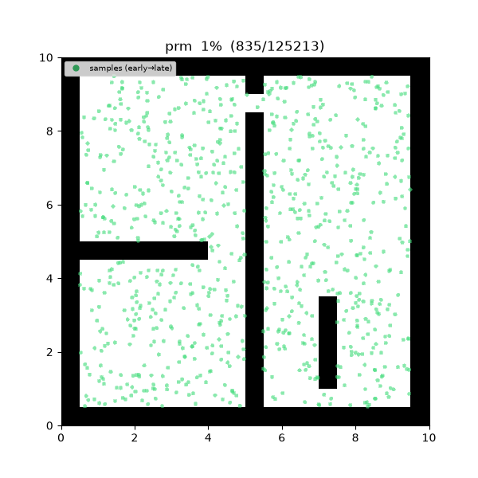
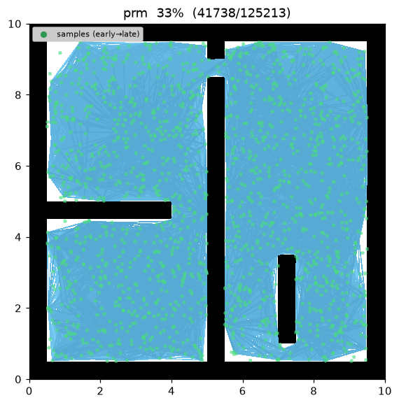
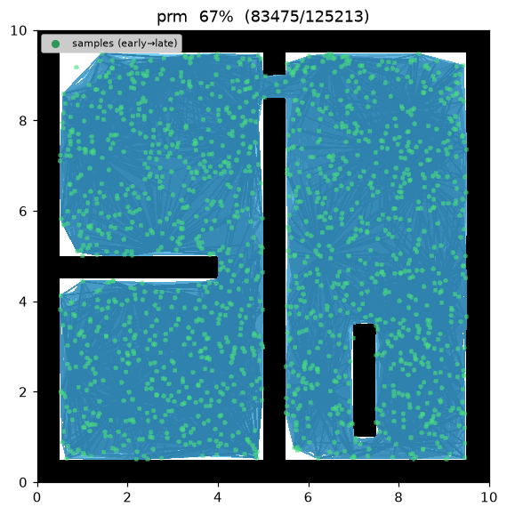
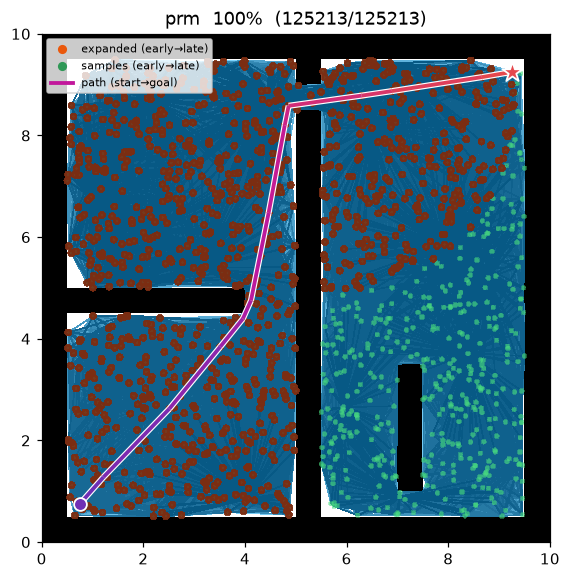
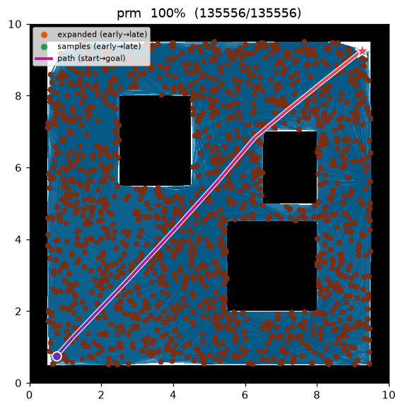

[🇰🇷 한국어](../../ko/algorithms/prm.md) | [🇬🇧 English](prm.md)

# PRM (Probabilistic Roadmap)
{: .no_toc }

| Item | Description |
|---|---|
| Category | sampling-based, multi-query roadmap (used here single-query) |
| Required capability | `SamplingSpace` |
| Completeness | probabilistically complete |
| Optimality | **not asymptotically optimal** — fixed radius, so quality depends on samples and radius |
| Complexity | O(n²) edge checks (naive) + Dijkstra query O(E log V) |
| Original paper | Kavraki, Švestka, Latombe & Overmars (1996) [^kavraki] |

1. TOC
{:toc}

## Background

Kavraki et al.[^kavraki] proposed the **roadmap** method to answer many queries (multi-query) quickly
in high-dimensional configuration spaces. By sampling free space up front into a graph, each later
start→goal query reduces to a shortest-path search over that graph. This project uses the roadmap in a
**single-query** form (rebuilt per query), but the algorithmic skeleton is exactly the original.

PRM is the **roadmap foundation** on which the later asymptotically optimal variants
([PRM\*](prm_star.md), [FMT\*](fmt_star.md), [BIT\*](bit_star.md)) all build — they change only the
radius policy for *what gets connected to what*.

It has two phases:

1. **Learning** — sample `num_samples` collision-free nodes and connect every pair within
   `connection_radius` via a local planner (a collision check on the straight-line motion).
2. **Query** — add start and goal as nodes, connect them under the same radius, then run Dijkstra
   over the roadmap for the shortest path.

## How It Works

```
PRM(start, goal):
    R ← roadmap()
    R.add(start); R.add(goal)
    for i in 1..num_samples:                       # learning: sample free nodes
        q ← sample()
        if is_state_valid(q): R.add(q)
    for v in R.nodes:                               # learning: fixed-radius connect
        for u in R.nodes within connection_radius of v (u before v):
            if is_motion_valid(u, v):
                R.add_edge(u, v, distance(u, v))
    return DIJKSTRA(R, start, goal)                 # query
```

The implementation adds nodes one at a time and only attempts to connect each to nodes added *before*
it — so each undirected edge is created exactly once. Start and goal are part of the roadmap, so they
connect under the same radius rule with no separate connection step.

## Properties

- **Completeness**: probabilistically complete — if a solution exists it is found with probability 1
  as the sample count → ∞[^kavraki].
- **Optimality**: **not asymptotically optimal.** With a constant radius the edge density grows with
  the sample count; solution quality depends on `num_samples` and `connection_radius`, and convergence
  to the shortest path is not guaranteed even in the limit. [PRM\*](prm_star.md) fixes exactly this
  with its radius policy.
- **Cost**: the naive implementation examines O(n²) candidate edges by all-pairs distance checks. In a
  multi-query setting the roadmap is reused, so per-query cost amortizes to a Dijkstra run.

## Parameters

| Name | Type | Default | Range | Description |
|---|---|---|---|---|
| `num_samples` | int | 1500 | [1, 200000] | Number of collision-free samples placed in the roadmap (start/goal excluded) |
| `connection_radius` | float | 2.0 | [0.01, 100.0] | Maximum distance to connect two nodes with an edge (m) |
| `seed` | int | 1 | [0, 2^31−1] | Random seed (reproducibility) |

## Roadmap Construction and Query

**Roadmap.** For the sample set $V=\{v_1,\dots,v_n\}\subset X_{\text{free}}$ the edge set is

$$
E=\bigl\{(u,v)\in V\times V:\lVert u-v\rVert\le r,\ \text{motion}(u,v)\subset X_{\text{free}}\bigr\},
$$

i.e. every pair within the **fixed radius** $r=\texttt{connection\_radius}$ whose straight-line motion
is collision-free. Edge cost is the Euclidean distance $c(u,v)=\lVert u-v\rVert$.

**Query.** Insert start $s$ and goal $g$ into $V$ and solve, by Dijkstra over the roadmap,

$$
Y_n=\min_{\pi:\,s\rightsquigarrow g\ \text{in}\ (V,E)}\ \sum_{k}c(\pi_k,\pi_{k+1}).
$$

Because $r$ is fixed, $Y_n$ improves as the graph densifies but is not guaranteed to converge to the
optimum $c^*$ as $n\to\infty$ — the decisive difference from the asymptotically optimal variants.

## Implementation Notes

- C++: `cpp/src/global_planning/prm.cpp`, Python: `python/navigation/global_planning/prm.py`
- The roadmap data structure, connection, and Dijkstra query live in common utilities
  (`roadmap_common` / `_roadmap`) shared with [PRM\*](prm_star.md). PRM only layers a **fixed-radius**
  policy on top.
- Near-neighbour queries use `near_points` from `sampling_common` / `_sampling`, shared with the
  batch planners.

## Emitted Trace Events

`planning_started` → `sample_drawn`\* → `edge_added`\* → `node_expanded`\* → `path_found` → `planning_finished`

`sample_drawn` marks a learning-phase sample, `edge_added` a roadmap edge, and `node_expanded` a node
popped by Dijkstra during the query.

## Demo

`maze01` — samples scatter across free space, within-radius pairs are wired into a roadmap, and
Dijkstra then extracts the shortest path over it.



Intermediate search progress (left → right: early samples/edges / roadmap forming / final path):

| | | |
|:---:|:---:|:---:|
|  |  |  |

Final result on `open01` — nearly a straight line:



Measurements (Python, seed = 1, trace on):

| map | path cost | roadmap nodes | expanded (Dijkstra pops) |
|---|---|---|---|
| maze01 | 13.595 | 1,502 | 1,091 |
| open01 | 12.053 | — | — |

The C++ implementation mirrors the same scenario and produces matching results within the variance of
the two languages' random streams.

Reproduce:

```bash
python python/demos/demo_prm.py \
  --map maps/grid/maze01.yaml --scenario maps/scenarios/maze01_s1.yaml \
  --params configs/global_planning/prm.yaml --trace out/prm.jsonl
python tools/viz/replay.py out/prm.jsonl --gif out/prm.gif
```

## References

[^kavraki]: Kavraki, L. E., Švestka, P., Latombe, J.-C., & Overmars, M. H. (1996). "Probabilistic roadmaps for path planning in high-dimensional configuration spaces." *IEEE Transactions on Robotics and Automation*, 12(4), 566–580. [doi:10.1109/70.508439](https://doi.org/10.1109/70.508439)
