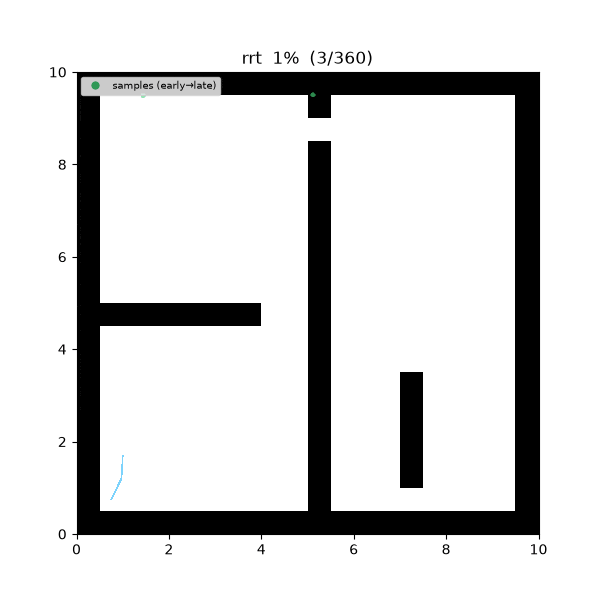
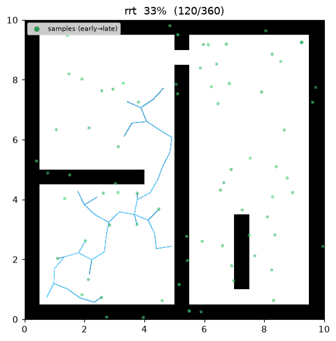
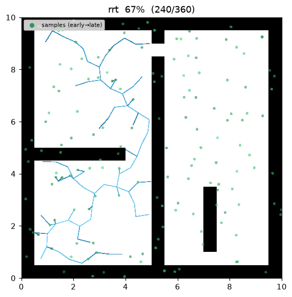
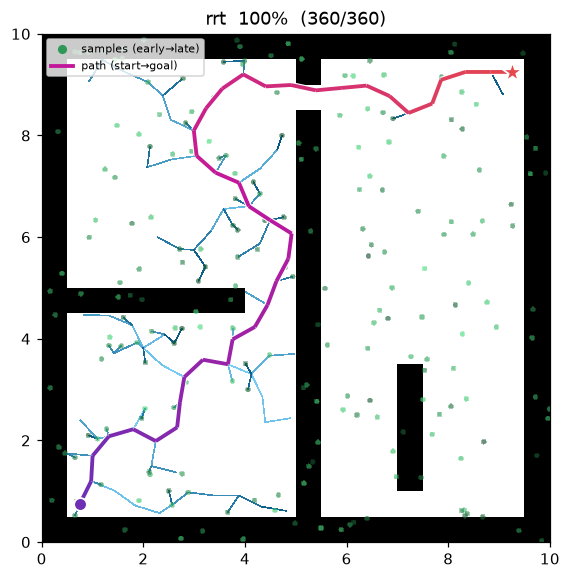
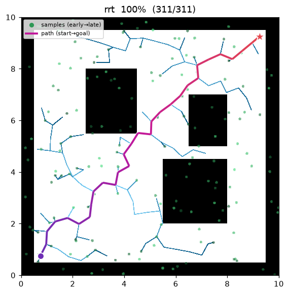
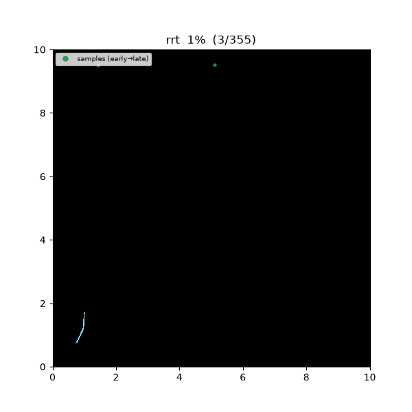
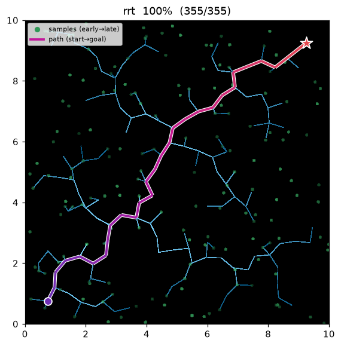
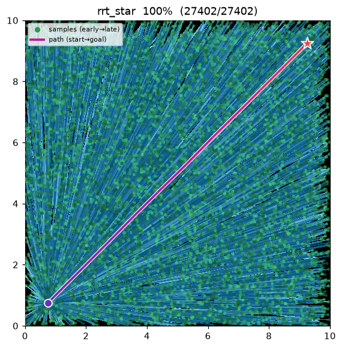

[🇰🇷 한국어](../../ko/algorithms/rrt.md) | [🇬🇧 English](rrt.md)

# RRT — Rapidly-exploring Random Tree
{: .no_toc }

| Item | Description |
|---|---|
| Category | sampling-based, single-query |
| Required capability | `SamplingSpace` |
| Completeness | probabilistically complete |
| Optimality | **non-optimal** — returns the first feasible path |
| Complexity | dominated by the nearest-neighbor query per iteration (naive O(n)) |
| Original paper | LaValle (1998) [^lavalle98] · LaValle & Kuffner (2001) [^lavalle01] |

1. TOC
{:toc}

## Background

RRT[^lavalle98] is a sampling-based planner proposed for **high-dimensional continuous state spaces** where discretization is impractical. Instead of discretizing the space up front, it explores free space by incrementally extending a tree toward random samples. Its key property is the **Voronoi bias** — because the tree node nearest to the sample is the one extended, nodes with large Voronoi regions (i.e., facing unexplored space) are more likely to be selected, so the tree extends "rapidly" into unexplored space. Kinodynamic constraints (nonholonomic vehicles, etc.) can be absorbed naturally into the steer function, which made RRT a standard tool across robotics[^lavalle01].

## How It Works

`maze01` — the tree (light blue) extends through free space and terminates as soon as it touches the goal radius. The zigzag path (purple→red) is the classic RRT signature.



Intermediate search progress (left → right: early / middle / final path):

| | | |
|:---:|:---:|:---:|
|  |  |  |

Final result on `open01`:



```
RRT(start, goal):
    T ← {start}
    for i in 1..max_iterations:
        x_rand ← (goal with prob. goal_bias) else sample()
        x_near ← nearest(T, x_rand)
        x_new  ← steer(x_near, x_rand, step_size)     # advance by η from x_near
        if is_motion_valid(x_near, x_new):
            T.add(x_new, parent = x_near)
            if distance(x_new, goal) ≤ goal_tolerance:
                return path(start → x_new) + goal
    return failure
```

- **goal bias**: with probability `goal_bias`, the goal itself is sampled instead of a random sample. Pure uniform sampling reaches the goal slowly, so this is the standard technique in practical implementations[^lavalle01].
- **steer**: advance toward the sample by at most `step_size` (η). This governs the trade-off between tree growth speed and obstacle traversal.

Measurements (Python, seed = 1, trace on):

| map | path cost | samples | tree size | Notes |
|---|---|---|---|---|
| maze01 | 18.414 | 229 | 132 | First solution returned immediately — [RRT*](rrt_star.md) reaches 13.46 |
| open01 | 14.371 | 177 | 135 | [RRT*](rrt_star.md) reaches 12.05 |

It finds a solution within a few hundred samples at the price of path quality — 19–37% longer than RRT*.

Reproduce:

```bash
python python/demos/demo_rrt.py \
  --map maps/grid/maze01.yaml --scenario maps/scenarios/maze01_s1.yaml \
  --params configs/global_planning/rrt.yaml --trace out/rrt.jsonl --seed 1
python tools/viz/replay.py out/rrt.jsonl --gif out/rrt.gif
```

## Properties

- **Completeness**: probabilistically complete — if a solution exists, the probability of finding it converges to 1 as the number of iterations → ∞[^lavalle01]. With a finite iteration budget it can fail (`max_iterations` exhausted).
- **Optimality**: none. The first feasible path is returned as-is; in fact, Karaman & Frazzoli proved that the probability of RRT converging to an optimal path is 0[^karaman]. If optimality matters, use [RRT*](rrt_star.md).
- **Stochastic results**: the same problem yields different path shapes and costs depending on the seed. This repository pins reproducibility with the `seed` parameter.

## Probabilistic Completeness & Non-optimality

**Probabilistic completeness.** If a feasible path with clearance $>0$ exists, the probability that
RRT fails to find it after $n$ samples decays exponentially to zero:

$$
P[\text{fail after $n$ samples}]\;\le\;a\,e^{-b\,n},\qquad a,b>0,
$$

so $\lim_{n\to\infty}P[\text{success}]=1$ (LaValle & Kuffner). It may still fail under a finite budget.

*Derivation (covering balls).* Cover a feasible path $\sigma$ of clearance $\delta>0$ with balls
$B_1,\dots,B_m$ of radius $\delta/2$ ($m\approx\lVert\sigma\rVert/(\delta/2)$, adjacent centres
$\le\delta/2$ apart). When the tree already reaches $B_k$, one iteration's sample lands in $B_{k+1}$
with probability $p\ge\mu(B)/\mu(X_{\text{free}})>0$, and with $\eta\ge\delta/2$ that sample actually
connects. Passing through all $m$ balls in order is therefore a chain of trials each succeeding with
probability $p$, so after $n$ iterations the probability of not completing decays like a binomial tail
$a\,e^{-bn}$ (with $b$ depending on $p,m$). If the clearance is $0$ (the path grazes an obstacle) then
$p\to0$ and the guarantee breaks. ∎

**Voronoi bias (why "rapidly").** For a uniform sample $x_{rand}$, the probability that tree node
$v$ is the nearest (and thus extended) is proportional to the volume of its Voronoi cell:

$$
P[\text{extend from $v$}]\;=\;\frac{\mu\!\left(\mathrm{Vor}(v)\right)}{\mu(X_{\text{free}})}.
$$

Nodes bordering unexplored regions own large Voronoi cells, so the tree grows preferentially toward
them.

**Non-optimality.** Let $Y_n^{\text{RRT}}$ be the path cost after $n$ iterations. Karaman & Frazzoli
proved

$$
P\!\left[\lim_{n\to\infty}Y_n^{\text{RRT}}=c^*\right]=0,
$$

i.e. RRT converges almost surely to a suboptimal cost — because the parent chosen at first
connection is never revised. For optimality, use [RRT*](rrt_star.md).

## Counterexample: RRT does not converge to the optimum

In obstacle-free open space the optimal path is the **straight line** start→goal ($c^*=12.02$). But RRT
never revises the parent fixed at first connection, so it returns a path kinked along its random
samples. In `rrt_subopt01` (a 20×20 fully free map):

| | RRT | RRT\* | straight-line optimum |
|---|---|---|---|
| path cost | **14.30** | **12.02** | 12.02 |
| route | zigzag (suboptimal) | nearly straight (optimal) | — |



| RRT — cost 14.30 (zigzag) | RRT\* — cost 12.02 (rewire → optimal) |
|:---:|:---:|
|  |  |

RRT\* densely covers the same space and rewires the tree straight, reaching the straight-line optimum,
while RRT is stuck with the kinks of its first solution forever — a visual confirmation of
$P[\lim_{n\to\infty}Y_n^{\text{RRT}}=c^*]=0$ above. [RRT\*](rrt_star.md), [FMT\*](fmt_star.md), and
[BIT\*](bit_star.md) are the family that fixes this.

```bash
python python/demos/demo_rrt.py --map maps/grid/rrt_subopt01.yaml \
  --scenario maps/scenarios/rrt_subopt01_s1.yaml --params configs/global_planning/rrt.yaml \
  --trace out/rrt_ce.jsonl --seed 1   # swap in demo_rrt_star.py to get 12.02 (optimal)
```

## Parameters

| Name | Type | Default | Range | Description |
|---|---|---|---|---|
| `max_iterations` | int | 5000 | [1, 200000] | Maximum extension iterations. Failure is returned when exceeded |
| `step_size` | float | 0.5 | [0.01, 100.0] | Steer extension distance η (m) |
| `goal_bias` | float | 0.05 | [0.0, 1.0] | Probability of sampling the goal directly |
| `goal_tolerance` | float | 0.3 | [0.0, 100.0] | Goal-reached radius (m) |
| `seed` | int | 1 | [0, 2^31−1] | Random seed (reproducibility) |

## Emitted Trace Events

`planning_started` → (`sample_drawn`, `edge_added`)* → `path_found` → `planning_finished`

## References

[^lavalle98]: LaValle, S. M. (1998). "Rapidly-exploring random trees: A new tool for path planning." Technical Report TR 98-11, Computer Science Dept., Iowa State University. [PDF](https://lavalle.pl/papers/Lav98c.pdf)
[^lavalle01]: LaValle, S. M., & Kuffner, J. J. (2001). "Randomized kinodynamic planning." *The International Journal of Robotics Research*, 20(5), 378–400. [doi:10.1177/02783640122067453](https://doi.org/10.1177/02783640122067453) · [PDF](https://lavalle.pl/papers/LavKuf01b.pdf)
[^karaman]: Karaman, S., & Frazzoli, E. (2011). "Sampling-based algorithms for optimal motion planning." *The International Journal of Robotics Research*, 30(7), 846–894. [doi:10.1177/0278364911406761](https://doi.org/10.1177/0278364911406761) · [PDF (arXiv)](https://arxiv.org/abs/1105.1186)
