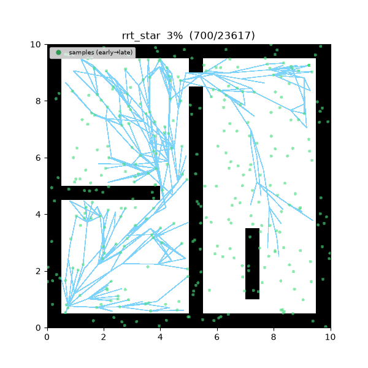
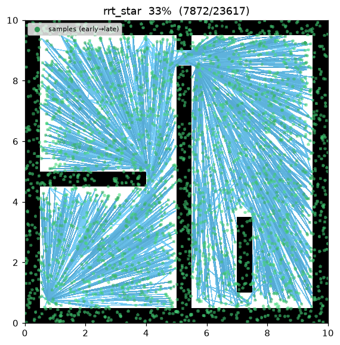
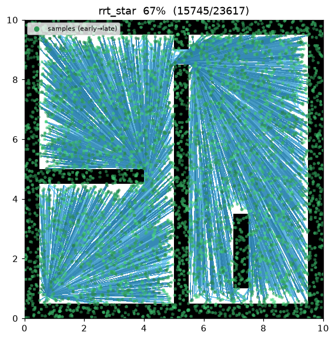
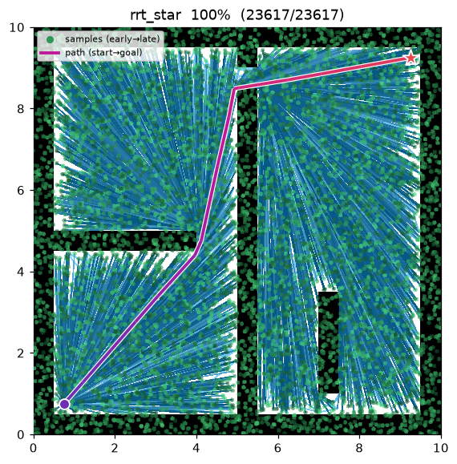
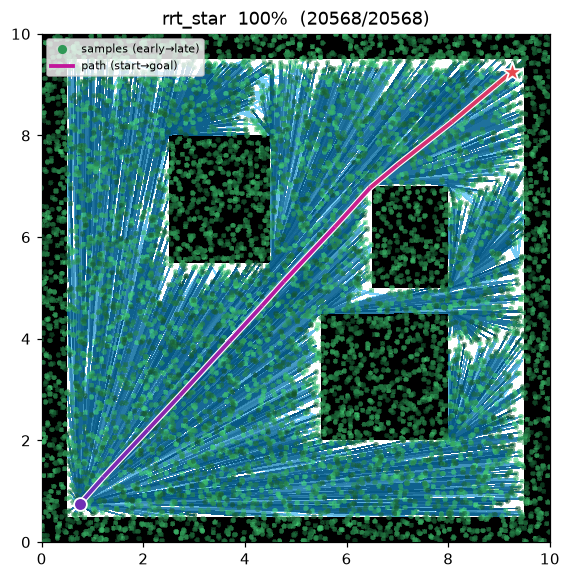

[🇰🇷 한국어](../../ko/algorithms/rrt_star.md) | [🇬🇧 English](rrt_star.md)

# RRT* (RRT-star)
{: .no_toc }

| Item | Description |
|---|---|
| Category | sampling-based, single-query, anytime |
| Required capability | `SamplingSpace` |
| Completeness | probabilistically complete |
| Optimality | **asymptotically optimal** — converges to the optimal path with probability 1 as samples → ∞ |
| Complexity | dominated by the near-neighbor query per iteration; O(n log n) total when O(log n) neighbors are examined |
| Original paper | Karaman & Frazzoli (2011) [^karaman] |

1. TOC
{:toc}

## Background

Karaman & Frazzoli[^karaman] proved that RRT **never converges to an optimal path** (convergence probability 0) and proposed RRT*, which attains asymptotic optimality by adding two local repair operations. It is a landmark paper that became the starting point of subsequent sampling-based optimal planning research (Informed RRT*, BIT*, FMT*, and more).

The difference from RRT lies in two operations applied when attaching a new node to the tree:

1. **Choose-parent** — instead of the nearest node, the parent is the neighbor within radius r that **minimizes the accumulated cost from the start**.
2. **Rewire** — for the existing neighbors within radius r, if routing through the new node is cheaper, their parent is switched to the new node. The tree keeps "straightening itself" after the fact.

## How It Works

```
RRT_STAR(start, goal):
    T ← {start}
    for i in 1..max_iterations:                       # anytime — runs the full budget
        x_rand ← (goal with prob. goal_bias) else sample()
        x_near ← nearest(T, x_rand)
        x_new  ← steer(x_near, x_rand, step_size)
        if not is_motion_valid(x_near, x_new): continue
        N ← near(T, x_new, neighbor_radius)
        parent ← argmin_{x ∈ N ∪ {x_near}} cost(x) + c(x, x_new)   # choose-parent
        T.add(x_new, parent)
        for x ∈ N:                                                 # rewire
            if cost(x_new) + c(x_new, x) < cost(x) and is_motion_valid(x_new, x):
                x.parent ← x_new
        if distance(x_new, goal) ≤ goal_tolerance:
            best ← min(best, path through x_new)       # keep searching, improving the incumbent
    return best
```

RRT stops at the first solution, but RRT* **spends its entire iteration budget**, continually improving the current best solution (the incumbent) — it is an anytime algorithm.

## Properties

- **Completeness**: probabilistically complete (same as RRT)[^karaman].
- **Optimality**: asymptotically optimal. In theory this holds when the neighbor radius shrinks as r(n) = γ(log n / n)^(1/d)[^karaman]. For simplicity, this implementation uses a **fixed radius** `neighbor_radius` — asymptotic optimality is preserved with a sufficiently large fixed radius, at a higher per-iteration cost.
- **Cost**: slower than RRT by the near query + rewire checks per iteration. A "quality ↔ time" trade-off.

## Parameters

| Name | Type | Default | Range | Description |
|---|---|---|---|---|
| `max_iterations` | int | 8000 | [1, 200000] | Iteration budget (anytime — current best is returned when exhausted) |
| `step_size` | float | 0.5 | [0.01, 100.0] | Steer extension distance η (m) |
| `goal_bias` | float | 0.05 | [0.0, 1.0] | Probability of sampling the goal directly |
| `goal_tolerance` | float | 0.3 | [0.0, 100.0] | Goal-reached radius (m) |
| `neighbor_radius` | float | 1.5 | [0.01, 100.0] | Choose-parent / rewire neighborhood radius (m) |
| `seed` | int | 1 | [0, 2^31−1] | Random seed (reproducibility) |

## Asymptotic Optimality — Proof

**The two key operations.** With the near set
$X_{\text{near}}=\{x\in T:\lVert x-x_{\text{new}}\rVert\le r_n\}$:

- **Choose-parent** —

$$
x_{\min}=\arg\min_{x\in X_{\text{near}}\cup\{x_{\text{nearest}}\}}\!\Bigl(\mathrm{cost}(x)+c(x,x_{\text{new}})\Bigr),\qquad
\mathrm{cost}(x_{\text{new}})=\mathrm{cost}(x_{\min})+c(x_{\min},x_{\text{new}}).
$$

- **Rewire** — for $x\in X_{\text{near}}$, if $\mathrm{cost}(x_{\text{new}})+c(x_{\text{new}},x)<\mathrm{cost}(x)$
  and the segment is collision-free, set $x$'s parent to $x_{\text{new}}$.

Here $c(\cdot,\cdot)$ is the collision-free segment cost.

**Theorem (asymptotic optimality, Karaman & Frazzoli 2011).** With the near radius

$$
r_n=\min\!\left\{\gamma_{\text{RRT}^*}\left(\frac{\log n}{n}\right)^{1/d},\;\eta\right\},\qquad
\gamma_{\text{RRT}^*}>\gamma^*=2\left(1+\frac1d\right)^{1/d}\left(\frac{\mu(X_{\text{free}})}{\zeta_d}\right)^{1/d}
$$

($\zeta_d$ = volume of the unit $d$-ball),

$$
P\!\left[\lim_{n\to\infty}Y_n^{\text{RRT}^*}=c^*\right]=1.
$$

*Intuition.* Shrinking the radius as $(\log n/n)^{1/d}$ while keeping it large enough leaves each
node with an expected $\Theta(\log n)$ near-neighbors, so rewiring recovers, in the limit, a path in
the same homotopy class and as short as the optimum. Shrinking too fast (e.g. fixed $k=1$) breaks
connectivity and destroys optimality.

{: .note }
> This implementation uses a **fixed radius** `neighbor_radius` for simplicity. A sufficiently large
> constant still preserves almost-sure optimality, at a higher per-iteration near-query cost (which
> is why it is slower than RRT at the same 8,000-iteration budget).

## Implementation Notes

- C++: `cpp/src/global_planning/rrt_star.cpp`, Python: `python/nav_study/global_planning/rrt_star.py`
- Choose-parent / rewire are factored out into common utilities (`sampling_common` / `_sampling`) shared with [Fast-RRT](fast_rrt.md).
- A `rewire` trace event is emitted whenever a rewire occurs — in the visualization, this is when a tree edge switches over mid-run.

## Emitted Trace Events

`planning_started` → (`sample_drawn`, `edge_added`, `rewire`*)* → `path_found`* → `planning_finished`

`path_found` can be emitted multiple times (each time the incumbent improves).

## Demo

`maze01` — over 8,000 samples the tree densely covers free space, and rewiring gradually straightens the path. The final path contrasts sharply with the zigzag of [RRT](rrt.md).



Intermediate search progress (left → right: early / middle / final path):

| | | |
|:---:|:---:|:---:|
|  |  |  |

Final result on `open01` — nearly a straight line:



Measurements (seed = 1, 8000 iterations, trace on):

| map | Language | path cost | tree size | runtime |
|---|---|---|---|---|
| maze01 | Python | 13.458 | 5,915 | 9.15 s |
| maze01 | C++ | 13.471 | 5,949 | 1.09 s |
| open01 | Python | 12.047 | 5,483 | 8.35 s |
| open01 | C++ | 12.048 | 5,481 | 0.98 s |

16–27% shorter than [RRT](rrt.md)'s first solutions (18.41 / 14.37). The cost difference between languages comes from different random streams and stays within 0.1%. (Runtimes include trace emission — for relative comparison only.)

Reproduce:

```bash
python python/demos/demo_rrt_star.py \
  --map maps/grid/maze01.yaml --scenario maps/scenarios/maze01_s1.yaml \
  --params configs/global_planning/rrt_star.yaml --trace out/rrt_star.jsonl
python tools/viz/replay.py out/rrt_star.jsonl --gif out/rrt_star.gif
```

## References

[^karaman]: Karaman, S., & Frazzoli, E. (2011). "Sampling-based algorithms for optimal motion planning." *The International Journal of Robotics Research*, 30(7), 846–894. [doi:10.1177/0278364911406761](https://doi.org/10.1177/0278364911406761) · [PDF (arXiv)](https://arxiv.org/abs/1105.1186)
