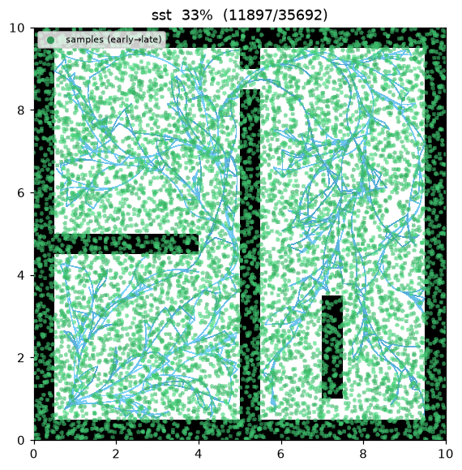
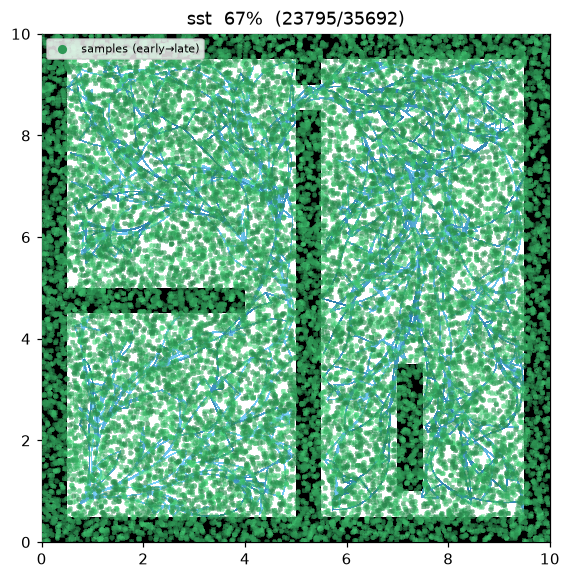
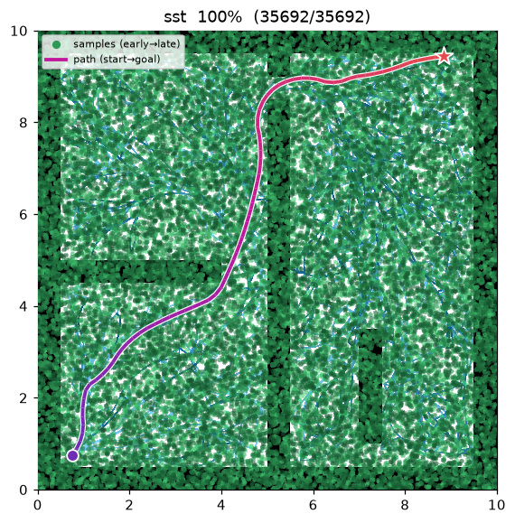
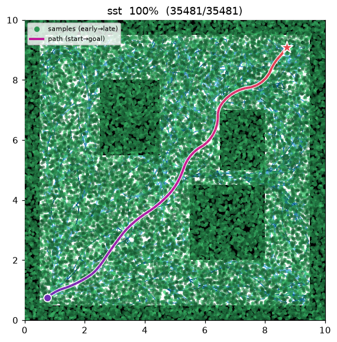

[🇰🇷 한국어](../../ko/algorithms/sst.md) | [🇬🇧 English](sst.md)

# SST / SST* (Stable Sparse RRT)
{: .no_toc }

| Item | Description |
|---|---|
| Category | sampling-based, kinodynamic, single-query, anytime |
| Required capability | `SamplingSpace` |
| Completeness | probabilistically complete (asymptotically, under forward propagation) |
| Optimality | SST: near-optimal (bounded); **SST\***: asymptotically optimal (shrinking radii) |
| Complexity | per iteration: BestNear over the sparse active set + one forward propagation + witness query |
| Original paper | Li, Littlefield & Bekris (2016) [^li] |

1. TOC
{:toc}

## Background

Optimal sampling planners such as [RRT\*](rrt_star.md) rely on a **steering function** — an exact
solution to the two-point boundary-value problem (BVP) that connects any two states. For systems with
non-trivial dynamics that BVP is expensive or has no closed form. Li, Littlefield & Bekris[^li] observed
that a planner can stay asymptotically (near-)optimal using **only forward propagation** — integrate a
control forward and check collisions — with no steering at all, provided the tree is kept **sparse**.

SST grows a tree by propagating a **random control for a random duration** from a carefully chosen node.
Two ideas make it "stable" and "sparse":

1. **BestNear selection** — instead of the single nearest node, the parent to expand is the
   **lowest-cost active node** within a ball of radius `delta_bn` around the sample. Expanding cheap
   nodes drives the incumbent cost down (stability).
2. **Witness-set pruning** — a set of **witness** points, spaced at least `delta_s` apart, each keep a
   single **active representative**: the lowest-cost node in its `delta_s` ball. A new node is kept only
   if it *improves* on its witness's representative; the dominated representative is deactivated and,
   with its now-leaf inactive ancestors, pruned. This **bounds the number of active nodes** regardless
   of iteration count (sparsity).

**SST\*** shrinks `delta_bn` and `delta_s` over iterations (a schedule), which lets the sparse tree keep
refining and recovers **asymptotic optimality**. The same class provides both: `sst_star = false` is SST
(fixed radii), `sst_star = true` is SST\*.

## How It Works

`maze01` — a unicycle (state (x, y, θ), controls (v, ω)) forward-propagates random arcs. The dense green
cloud is the drawn samples; the sparse sky-blue tree underneath is the **active** set the witnesses cap.
The final path is a smooth, dynamically-feasible trajectory (not a straight-line steer path).


Intermediate search progress (left → right: early / middle / final path):

| | | |
|:---:|:---:|:---:|
|  |  |  |

Final result on `open01` — a smooth curved trajectory near the straight-line optimum:



```
SST(start, goal):
    V_active ← {start};  S ← {witness(start) → rep=start}          # witness set
    for i in 1..max_iterations:                                     # anytime
        s_sample ← (goal with prob. goal_bias) else sample()
        x_sel    ← BestNear(V_active, s_sample, delta_bn)           # min-cost in ball (else nearest)
        x_new, arc ← MonteCarloProp(x_sel)                          # random (v, ω) for random duration
        if arc collides: continue                                   # forward-propagation only, no steer
        w ← nearest_witness(x_new)
        if dist(x_new, w) > delta_s: S.add(witness(x_new) → rep=∅)  # new witness
        x_peer ← rep(witness of x_new)
        if x_peer = ∅ or cost(x_new) < cost(x_peer):                # locally best?
            V_active.add(x_new);  rep(witness) ← x_new
            if x_peer ≠ ∅: deactivate x_peer; prune inactive leaf ancestors   # bound the tree
            if dist(x_new, goal) ≤ goal_tolerance:
                best ← min(best, cost(x_new))                        # keep improving the incumbent
    return best
```

Measurements (seed = 1, 30,000 iterations, trace on):

| map | Language | path cost | active nodes | nodes added | runtime |
|---|---|---|---|---|---|
| maze01 | Python | 13.683 | 198 | 1,286 | 1.20 s |
| open01 | Python | 12.005 | 186 | 1,226 | 1.19 s |

The gap between **active nodes** (198 / 186) and **nodes added** (1,286 / 1,226) is exactly the witness
pruning at work: over four in five accepted nodes are later dominated and pruned, so the active tree
stays tiny while a naive RRT would retain every node. `open01`'s cost (12.005) sits within ~0.1% of the
straight-line lower bound (≈12.02). The C++ port mirrors the algorithm but draws from an independent
`std::mt19937` stream, so its exact numbers differ (build with CMake to reproduce).

Reproduce:

```bash
python python/demos/demo_sst.py \
  --map maps/grid/maze01.yaml --scenario maps/scenarios/maze01_s1.yaml \
  --params configs/global_planning/sst.yaml --trace out/sst.jsonl
python tools/viz/replay.py out/sst.jsonl --gif out/sst.gif
```

## Properties

- **No steering / BVP solver.** SST needs only forward propagation + collision checks, so it applies to
  systems where connecting two states exactly is hard[^li]. Here the model is a unicycle; the planner
  owns the dynamics, and the map only answers state / motion validity (`SamplingSpace`).
- **Sparsity is bounded.** The witness set caps the active-node count by the number of `delta_s`-separated
  witnesses (≈ free-space area / `delta_s`²), *independent* of `max_iterations`.
- **Anytime, monotone incumbent.** BestNear + the "keep only if it improves the representative" rule make
  every representative's cost non-increasing, so the best solution never gets worse.
- **Optimality.** Fixed radii (SST) give a near-optimal solution with a bound tied to `delta_bn` /
  `delta_s`; the shrinking schedule (SST\*) recovers asymptotic optimality[^li].

## Parameters

| Name | Type | Default | Range | Description |
|---|---|---|---|---|
| `max_iterations` | int | 30000 | [1, 2000000] | Iteration budget (anytime — current best is returned when exhausted) |
| `goal_bias` | float | 0.1 | [0.0, 1.0] | Probability of sampling the goal directly |
| `goal_tolerance` | float | 0.6 | [0.0, 100.0] | Goal-reached radius (m, position only) |
| `delta_bn` | float | 1.2 | [0.01, 100.0] | BestNear radius δ_BN (m) — min-cost active node ball |
| `delta_s` | float | 0.5 | [0.01, 100.0] | Witness / sparsification radius δ_s (m) — active-node density cap |
| `max_velocity` | float | 1.5 | [0.01, 100.0] | Forward speed v upper bound (m/s); sampled in [0, v_max] |
| `max_omega` | float | 1.5 | [0.0, 100.0] | Yaw rate ω upper bound (rad/s); sampled in [−ω_max, ω_max] |
| `prop_duration_min` | float | 0.2 | [0.001, 100.0] | Propagation duration lower bound (s) |
| `prop_duration_max` | float | 0.8 | [0.001, 100.0] | Propagation duration upper bound (s) |
| `sst_star` | bool | false | — | true → SST\* (shrink δ_BN / δ_s over iterations for asymptotic optimality) |
| `seed` | int | 1 | [0, 2³¹−1] | Random seed (reproducibility) |

## Emitted Trace Events

`planning_started` → (`sample_drawn`, `edge_added`*, `rewire`?)* → `path_found`* → `planning_finished`

`edge_added` is emitted per arc chord so the curved propagation renders smoothly; `rewire` marks a
witness representative moving to a cheaper node (the dominated branch is pruned away), so the replay
shows the tree staying sparse. `path_found` can be emitted multiple times (each incumbent improvement).

## References

[^li]: Li, Y., Littlefield, Z., & Bekris, K. E. (2016). "Asymptotically optimal sampling-based kinodynamic planning." *The International Journal of Robotics Research*, 35(5), 528–564. [doi:10.1177/0278364915614386](https://doi.org/10.1177/0278364915614386) · [PDF (arXiv)](https://arxiv.org/abs/1407.2896)
