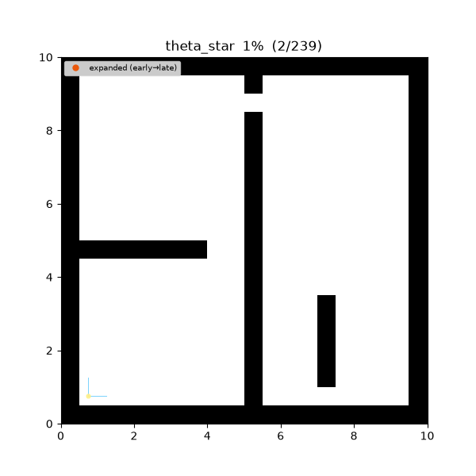
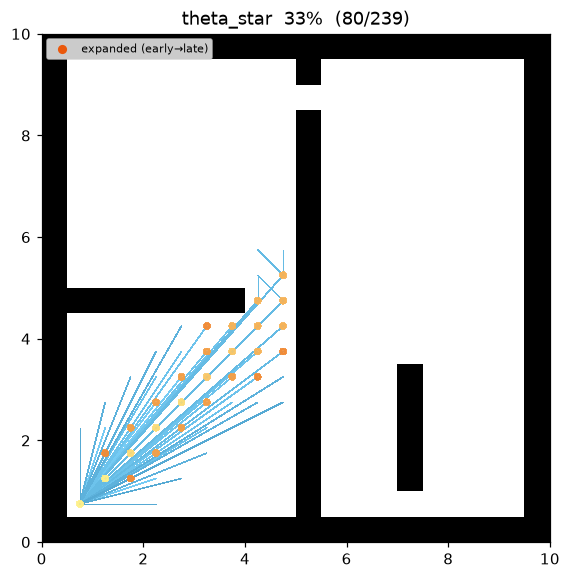
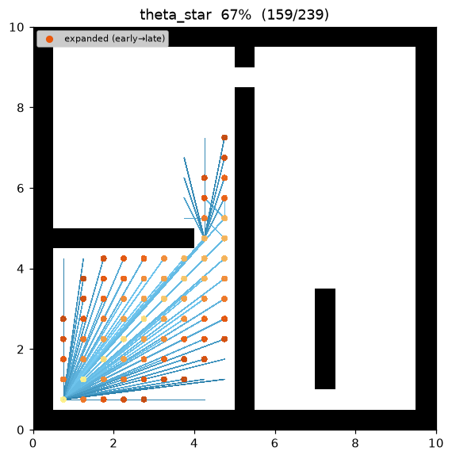
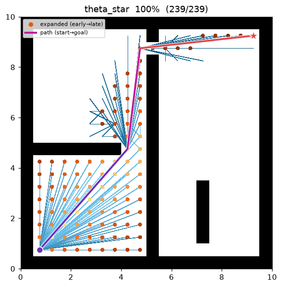
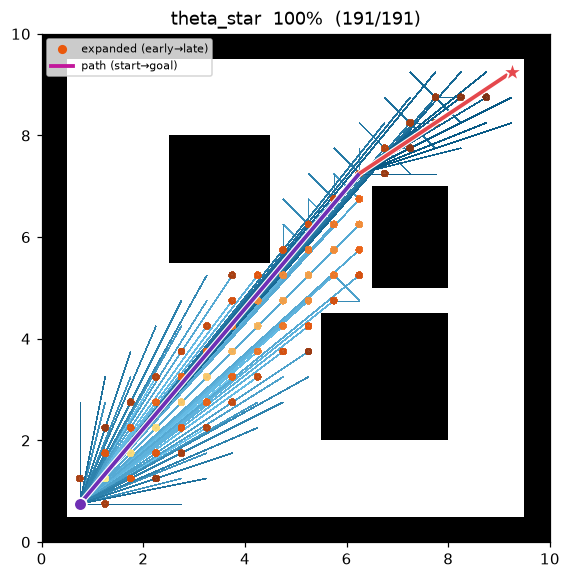

[🇰🇷 한국어](../../ko/algorithms/theta_star.md) | [🇬🇧 English](theta_star.md)

# Theta* (any-angle)
{: .no_toc }

| Item | Description |
|---|---|
| Category | any-angle graph search |
| Required capability | `LineOfSightSpace` (`neighbors` + `heuristic` + `line_of_sight`) |
| Completeness | complete (finite graphs, non-negative costs) |
| Optimality | any-angle path — **grid-optimality is not guaranteed** (basic Theta\*, Nash et al. 2007) |
| Complexity | A\* level + one line-of-sight check per relaxation |
| Original paper | Nash, Daniel, Koenig & Felner (2007) [^nash] · LOS: Amanatides & Woo (1987) [^aw] · weighted: Pohl (1970) [^pohl] |

1. TOC
{:toc}

## Background

A\*[^hart] on a grid lays its path only on grid edges (orthogonal and diagonal), so a stretch that
could be crossed by a straight line still becomes a staircase that bends in 45°/90° steps.
**Theta\***[^nash] adds a single rule to A\*: when relaxing a node, it checks whether a candidate's
parent can be **the parent of the current node** rather than the current node itself — that is,
whether there is an obstacle-free **line of sight** between the two. If there is, the path leaves the
grid and takes an arbitrary-angle (any-angle) straight-line shortcut.

The resulting path has far sparser waypoints (it bends only at obstacle corners) and is shorter than
the grid path. In this repository's demo, `maze01` shrinks from A\* 26 waypoints · cost 28.73 to
Theta\* **4 waypoints · cost 27.75**.

## How It Works

```
THETASTAR(start, goal):
    g[start] ← 0; parent[start] ← start
    open ← priority queue keyed by f = g + w·h        # h = Euclidean straight-line distance
    while open is not empty:
        s ← open.pop_min()
        if s == goal: return reconstruct(parent, s)
        if s already settled: continue                # lazy deletion
        for (s2, edge_cost) in neighbors(s):
            p ← parent[s]
            if line_of_sight(p, s2):                   # Path 2 — any-angle shortcut
                cand ← g[p] + euclid(p, s2);  par ← p
            else:                                      # Path 1 — standard grid step
                cand ← g[s] + edge_cost;      par ← s
            if cand < g[s2]:                           # relaxation
                g[s2] ← cand; parent[s2] ← par
                open.push(s2, cand + w·h(s2, goal))
    return failure
```

The difference from A\* is the single inner `if line_of_sight(...)` **block**. If the LOS check always
fails, it degenerates into exactly weighted A\*. Because parent links are only ever set on pairs whose
LOS has been confirmed (Path 2 verifies visibility, Path 1 is between adjacent cells and therefore
trivial), **every edge of the reconstructed path is an actually traversable straight line**.

### Line of Sight — one collision model with the grid

`line_of_sight(a, b)` decides whether the segment joining two cell centres is actually traversable,
using the **same corner-cut-forbidden rule** as `neighbors()`. The original paper used Bresenham, but
Bresenham visits only one cell per axis and can wrongly report a corner-grazing segment as "visible."
This repository reuses the **supercover**[^aw], which visits every cell the segment touches (delegating
to the map's `is_motion_valid`). Therefore "a pair visible by LOS" ⇔ "a legal straight move," and
Theta\* and grid A\* share **one collision model**.

### Heuristic — Euclidean (not octile)

Theta\*'s g-values are straight-line (Euclidean) distances, so the heuristic is also **Euclidean**:

```
h(a, b) = √((Δrow)² + (Δcol)²)
```

The octile heuristic the map provides for A\* satisfies octile ≥ Euclidean, so it is **inadmissible**
(overestimating) for any-angle costs and is not used. The Euclidean distance is an admissible lower
bound for arbitrary-angle motion.

## Properties

- **Completeness**: complete on a finite grid with non-negative costs (same as A\*).
- **Optimality**: basic Theta\* guarantees **neither grid-optimality nor true-optimality**[^nash].
  Because the local rule only ever inherits the grandparent as parent, it can miss the truly shortest
  any-angle path (though it stays very close). When strict optimality is required, use later variants
  such as Lazy Theta\* / AP Theta\*.
- **Quality**: the returned path cost is always ≤ the A\* cost on the same grid — LOS shortcuts replace
  grid staircases.
- **Complexity**: the same search as A\* plus one LOS check (linear in segment length) per relaxation.
- w > 1 (weighted Theta\*, Pohl 1970[^pohl]): inflating the heuristic reduces expanded nodes at the
  cost of path quality.

## Parameters

| Name | Type | Default | Range | Description |
|---|---|---|---|---|
| `heuristic_weight` | float | 1.0 | [1.0, 5.0] | The w in f = g + w·h (h is Euclidean). 1.0 = standard Theta\*, above = weighted |

## Implementation Notes

- C++: `cpp/src/global_planning/search/theta_star.cpp`, Python: `python/navigation/global_planning/search/theta_star.py`
- The Euclidean distance is computed as **`sqrt(Δrow² + Δcol²)`, not `hypot`**. `hypot` is not
  IEEE-754 correctly-rounded and can differ by 1 ULP between runtimes, which would make f-values,
  tie-breaking, and the emitted trace stream diverge between the two languages (the benchmark's
  C++/Python comparison relies on that stream). `sqrt` is correctly rounded, and `sqrt(2.0)` exactly
  equals the diagonal edge cost from `neighbors()`, so a Path-2 diagonal shortcut and a Path-1 diagonal
  step are bit-identical.
- Path cost is reported as `g[goal]`. Summing adjacent edges would be wrong — it returns 0 for
  non-adjacent (any-angle) jumps.
- Tie-breaking is the same `(f, insertion order)` as A\*, so the two languages converge to the same
  path — the maze01 expansion order matches cell-for-cell between C++ and Python.

## Emitted Trace Events

`planning_started` → (`node_expanded`, `candidate_evaluated`, `edge_added`)* → `path_found` → `planning_finished`

In `edge_added(state=s2, parent)`, `parent` becomes a **non-adjacent grandparent** on Path 2 (the
schema and the visualizer impose no adjacency constraint). `replay.py` draws the parent→state straight
line as-is to render the any-angle shortcut, so no new trace event is required.

## Demo

Search on `maze01`. Like the A\* frontier it grows toward the goal, but the final path is not a grid
staircase — it is a **sparse straight-line polyline** that only grazes obstacle corners.



Intermediate search progress (left → right: early / middle / final path):

| | | |
|:---:|:---:|:---:|
|  |  |  |

Final result on `open01` — with few obstacles, start→goal connects as almost a single straight line:



Measurements (Python, w = 1.0, trace on · A\* comparison on the same instance):

| map | Theta\* cost | A\* cost | Theta\* expanded | A\* expanded | Theta\* waypoints |
|---|---|---|---|---|---|
| maze01 | **27.748** | 28.728 | 104 | 108 | 4 (A\*: 26) |
| open01 | **24.241** | 25.213 | 66 | 71 | 3 (A\*: 20) |

Reproduce:

```bash
python python/demos/demo_theta_star.py \
  --map maps/grid/maze01.yaml --scenario maps/scenarios/maze01_s1.yaml \
  --params configs/global_planning/theta_star.yaml --trace out/theta_star.jsonl
python tools/viz/replay.py out/theta_star.jsonl --gif out/theta_star.gif --snapshots out/theta_snaps/
```

## References

[^nash]: Nash, A., Daniel, K., Koenig, S., & Felner, A. (2007). "Theta\*: Any-Angle Path Planning on Grids." *Proc. AAAI Conference on Artificial Intelligence*, 1177–1183. [PDF](https://ojs.aaai.org/index.php/AAAI/article/view/11009)
[^aw]: Amanatides, J., & Woo, A. (1987). "A Fast Voxel Traversal Algorithm for Ray Tracing." *Proc. Eurographics*, 3–10. [PDF](https://www.cse.yorku.ca/~amana/research/grid.pdf)
[^hart]: Hart, P. E., Nilsson, N. J., & Raphael, B. (1968). "A Formal Basis for the Heuristic Determination of Minimum Cost Paths." *IEEE Transactions on Systems Science and Cybernetics*, 4(2), 100–107. [doi:10.1109/TSSC.1968.300136](https://doi.org/10.1109/TSSC.1968.300136)
[^pohl]: Pohl, I. (1970). "Heuristic search viewed as path finding in a graph." *Artificial Intelligence*, 1(3–4), 193–204. [doi:10.1016/0004-3702(70)90007-X](https://doi.org/10.1016/0004-3702%2870%2990007-X)
</content>
</invoke>
