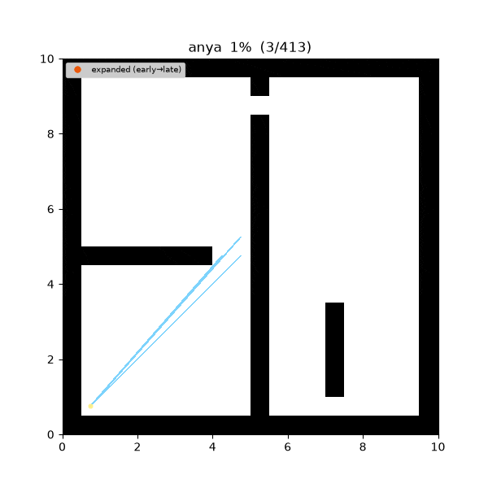
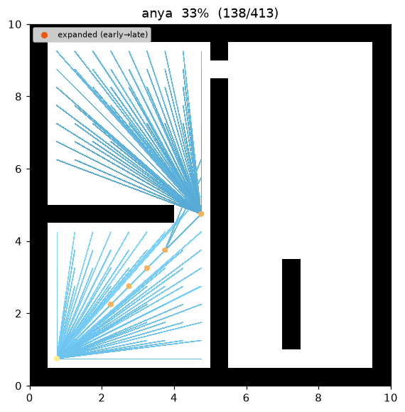
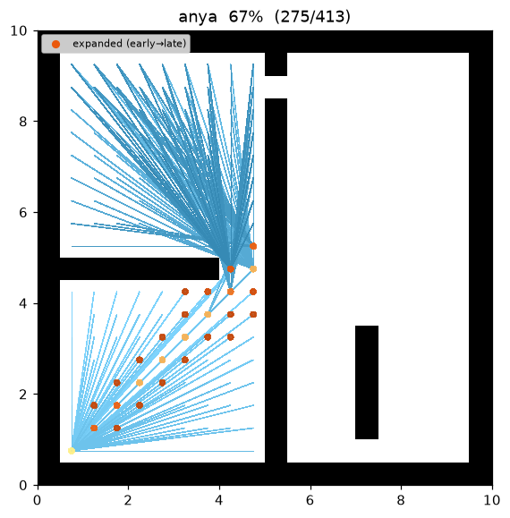
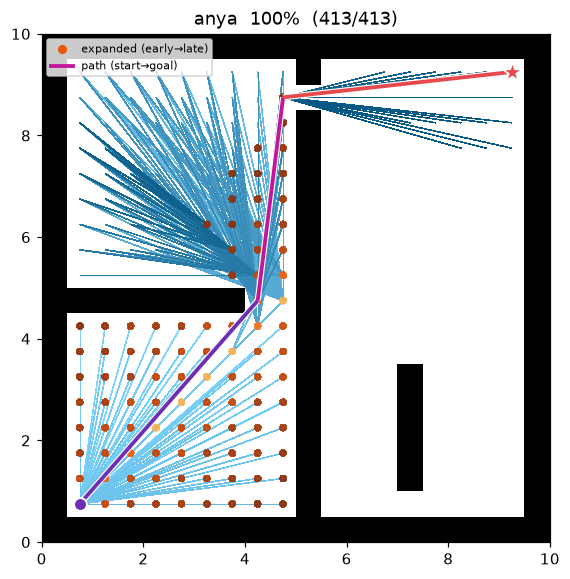
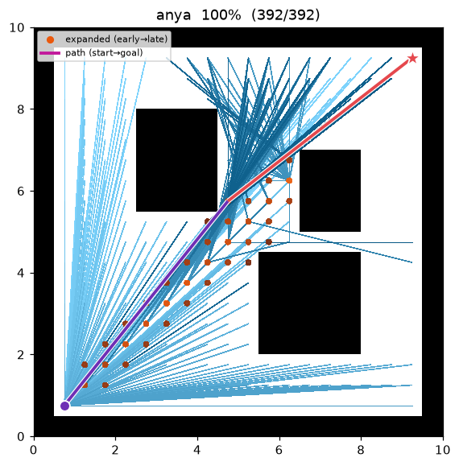

[🇰🇷 한국어](../../ko/algorithms/visibility_astar.md) | [🇬🇧 English](visibility_astar.md)

# Visibility A* (cell-centre any-angle)
{: .no_toc }

| Item | Description |
|---|---|
| Category | any-angle graph search (cell-centre visibility graph) |
| Required capability | `LineOfSightSpace` (`neighbors` + `heuristic` + `line_of_sight`) |
| Completeness | complete (finite graphs, non-negative costs) |
| Optimality | shortest over the cell-centre visibility graph — **not the true Euclidean any-angle optimum** (turns pinned to cell centres) |
| Complexity | best-first search; each expansion projects the root's visibility into per-row intervals and relaxes them |
| Related work | LOS: Amanatides & Woo (1987) [^aw] · weighted: Pohl (1970) [^pohl] · compared against Theta\*: Nash et al. (2007) [^nash] |

1. TOC
{:toc}

## Background

**Theta\***[^nash] makes A\* *any-angle* — its path leaves the grid and takes straight-line
shortcuts — but it is **not optimal**: the shortcut parent of a node is only ever its
grandparent, so the string can never pull fully taut and the path stays a little longer than the
best a cell-centre polyline could achieve.

**Visibility A\*** removes that slack. It is **plain A\*** with no special search node — only its
successor relation is changed from grid adjacency to **line-of-sight visibility**: from an expanded
cell it relaxes **every** free cell it can see along an obstacle-free straight line, at Euclidean
cost. The result is the shortest path over the **cell-centre visibility graph** — vertices = reachable
free cells, edges = mutually LOS-visible pairs, weight = straight-line length — found with the
admissible, consistent Euclidean heuristic.

An important limitation: this is **not the true Euclidean any-angle optimum**. Restricting turning
points to cell centres means it cannot recover the extra shortening a genuinely shortest any-angle
route gets by turning at obstacle **corners** (points that no cell centre lands on). It is optimal
only over the cell-centre vertex set. What it does give is (1) a path that is always a **valid
any-angle path** (every leg a LOS-clear straight segment), and (2) a cost that is always **≤ Theta\***
on the same instance — because any Theta\* output is itself one path in this same cell-centre
visibility graph.

On this repository's demos, `open01` shrinks from Theta\* cost 24.241 to Visibility A\* **24.208** —
removing the sliver Theta\* leaves on the table over cell-centre polylines. On `maze01` Theta\* already
happens to be cell-centre-optimal (27.748), and Visibility A\* matches it while expanding fewer nodes
(95 vs 104).

## How It Works

Search on `maze01`. The frontier grows toward the goal like A\*, but each expansion fans the root's
**visible region** outward, and the final path is a **sparse straight-line polyline** grazing near
obstacle corners (with turns pinned to cell centres).



Intermediate search progress (left → right: early / middle / final path):

| | | |
|:---:|:---:|:---:|
|  |  |  |

Final result on `open01` — with few obstacles, start→goal connects as a single straight line (when the
goal is directly visible from the start, that segment is also the true shortest route):



### Projecting the root's visibility into per-row intervals

When a root is expanded, the free cells LOS-visible from it are gathered **per grid row** into
contiguous column runs (intervals), and every cell of each run is relaxed. The interval grouping is
only an implementation/visualization convenience — the search nodes pushed on the queue are still
individual **cells**, not `(root, interval)` pairs. Because a root's entire visible set is relaxed, the
search is exactly A\* over the cell-centre visibility graph.

### Line of sight — one collision model with the grid

`line_of_sight(a, b)` decides whether the segment joining two cell centres is traversable, using the
**same corner-cut-forbidden supercover**[^aw] rule as `neighbors()` (delegating to the map's
`is_motion_valid`). So "a pair visible by LOS" ⇔ "a legal straight move," and Visibility A\*, Theta\*
and grid A\* all share **one collision model**.

```
VISIBILITY_ASTAR(start, goal):
    g[start] ← 0; parent[start] ← start
    open ← priority queue keyed by f = g + w·h        # h = Euclidean straight-line distance
    reachable ← free cells connected to start (via neighbors())
    while open is not empty:
        r ← open.pop_min()
        if r == goal: return reconstruct(parent, r)
        if r already settled: continue                # lazy deletion
        for each grid row y in reachable:             # project the root's visibility, row by row
            for each maximal interval [a, b] of cells on y visible from r:
                for cell in a..b:
                    cand ← g[r] + euclid(r, cell)      # straight-line leg from the root
                    if cand < g[cell]:                 # relaxation
                        g[cell] ← cand; parent[cell] ← r
                        open.push(cell, cand + w·h(cell, goal))
    return failure
```

## Optimality and Cost Model

**Notation.** Treat cell centres as points in $\mathbb{R}^2$. A **cell-centre** any-angle path
$P=(v_0,\dots,v_k)$ is a polyline through cell centres whose every segment $\overline{v_i v_{i+1}}$ is
obstacle-free (LOS); its cost is $\operatorname{cost}(P)=\sum_i\lVert v_{i+1}-v_i\rVert_2$. Let
$C^\ast$ be the minimum such cost (the optimum **restricted to cell-centre vertices**),
$h(n)=\lVert n-\text{goal}\rVert_2$, and $h^\ast(n)$ the true shortest feasible cost from $n$ to the
goal. The true continuous Euclidean optimum, free to turn at corners rather than cell centres, is
$\le C^\ast$; this algorithm targets $C^\ast$, not that continuous optimum.

**Lemma 1 (Euclidean $h$ is admissible and consistent).** By the triangle inequality applied
segment-by-segment, $\lVert b-a\rVert_2\le\operatorname{cost}(P)$ for any feasible $P$ from $a$ to
$b$; with $a=n,\ b=\text{goal}$ this gives $h(n)\le h^\ast(n)$ (admissible). For any LOS edge $(a,b)$
of cost $\lVert a-b\rVert_2$, $h(a)\le\lVert a-b\rVert_2+h(b)=c(a,b)+h(b)$ (consistent). So at $w=1$
best-first search never expands a node before its optimal $g$ is known. ∎

**Lemma 2 (every $g$ is a real feasible length).** A relaxation sets
$g[\text{cell}]=g[r]+\lVert r-\text{cell}\rVert_2$ only when `line_of_sight(r, cell)` holds, so
unrolling `parent` makes $g[\text{cell}]$ exactly the length of an obstacle-free polyline
$\text{start}\to\cdots\to r\to\text{cell}$. The returned $g[\text{goal}]$ is therefore an achievable
upper bound — the path is always feasible. ∎

**Proposition 3 (optimal on the cell-centre visibility graph).** Every settled root fans out to **all**
free cells LOS-visible from it, so the search is exactly A\* over the *cell-centre visibility graph*
$G=(V,E)$: $V$ = reachable free cells, $E$ = mutually-visible pairs, weight $=\lVert\cdot\rVert_2$.
With the consistent heuristic of Lemma 1, A\* returns the shortest path in $G$, and by Lemma 2 that
value is achievable. Hence $\operatorname{cost}(P)=C^\ast$ over cell-centre polylines. Because turns
are pinned to cell centres, this can differ from the true continuous Euclidean shortest path. ∎

**Proposition 4 (never longer than Theta\*).** Theta\*'s output is one feasible cell-centre polyline,
i.e. a path in $G$, so $C^\ast\le\operatorname{cost}(P_\Theta)$; therefore
$\operatorname{cost}(P)\le\operatorname{cost}(P_\Theta)$ on every instance. Where Theta\*'s myopic
grandparent rule leaves the string slightly slack, Visibility A\* pulls it fully taut over cell-centre
vertices (this repo's `open01`: 24.208 vs Theta\* 24.241). ∎

Measurements (Python, w = 1.0, trace on · Theta\* / A\* on the same instance):

| map | Visibility A\* cost | Theta\* cost | A\* cost | Visibility A\* expanded | Theta\* expanded | waypoints |
|---|---|---|---|---|---|---|
| maze01 | **27.748** | 27.748 | 28.728 | 95 | 104 | 4 |
| open01 | **24.208** | 24.241 | 25.213 | 38 | 66 | 3 |

Reproduce:

```bash
python python/demos/demo_visibility_astar.py \
  --map maps/grid/maze01.yaml --scenario maps/scenarios/maze01_s1.yaml \
  --params configs/global_planning/visibility_astar.yaml --trace out/visibility_astar.jsonl
python tools/viz/replay.py out/visibility_astar.jsonl --gif out/visibility_astar.gif --snapshots out/visibility_astar_snaps/
```

## Properties

- **Completeness**: complete on a finite grid with non-negative costs (same as A\*).
- **Optimality**: at `w = 1`, **shortest over the cell-centre visibility graph** — an any-angle path
  whose turns are pinned to cell centres. It is not the true continuous Euclidean any-angle optimum.
- **Quality vs Theta\***: cost is always ≤ the Theta\* cost on the same grid (Proposition 4).
- **Weighting**: `w > 1` (weighted, Pohl 1970[^pohl]) inflates the heuristic to expand fewer nodes at
  the cost of the shortest-path guarantee — bounded-suboptimal any-angle.

## Parameters

| Name | Type | Default | Range | Description |
|---|---|---|---|---|
| `heuristic_weight` | float | 1.0 | [1.0, 5.0] | The w in f = g + w·h (h is Euclidean). 1.0 = cell-centre visibility shortest; above 1.0 = weighted (faster, gives up the shortest-path guarantee) |

## Emitted Trace Events

`planning_started` → (`node_expanded`, `candidate_evaluated`, `edge_added`)* → `path_found` → `planning_finished`

`node_expanded(state=r)` fires once per settled root. Each relaxation inside a projected interval
emits `candidate_evaluated` plus `edge_added(state=cell, parent=r)`, where `parent` is the (possibly
non-adjacent) root — the visualizer draws the parent→state straight line as-is to render the any-angle
leg, so no new trace event is required (the fan of edges from a root shows the visible region it
projected).

## References

[^nash]: Nash, A., Daniel, K., Koenig, S., & Felner, A. (2007). "Theta\*: Any-Angle Path Planning on Grids." *Proc. AAAI Conference on Artificial Intelligence*, 1177–1183. [PDF](https://ojs.aaai.org/index.php/AAAI/article/view/11009)
[^aw]: Amanatides, J., & Woo, A. (1987). "A Fast Voxel Traversal Algorithm for Ray Tracing." *Proc. Eurographics*, 3–10. [PDF](https://www.cse.yorku.ca/~amana/research/grid.pdf)
[^pohl]: Pohl, I. (1970). "Heuristic search viewed as path finding in a graph." *Artificial Intelligence*, 1(3–4), 193–204. [doi:10.1016/0004-3702(70)90007-X](https://doi.org/10.1016/0004-3702%2870%2990007-X)
