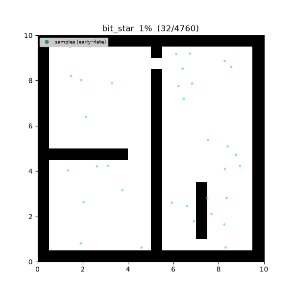
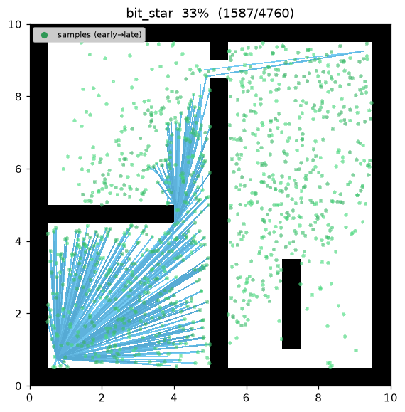
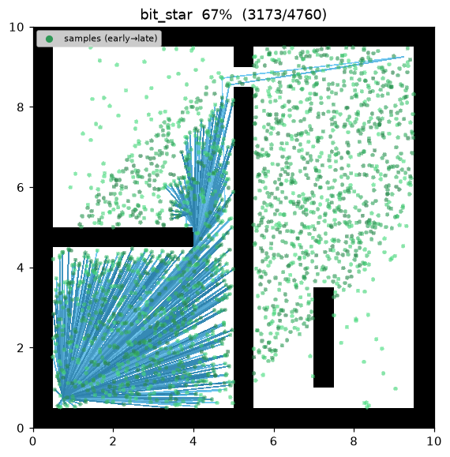
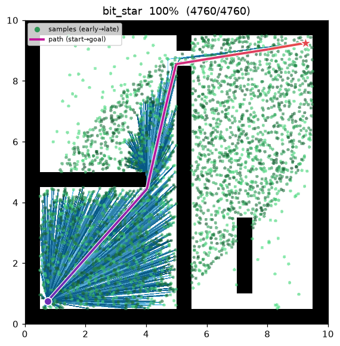
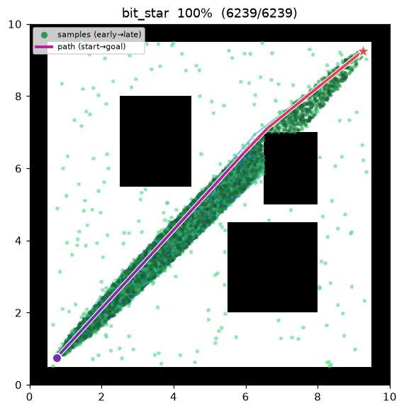

[🇰🇷 한국어](bit_star.md) | [🇬🇧 English](../../en/algorithms/bit_star.md)

# BIT\* (Batch Informed Trees)
{: .no_toc }

| 항목 | 내용 |
|---|---|
| 분류 | sampling-based, batch, anytime, asymptotically optimal |
| 요구 capability | `SamplingSpace` |
| 완전성 | probabilistically complete |
| 최적성 | **almost-surely asymptotically optimal** — 통상 RRT\*/FMT\* 보다 빠르게 수렴 |
| 복잡도 | 배치당 edge queue best-first 처리 + lazy 충돌 검사 |
| 원 논문 | Gammell, Srinivasa & Barfoot (2015) [^gammell_bit] |

1. TOC
{:toc}

## 배경

Gammell 등[^gammell_bit] 은 로드맵 계열의 **배치 표본화**(RGG)와 그래프 탐색의 **heuristic
best-first**(A\*/LPA\*), 그리고 **informed sampling** 을 하나로 묶은 BIT\* 를 제안했다. 표본을
배치 단위로 처리하되, 한 배치 안에서는 edge queue 를 추정 해 비용

$$
g_T(v)+\hat c(v,x)+\hat h(x)
$$

순으로 best-first 처리한다. 충돌 검사는 **간선을 큐에서 꺼낼 때에만**(lazy) 수행하고, 개선되는
간선은 표본을 트리에 잇거나 기존 정점을 rewire 한다.

해가 하나 생기면(비용 $c_{\text{best}}$) 이후 배치는 **informed ellipse**(Gammell et al.
2014[^gammell])에서 표본을 뽑는다 — 초점이 start·goal, 횡단 지름이 $c_{\text{best}}$ 인 타원이라
현재 해를 개선할 수 있는 영역에만 표본이 떨어진다. anytime 알고리즘으로, 배치를 거듭하며 경로를
계속 조인다.

## 동작 원리

```
BIT_STAR(start, goal):
    tree ← {start};  samples ← {goal};  c_best ← ∞
    for batch in 1..max_batches:
        samples ← prune(samples, c_best)              # 개선 불가 표본 제거
        samples ← samples ∪ draw(batch_size, c_best)  # informed 배치 (해 존재 시)
        r ← gamma · sqrt(log n / n);  N ← radius_neighbors(V, r)
        Q_V ← tree 정점 (키 g_T(v)+ĥ(v));  Q_E ← ∅
        loop:
            while best_v(Q_V) ≤ best_e(Q_E):          # 정점 확장으로 후보 간선 생성
                v ← pop(Q_V);  expand v into Q_E
            (v, x) ← pop_min(Q_E)                       # 최선 간선
            if key(v, x) ≥ c_best: break                # 더는 개선 불가 → 배치 종료
            if g_T(v)+‖v−x‖ ≥ g_T(x): continue          # 트리 비용 개선 없음
            if not is_motion_valid(v, x): continue      # lazy 충돌 검사 (여기서만)
            if g_T(v)+‖v−x‖ < g_T(x):                   # 간선 채택: 연결 또는 rewire
                connect_or_rewire(x, parent=v)
                if goal in tree and g_T(goal) < c_best:
                    c_best ← g_T(goal)                  # incumbent 개선
    return path(goal)
```

$g_T(v)$ 는 트리 안 cost-to-come, $\hat h(x)=\lVert x-\text{goal}\rVert$ 는 admissible 휴리스틱,
$\hat g(x)=\lVert \text{start}-x\rVert$ 다. 정점 큐 $Q_V$ 와 간선 큐 $Q_E$ 를 번갈아 비우며,
정점 확장이 만들 수 있는 최선 간선이 이미 큐에 있는 최선 간선을 못 이길 때까지만 정점을 확장한다.

## 성질

- **완전성**: probabilistically complete[^gammell_bit].
- **최적성**: **almost-surely asymptotically optimal.** 배치가 쌓이며 RGG 가 조밀해지고 informed
  표본이 해 영역에 집중되어 통상 RRT\*·FMT\* 보다 빠르게 최적으로 수렴한다[^gammell_bit].
- **anytime**: 첫 배치에서 해가 나오면 이후 배치가 경로를 계속 조인다. `max_batches` 소진 시
  현재 최선 해를 반환한다.
- **lazy 충돌 검사**: 간선은 큐에서 dequeue 되는 순간에만 검사한다 — 개선 가망이 없는 간선은
  아예 검사하지 않아 충돌 검사가 절약된다.

## 파라미터

| 이름 | 타입 | 기본값 | 범위 | 설명 |
|---|---|---|---|---|
| `batch_size` | int | 200 | [1, 100000] | 배치당 새로 뿌리는 (informed) 샘플 수 |
| `max_batches` | int | 15 | [1, 10000] | 최대 배치 수 (anytime — 소진 시 현재 best 반환) |
| `gamma` | float | 30.0 | [0.01, 1000.0] | RGG 연결 반경 계수 γ. r_n = γ·(log n / n)^(1/2) |
| `seed` | int | 1 | [0, 2^31−1] | 난수 시드 (재현성) |

## Informed sampling 과 edge queue

**Informed ellipse (Gammell et al. 2014).** 해 비용 $c_{\text{best}}$ 가 존재할 때, start·goal 을
초점으로 하는 타원 안에서만 표본을 뽑는다. $c_{\min}=\lVert\text{start}-\text{goal}\rVert$ 에 대해

$$
r_1=\frac{c_{\text{best}}}{2},\qquad
r_2=\frac{\sqrt{c_{\text{best}}^{\,2}-c_{\min}^{\,2}}}{2},
$$

중심은 두 점의 중점, 회전은 start→goal 축이다. $x^2/r_1^2+y^2/r_2^2\le1$ 밖의 점은 어떤 경로도
$c_{\text{best}}$ 를 개선할 수 없으므로 표본에서 배제된다.

**Edge queue 우선순위.** 간선 $(v,x)$ 의 키는

$$
\underbrace{g_T(v)}_{\text{트리 도달}}+\underbrace{\hat c(v,x)}_{\lVert v-x\rVert}+\underbrace{\hat h(x)}_{\lVert x-\text{goal}\rVert},
$$

즉 이 간선을 채택했을 때의 추정 해 비용이다. 이 값이 $c_{\text{best}}$ 이상인 간선은 큐에서
꺼내는 즉시 배치를 끝낸다 — 남은 어떤 간선도 incumbent 를 못 줄이기 때문이다.

*직관.* RGG 위의 A\* 를 배치마다 다시 도는 것과 같다. 휴리스틱이 탐색을 해 영역으로 이끌고,
informed 표본이 그 영역만 조밀하게 채우며, lazy 검사가 불필요한 충돌 검사를 미룬다. 세 요소가
겹쳐 같은 표본 예산에서 RRT\*/FMT\* 보다 빠른 수렴을 낸다.

## 구현 노트

- C++: `cpp/src/global_planning/bit_star.cpp`, Python: `python/navigation/global_planning/bit_star.py`
- 배치 근방 그래프(`radius_neighbors`)·줄어드는 반경(`rgg_radius`)·informed 표본 길이 계산은
  [PRM\*](prm_star.md)·[FMT\*](fmt_star.md) 와 공유하는 `sampling_common` / `_sampling` 에 있다.
- rewire 시 하위 트리 cost 를 전파(`propagate`)해 큐 키와 보고 비용의 일관성을 유지한다.

## 방출 trace 이벤트

`planning_started` → `sample_drawn`\* → `edge_added`\* → `candidate_evaluated`\* → `path_found` → `planning_finished`

`sample_drawn` 은 배치별 표본, `edge_added` 는 채택된 간선, `candidate_evaluated` 는 incumbent
비용 $c_{\text{best}}$ 가 개선될 때마다(현재 최선 해 갱신) 방출된다.

## Demo

`maze01` — 첫 배치가 자유 공간을 탐색해 해를 찾으면, 이후 배치는 informed 타원 안으로 표본을
집중시켜 경로를 배치마다 조인다.



탐색 중간 과정 (좌 → 우: 첫 배치 / informed 배치 / 최종 경로):

| | | |
|:---:|:---:|:---:|
|  |  |  |

`open01` 최종 결과 — 거의 직선에 가깝다:



측정치 (Python, seed = 1, trace on):

| map | path cost | 표본 수 | expanded (채택 간선) |
|---|---|---|---|
| maze01 | 13.474 | 3,002 | 1,760 |
| open01 | 12.047 | — | — |

C++ 구현도 동일 시나리오를 미러링하며, 언어 간 난수 스트림 차이 범위 안에서 같은 결과를 낸다.

재현:

```bash
python python/demos/demo_bit_star.py \
  --map maps/grid/maze01.yaml --scenario maps/scenarios/maze01_s1.yaml \
  --params configs/global_planning/bit_star.yaml --trace out/bit_star.jsonl
python tools/viz/replay.py out/bit_star.jsonl --gif out/bit_star.gif
```

## References

[^gammell_bit]: Gammell, J. D., Srinivasa, S. S., & Barfoot, T. D. (2015). "Batch Informed Trees (BIT\*): Sampling-based optimal planning via the heuristically guided search of implicit random geometric graphs." *Proc. IEEE ICRA*, 3067–3074. [doi:10.1109/ICRA.2015.7139620](https://doi.org/10.1109/ICRA.2015.7139620) · [PDF (arXiv)](https://arxiv.org/abs/1405.5848)
[^gammell]: Gammell, J. D., Srinivasa, S. S., & Barfoot, T. D. (2014). "Informed RRT\*: Optimal sampling-based path planning focused via direct sampling of an admissible ellipsoidal heuristic." *Proc. IEEE/RSJ IROS*, 2997–3004. [doi:10.1109/IROS.2014.6942976](https://doi.org/10.1109/IROS.2014.6942976) · [PDF (arXiv)](https://arxiv.org/abs/1404.2334)
[^karaman]: Karaman, S., & Frazzoli, E. (2011). "Sampling-based algorithms for optimal motion planning." *The International Journal of Robotics Research*, 30(7), 846–894. [doi:10.1177/0278364911406761](https://doi.org/10.1177/0278364911406761) · [PDF (arXiv)](https://arxiv.org/abs/1105.1186)
