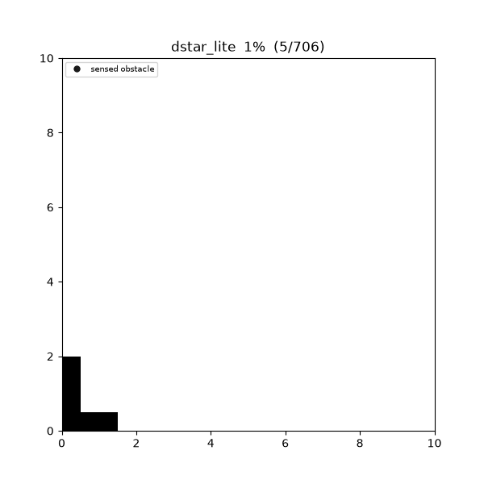
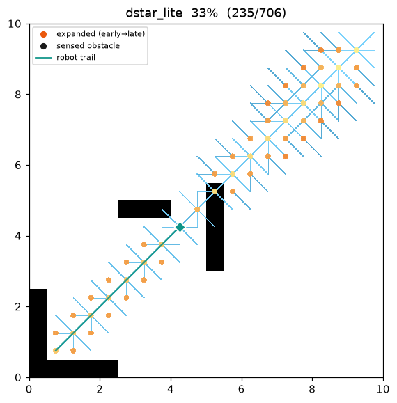
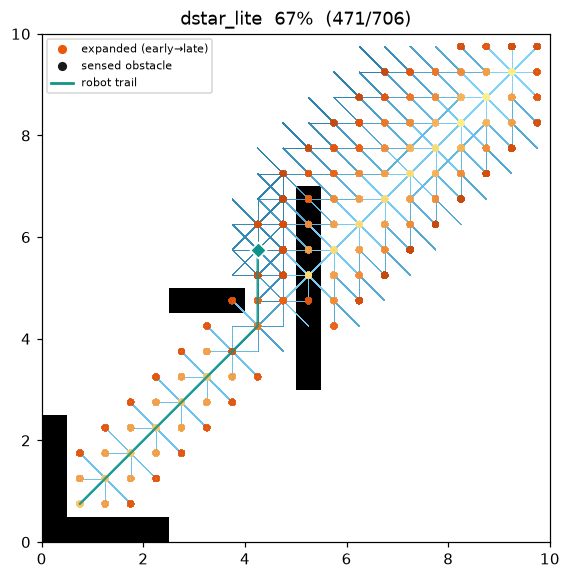
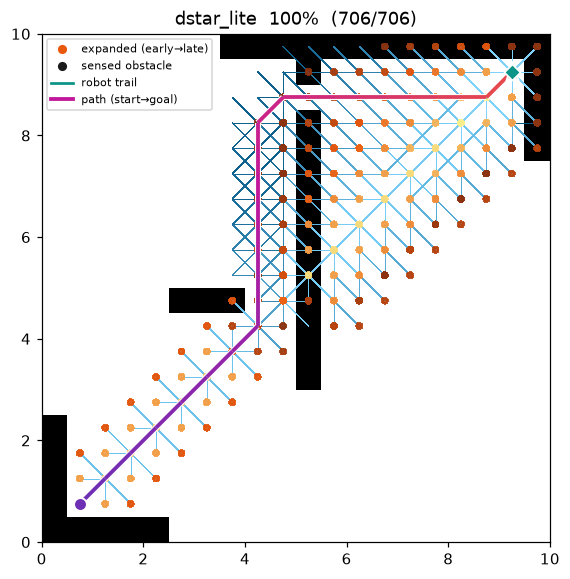
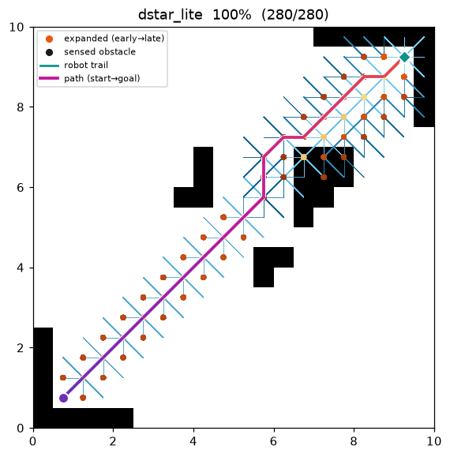

[🇰🇷 한국어](dstar_lite.md) | [🇬🇧 English](../../en/algorithms/dstar_lite.md)

# D* Lite (dynamic replanning)
{: .no_toc }

| 항목 | 내용 |
|---|---|
| 분류 | incremental / dynamic replanning graph search |
| 요구 capability | `DynamicGridSpace` (`passable_neighbors` + `is_blocked`) |
| 완전성 | complete (유한 grid, 비음수 비용) |
| 최적성 | **현재 belief 기준 최적** — 매 스텝 알려진 지도에 대한 최단 경로를 따른다 |
| 복잡도 | 최초 1회는 A* 수준, 이후 각 replan 은 변화 주변만 국소 수리 (from-scratch 재탐색보다 훨씬 저렴) |
| 원 논문 | Koenig & Likhachev (2002) [^koenig] · LPA\* 기반: Koenig, Likhachev & Furcy (2004) [^lpastar] |

1. TOC
{:toc}

## 배경

A\*[^hart] 는 지도를 **미리 다 안다**고 가정한다. 하지만 실제 로봇은 지도 없이 출발해 **센서로 주변만
보면서** 이동하고, 예상 못 한 장애물을 만나면 경로를 다시 세워야 한다. 매 스텝 A\* 를 처음부터 다시
돌리는 것(naïve replanning)은 대부분의 계산을 반복한다.

**D\* Lite**[^koenig] 는 이 문제를 **증분 탐색(incremental search)** 으로 푼다. goal 에서 시작하는
**역방향(backward)** 탐색을 유지하며 각 셀에 두 값을 둔다: `g`(현재까지 계산된 goal 까지의 비용)와
`rhs`(한 스텝 앞을 본 look-ahead 값). 두 값이 다른 정점만 "불일치(inconsistent)" 로 보고 우선순위
큐로 처리한다. 센서가 belief 와 어긋나는 셀을 발견하면 **그 셀 주변의 몇 개 정점만 다시 넣어** 이전
탐색을 이어서 수리한다 — from-scratch 재탐색이 아니다.

이 저장소의 belief 는 **planner 내부 상태**다: 처음엔 blocked 집합이 비어 있어 **모든 in-bounds 셀을
free 로 가정**(freespace assumption)한다. `plan()` 은 move → sense → repair 루프를 goal 도달 또는
도달 불가까지 내부에서 시뮬레이션하고, **실제로 이동한 궤적(trajectory)** 을 결과 경로로 돌려준다
(출발점에서의 완성된 계획이 아니다).

## 동작 원리

역방향 탐색이므로 heuristic 은 `h(s_start, s)` (탐색 정점 `s` 에서 **현재 로봇 위치** `s_start` 까지)를
쓴다. 로봇이 움직이면 이 기준점이 바뀌므로, 이미 큐에 든 key 가 단조성을 잃지 않도록 오프셋 `k_m` 을
누적한다(그래야 큐를 통째로 다시 계산하지 않아도 된다).

```
CalcKey(s):                                   # 우선순위 = [k1, k2] (사전식)
    k2 ← min(g(s), rhs(s))
    return [k2 + h(s_start, s) + k_m,  k2]

Initialize():
    U ← ∅;  k_m ← 0
    모든 s 에 대해 rhs(s) = g(s) = ∞
    rhs(s_goal) ← 0                            # goal 이 역방향 탐색의 뿌리
    U.insert(s_goal, CalcKey(s_goal))

UpdateVertex(u):
    if u ≠ s_goal:
        rhs(u) ← min over s' ∈ Succ(u) of ( c(u, s') + g(s') )
    U 에서 u 제거
    if g(u) ≠ rhs(u): U.insert(u, CalcKey(u))  # 불일치 정점만 큐에

ComputeShortestPath():
    while U.top_key() < CalcKey(s_start) or rhs(s_start) ≠ g(s_start):
        (k_old, u) ← U.pop_min()
        if k_old < CalcKey(u):        U.insert(u, CalcKey(u))   # key 갱신(stale)
        else if g(u) > rhs(u):        g(u) ← rhs(u)             # over-consistent: 완화
                                      for s ∈ Pred(u): UpdateVertex(s)
        else:                         g(u) ← ∞                  # under-consistent: 상승
                                      for s ∈ Pred(u) ∪ {u}: UpdateVertex(s)

Main():
    s_last ← s_start;  Initialize();  sense(s_start);  ComputeShortestPath()
    while s_start ≠ s_goal:
        if g(s_start) = ∞: return "경로 없음"
        s_start ← argmin over s' ∈ Succ(s_start) of ( c(s_start, s') + g(s') )   # 한 스텝 이동
        changed ← sense(s_start)                      # 센서 disk 안을 살펴 belief 갱신
        if changed ≠ ∅:
            k_m ← k_m + h(s_last, s_start);  s_last ← s_start
            for c ∈ changed: 그 주변 정점 UpdateVertex
            ComputeShortestPath()                     # 국소 증분 수리
```

grid 이동은 대칭(무방향)이라 `Succ = Pred = passable_neighbors`(belief 기준 통과 가능한 이웃)다. 로봇은
매 스텝 `g` 가 최소인 이웃으로 이동한다 — 즉 **현재 아는 지도에 대한 최단 경로**를 따른다.

### 센싱과 belief — capability 가 담당

로봇은 매 스텝 자기 셀을 중심으로 반경 `sensor_radius`(단위: cell)의 **Euclidean disk**
(`dr² + dc² ≤ r²`) 안 셀에 대해 실제 점유를 질의한다(`is_blocked`). belief 에 없던 blocked 셀을
발견하면 belief 에 추가하고 `obstacle_revealed` 이벤트를 방출한 뒤, 그 셀로 들어오던 이웃 정점만
`UpdateVertex` 로 수리한다. **격자 기하(이동 테이블·corner-cut 금지)** 는 알고리즘이 아니라 맵의
`passable_neighbors` 가 소유하므로, D\* Lite 코드는 좌표를 직접 다루지 않는다.

### Heuristic — octile (역방향, 로봇 기준)

`h(a, b)` 는 8-connected 이동에 admissible 한 **octile 거리**를 쓴다:

```
h(a, b) = (hi − lo) + √2 · lo,   hi = max(|Δrow|, |Δcol|),  lo = min(|Δrow|, |Δcol|)
```

맵의 A\* heuristic 과 **정확히 같은 연산 순서**로 계산해 C++/Python key 가 bit 단위로 같다.

## 성질

- **완전성**: 유한 grid + 비음수 비용에서 완전. 참 지도에 경로가 있으면 로봇은 반드시 goal 에 도달하고,
  없으면 `g(s_start) = ∞` 로 도달 불가를 판정한다.
- **최적성**: 매 스텝의 이동은 **그 순간 belief 에 대해 최적**이다. 처음 보는 장애물을 우회하느라
  실제 이동 궤적은 (전지적) A\* 최적보다 길어질 수 있다 — 그래서 **실측 cost ≥ 같은 인스턴스의 A\* cost**.
  belief 가 참 지도와 충분히 일치하면 두 값은 같아진다(아래 demo 의 maze01·open01 이 그 경우).
- **증분성**: LPA\*[^lpastar] 의 g/rhs·불일치 큐를 그대로 쓰고, `k_m` 오프셋으로 로봇 이동 후에도
  이전 탐색을 재사용한다. replan 마다 변화 주변만 수리하므로 naïve full replan 보다 저렴하다.

## 파라미터

| 이름 | 타입 | 기본값 | 범위 | 설명 |
|---|---|---|---|---|
| `sensor_radius` | int | 3 | [1, 50] | 센서 반경(cell). 매 스텝 `dr² + dc² ≤ r²` 안 셀을 감지한다. 클수록 장애물을 멀리서 미리 보고 replan 이 줄어든다 |

## 구현 노트

- C++: `cpp/src/global_planning/search/dstar_lite.cpp`, Python: `python/navigation/global_planning/search/dstar_lite.py`
- **새 capability `DynamicGridSpace`** 위에 올라간다. `OccupancyGrid2D` 는 `neighbors()`(참 지도 기준)와
  `passable_neighbors(s, blocked)`(belief 기준)를 **하나의 8-이동 + corner-cut 워커**로 공유한다 —
  predicate 만 다르다. `is_blocked` 은 점유이거나 격자 밖이면 참인 **유일한 참-지도 센서**다.
- `PlanResult.path` 는 완성된 계획이 아니라 **실제로 이동한 궤적**이다(`cost` 는 그 궤적의 실측 길이).
  `stats.expanded_nodes` 는 전 replan 누적 확장 수, `stats.iterations` 는 replan 횟수다.
- octile 은 `hypot` 이 아니라 `(hi − lo) + √2·lo`(sqrt) 로 계산해 C++/Python key 가 bit 단위로 일치한다.
  로봇 이동·센싱·수리 순서가 두 언어에서 같아 방출 trace 가 셀 단위로 동일하다.

## 방출 trace 이벤트

`planning_started` → ( `node_expanded`, `candidate_evaluated`, `edge_added`, `robot_moved`, `obstacle_revealed` )\* → `path_found` → `planning_finished`

- `robot_moved` (state = 로봇의 새 실행 셀) — 궤적을 한 스텝씩 방출.
- `obstacle_revealed` (state = 새로 발견된 blocked 셀) — 센서가 belief 에 없던 장애물을 찾은 순간.

`replay.py` 는 이 두 이벤트가 있으면 배경을 **전부 free(belief)** 로 깔고, 발견된 장애물을 진행에 따라
검은 셀로 **fog-in** 하며, 로봇의 이동 자취를 그린다. 두 이벤트가 없는 기존 알고리즘의 렌더는 그대로다.

`planning_finished.metrics`: `path_cost`(실측 궤적 비용) · `expanded_nodes`(누적) · `replan_count` ·
`sensed_cells`(발견한 장애물 셀 수) · `runtime_sec`. 공용 metric 스키마는 그대로 쓴다.

## Demo

`maze01`. 로봇(청록 다이아몬드)이 빈 지도를 가정하고 출발해 벽을 하나씩 발견(검은 셀로 fog-in)하면서
매번 국소 수리로 경로를 다시 세운다. 이 인스턴스에서는 발견한 벽이 최적 경로를 벗어나게 만들지 않아,
실측 궤적이 (전지적) A\* 최적과 정확히 같아진다.



탐색·이동 중간 과정 (좌 → 우: 초반 / 중반 / 최종 궤적):

| | | |
|:---:|:---:|:---:|
|  |  |  |

`open01` 최종 결과:



측정치 (Python, `sensor_radius = 3`, trace on · 같은 인스턴스의 A\* 비교):

| map | D\* Lite 실측 cost | A\* cost | D\* Lite 누적 expanded | A\* expanded | replan | 발견 장애물 |
|---|---|---|---|---|---|---|
| maze01 | 28.728 | 28.728 | 247 | 108 | 20 | 41 |
| open01 | 25.213 | 25.213 | 69 | 71 | 11 | 35 |

실측 cost 는 A\* 와 같지만(발견 장애물이 최적 경로를 막지 않았다), 누적 expanded 는 더 크다 — 미지의
지도를 증분 수리로 따라잡는 대가다. 참 지도를 전부 아는 A\* 와 달리 D\* Lite 는 그 지식을 **이동하며
벌어들인다**.

재현:

```bash
python python/demos/demo_dstar_lite.py \
  --map maps/grid/maze01.yaml --scenario maps/scenarios/maze01_s1.yaml \
  --params configs/global_planning/dstar_lite.yaml --trace out/dstar_lite.jsonl
python tools/viz/replay.py out/dstar_lite.jsonl --gif out/dstar_lite.gif --snapshots out/dstar_snaps/
```

## References

[^koenig]: Koenig, S., & Likhachev, M. (2002). "D\* Lite." *Proc. AAAI Conference on Artificial Intelligence*, 476–483. [PDF](https://www.aaai.org/Papers/AAAI/2002/AAAI02-072.pdf)
[^lpastar]: Koenig, S., Likhachev, M., & Furcy, D. (2004). "Lifelong Planning A\*." *Artificial Intelligence*, 155(1–2), 93–146. [doi:10.1016/j.artint.2003.12.001](https://doi.org/10.1016/j.artint.2003.12.001)
[^hart]: Hart, P. E., Nilsson, N. J., & Raphael, B. (1968). "A Formal Basis for the Heuristic Determination of Minimum Cost Paths." *IEEE Transactions on Systems Science and Cybernetics*, 4(2), 100–107. [doi:10.1109/TSSC.1968.300136](https://doi.org/10.1109/TSSC.1968.300136)
