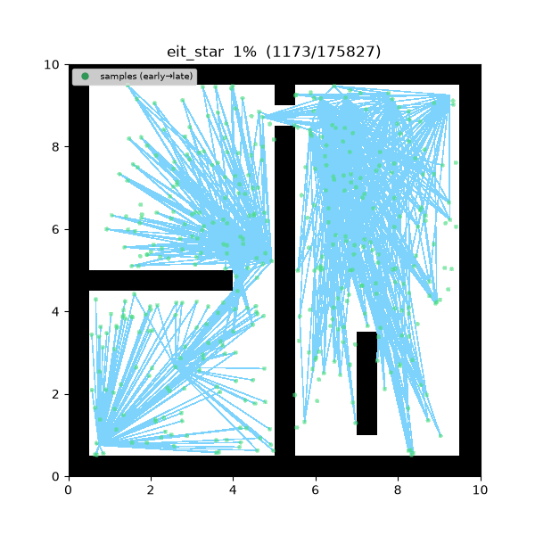
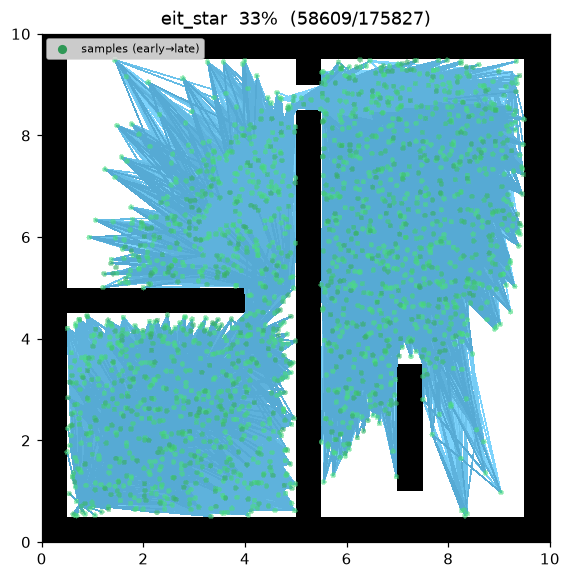
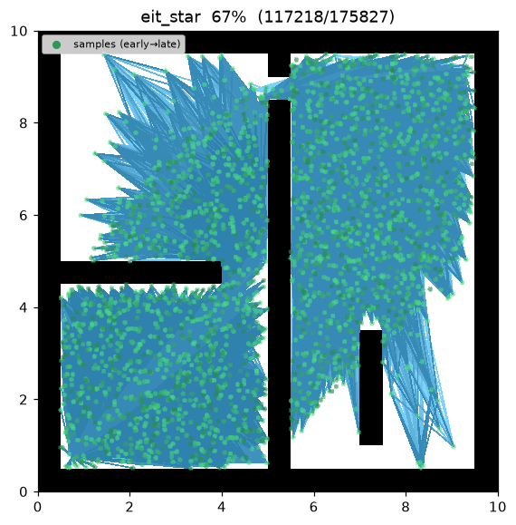
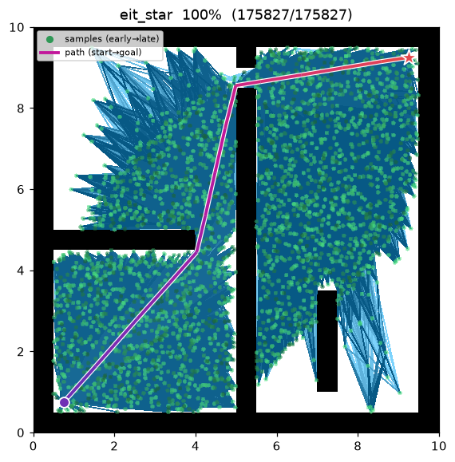
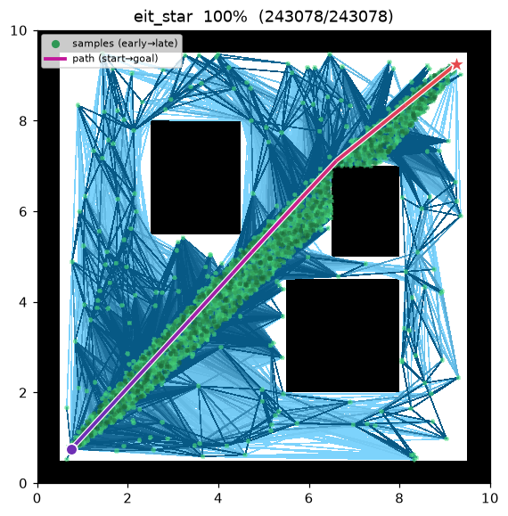

[🇰🇷 한국어](eit_star.md) | [🇬🇧 English](../../en/algorithms/eit_star.md)

# EIT\* (Effort Informed Trees)
{: .no_toc }

| 항목 | 내용 |
|---|---|
| 분류 | sampling-based, batch, anytime, asymptotically optimal, 비대칭 양방향 |
| 요구 capability | `SamplingSpace` |
| 완전성 | probabilistically complete |
| 최적성 | **almost-surely asymptotically optimal** |
| 추가 성질 | near-equal-cost 후보 중 **검증 비용이 싼** 해를 먼저 surface |
| 원 논문 | Strub & Gammell (2022, IJRR) [^strub_eit] |

1. TOC
{:toc}

## 배경

Strub & Gammell[^strub_eit] 의 EIT\* 는 AIT\* 계열을 잇는다. AIT\* 는 goal 에서 시작하는 **역방향
탐색**으로 RGG(random geometric graph) 위의 적응형 cost-to-go 휴리스틱을 만들고, 이를 소비하는
**순방향 best-first 탐색**이 실제 충돌 검사를 수행하며, 충돌로 판명된 간선을 역방향 탐색에
되먹여 휴리스틱을 적응시킨다. EIT\* 는 여기에 **검증 노력(validation effort)** 추정을 더한다 —
남은 경로를 충돌 검사하는 데 드는 비용을 함께 추정해, 비용이 비슷한 후보들 사이에서는 **검사가
싼**(간선이 적고 세그먼트가 짧은) 쪽을 선호한다. 고차원이나 검증이 비싼 공간에서는 그래프 탐색이
아니라 충돌 검사기가 실행 시간을 지배한다는 관찰이 동기다.

이 구현은 논문의 **충실한 핵심**을 담되 범위를 명시적으로 좁혔다(아래 [구현상 단순화](#구현상-단순화)).
핵심 아이디어(이중 cost+effort 역방향 휴리스틱 → lexicographic 순방향 탐색 + 간선 무효화 되먹임)는
그대로 구현하고, 반복적 재수리·완전한 다목적 통합·학습형 검증 비용 모델은 단순 대체물로 바꿨다.

## 동작 원리

`maze01` 에서의 탐색. 순방향 탐색을 이끄는 것은 여전히 비용이라 — AIT\* 처럼 배치를 거듭하며
미로 벽을 따라 우회한다 — 다만 비용이 비슷한 두 경로 사이에서는 effort tie-break 가 검증이 더
싼 쪽으로 밀어준다.



탐색 중간 과정 (좌 → 우: 초반 / 중반 / 최종 경로):

| | | |
|:---:|:---:|:---:|
|  |  |  |

`open01` 최종 결과 — 우회할 장애물이 없어 비용만으로 이미 직선 해가 선택되고, effort tie-break
가 개입할 일이 거의 없다:



배치마다 다음을 수행한다.

1. **RGG 성장** — `batch_size` 개의 informed 표본(Gammell et al. 2014[^gammell] 타원)을 뽑아 유효한
   것만 누적 표본 배열에 붙인다(0 = start, 1 = goal). `radius = γ·(log n/n)^{1/2}` 반경으로 이웃
   그래프를 만들고, **지금까지 충돌로 판명된 간선 집합**(배치 간 영구 유지)으로 필터링한다.
2. **역방향 탐색 (두 번의 독립 Dijkstra, 모두 goal 발원)** — 같은 필터 그래프 위에서
   - `ĥ(v)` = cost-to-go (간선 가중치 = `distance`),
   - `ê(v)` = effort-to-go (간선 가중치 = `effort`)
   를 각각 **독립된 단일 기준** Dijkstra 로 구한다.
3. **순방향 탐색** — lazy-deletion best-first. 힙 키는 lexicographic 튜플

   $$
   \bigl(\,g(v)+\hat h(v),\ \ e_g(v)+\hat e(v)\,\bigr)
   $$

   로, **비용이 1순위, effort 가 tie-break**다("동일 비용 해를 effort 로 구분"). 정점 $v$ 를 꺼내
   각 이웃 $x$ 에 대해 `candidate_evaluated` 를 방출한 뒤 **lazy** 하게 `is_motion_valid(v,x)` 를
   검사한다. 무효면 영구 무효 집합에 넣고 건너뛴다. 유효면 $g$·$e_g$ 를 갱신·채택하고
   `edge_added`(첫 연결)/`rewire`(개선)를 방출한다. $x=\text{goal}$ 이고 비용이 개선되면
   $c_{\text{best}}$ 를 갱신하고 `path_found` 를 방출한다.

```
EIT_STAR(start, goal):
    points ← {start, goal};  invalid ← ∅;  c_best ← ∞
    for batch in 1..max_batches:
        points ← points ∪ draw(batch_size, c_best)     # informed 배치 (해 존재 시)
        r ← gamma · sqrt(log n / n);  N ← radius_neighbors(points, r) \ invalid
        ĥ ← dijkstra(goal, N, weight=distance)          # cost-to-go
        ê ← dijkstra(goal, N, weight=effort)            # effort-to-go
        # 순방향: 키 (g+ĥ, e_g+ê) 의 lazy best-first
        g[start] ← 0;  e_g[start] ← 0;  push(start)
        while heap not empty:
            v ← pop_min()                               # lexicographic 최소
            if closed[v]: continue
            closed[v] ← true
            for x in N[v]:
                emit candidate_evaluated(x, g[v]+‖v−x‖)
                if not is_motion_valid(v, x):           # lazy 충돌 검사
                    invalid ← invalid ∪ {(v,x)}; continue
                if (g[v]+‖v−x‖, e_g[v]+effort(v,x)) < (g[x], e_g[x]):
                    connect_or_rewire(x, parent=v)
                    if x = goal and g[x] < c_best:
                        c_best ← g[x];  emit path_found
    return path(goal)                                   # 마지막 배치의 순방향 트리
```

여기서 effort 는 새 capability 없이 정의한다:

$$
\text{effort}(u,v) = \max\!\bigl(1,\ \mathrm{round}(\lVert u-v\rVert / \texttt{step\_size})\bigr),
$$

즉 이산화 검증기가 검사해야 할 `step_size` 크기 하위 세그먼트의 개수다. 맵 내부를 들여다보지 않고
`SamplingSpace` 의 `distance` 만으로 충돌 검사 비용을 근사한다.

$g,e_g,\text{parent}$·순방향 open 힙은 매 배치 누적 표본 배열 위에서 **새로** 계산한다(AIT\* 와 동일한
단순화 — 증분 이월 없음). $c_{\text{best}}$ 와 무효 간선 집합만 배치 간에 유지되며 개선·확장만 된다.

## 성질

- **완전성**: probabilistically complete[^strub_eit].
- **최적성**: **almost-surely asymptotically optimal.** 배치가 쌓이며 RGG 가 조밀해지고 informed
  표본이 해 영역에 집중된다[^strub_eit].
- **anytime**: 첫 배치에서 해가 나오면 이후 배치가 경로를 계속 조인다. `max_batches` 소진 시 현재
  최선 해를 반환한다.
- **effort 편향**: 비용이 비슷한 후보들 중 검증 비용(effort)이 낮은 쪽을 lexicographic 순서로
  먼저 확장하여, 같은 표본 예산에서 feasible 해를 더 빨리 surface 한다[^strub_eit].
- **lazy 충돌 검사 + 적응형 되먹임**: 간선은 순방향 탐색이 채택을 시도하는 순간에만 검사하고,
  무효 간선은 영구 집합에 쌓여 이후 배치의 역방향 휴리스틱을 자동으로 적응시킨다.

## 이중 휴리스틱과 lexicographic 순서

**두 개의 역방향 Dijkstra.** goal 을 발원점으로 같은 필터 그래프 위에서 두 번 돈다 — 한 번은
`distance` 가중치로 $\hat h$(cost-to-go), 한 번은 `effort` 가중치로 $\hat e$(effort-to-go). 두
휴리스틱 모두 실제 충돌 검사를 하지 않은 RGG 위의 **낙관적** 추정치라, 순방향 탐색을 해 영역으로
이끄는 admissible-형 가이드로 쓰인다.

**Lexicographic 우선순위.** 순방향 힙 키가 튜플이므로 비교가 사전식으로 이뤄진다 — 먼저 추정 총
비용 $g(v)+\hat h(v)$ 로 정렬하고, **동률일 때만** 추정 총 effort $e_g(v)+\hat e(v)$ 로 가른다.
연속 거리에서는 비용 동률이 드물어 effort 는 주로 near-tie 를 가르는 부드러운 편향으로 작동한다 —
경로 최적성을 훼손하지 않으면서 검증이 싼 해를 앞당긴다.

**Informed ellipse (Gammell et al. 2014).** 해 비용 $c_{\text{best}}$ 가 생기면 이후 표본은 start·goal
을 초점으로 하는 타원 안에서만 뽑는다. $c_{\min}=\lVert\text{start}-\text{goal}\rVert$ 에 대해 반장축
$r_1=c_{\text{best}}/2$, 반단축 $r_2=\tfrac12\sqrt{c_{\text{best}}^2-c_{\min}^2}$ 다. 이 타원 밖의 점은
어떤 경로도 $c_{\text{best}}$ 를 개선할 수 없어 표본에서 배제된다.

## 구현상 단순화

이 구현은 논문의 핵심 메커니즘(이중 cost+effort 역방향 휴리스틱을 소비하는 lexicographic 순방향
탐색 + 간선 무효화 되먹임)을 그대로 담되, 아래를 명시적으로 단순화했다.

- **배치 재계산 vs 증분 수리**: 논문의 역방향 탐색은 LPA\* 방식으로 배치 간 증분 수리하지만, 여기서는
  매 배치 누적 표본 배열 위에서 역방향/순방향 탐색을 처음부터 다시 계산한다. $c_{\text{best}}$ 와
  무효 간선 집합만 이월한다.
- **두 개의 독립 단일기준 Dijkstra vs 통합 다목적 탐색**: cost·effort 휴리스틱을 하나의 다목적
  탐색으로 통합하지 않고, 동일 그래프·동일 발원점에서 각각 한 번씩 도는 깨끗한 단일 기준 Dijkstra
  두 번으로 구한다.
- **단순 거리/step_size effort 프록시**: effort 를 학습·측정한 검증 비용 모델이 아니라
  `distance / step_size` 이산화 개수로 근사한다. 새 capability 없이 기존 `SamplingSpace` 만으로
  검증 비용을 대리한다.

## 파라미터

| 이름 | 타입 | 기본값 | 범위 | 설명 |
|---|---|---|---|---|
| `batch_size` | int | 200 | [1, 100000] | 배치당 새로 뿌리는 (informed) 샘플 수 |
| `max_batches` | int | 15 | [1, 10000] | 최대 배치 수 (anytime — 소진 시 현재 best 반환) |
| `gamma` | float | 30.0 | [0.01, 1000.0] | RGG 연결 반경 계수 γ. r_n = γ·(log n / n)^(1/2) |
| `step_size` | float | 0.5 | [0.01, 100.0] | effort 이산화 간격. effort=max(1, round(dist/step_size)) |
| `seed` | int | 1 | [0, 2^31−1] | 난수 시드 (재현성) |

## 방출 trace 이벤트

`planning_started` → `sample_drawn`\* → `candidate_evaluated`\* → `edge_added`\* / `rewire`\* → `path_found`\* → `planning_finished`

`sample_drawn` 은 배치별 표본, `candidate_evaluated` 는 순방향 탐색이 검토하는 이웃(비용을 1순위
지표로 보고), `edge_added` 는 첫 연결, `rewire` 는 개선, `path_found` 는 goal 비용이 개선될 때마다
방출된다.

## References

[^strub_eit]: Strub, M. P., & Gammell, J. D. (2022). "Adaptively Informed Trees (AIT\*) and Effort Informed Trees (EIT\*): Asymmetric bidirectional sampling-based path planning." *The International Journal of Robotics Research*, 41(4), 390–417. [doi:10.1177/02783649211069572](https://doi.org/10.1177/02783649211069572) · [PDF (arXiv)](https://arxiv.org/abs/2111.01877)
[^gammell]: Gammell, J. D., Srinivasa, S. S., & Barfoot, T. D. (2014). "Informed RRT\*: Optimal sampling-based path planning focused via direct sampling of an admissible ellipsoidal heuristic." *Proc. IEEE/RSJ IROS*, 2997–3004. [doi:10.1109/IROS.2014.6942976](https://doi.org/10.1109/IROS.2014.6942976) · [PDF (arXiv)](https://arxiv.org/abs/1404.2334)
[^karaman]: Karaman, S., & Frazzoli, E. (2011). "Sampling-based algorithms for optimal motion planning." *The International Journal of Robotics Research*, 30(7), 846–894. [doi:10.1177/0278364911406761](https://doi.org/10.1177/0278364911406761) · [PDF (arXiv)](https://arxiv.org/abs/1105.1186)
