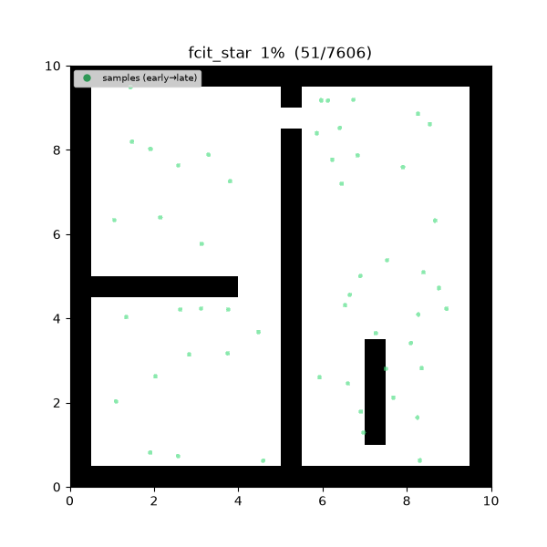
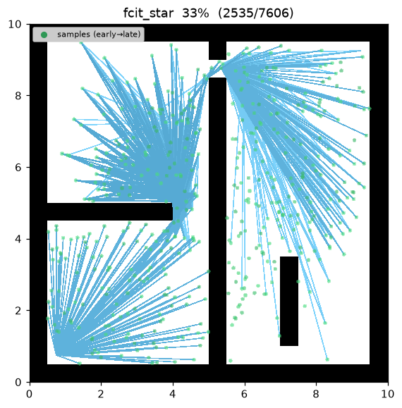
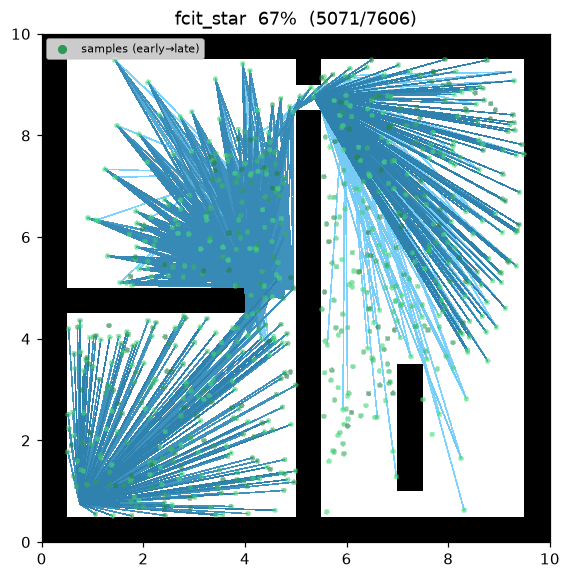
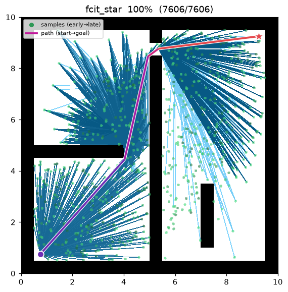
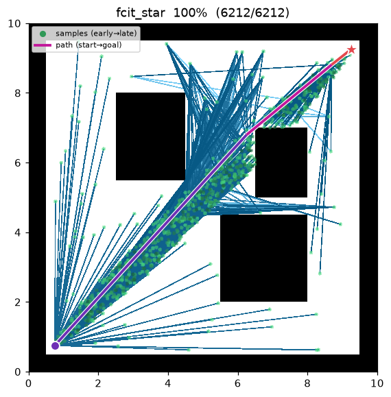

[🇰🇷 한국어](fcit_star.md) | [🇬🇧 English](../../en/algorithms/fcit_star.md)

# FCIT\* (Fully Connected Informed Trees)
{: .no_toc }

| 항목 | 내용 |
|---|---|
| 분류 | sampling-based, batch, anytime, asymptotically optimal |
| 요구 capability | `SamplingSpace` |
| 완전성 | probabilistically complete |
| 최적성 | asymptotically optimal — 완전 연결 그래프로 반경 제한 없이 탐색 |
| 복잡도 | 배치당 O(n²) 후보 간선 + reverse Dijkstra + lazy 충돌 검사 |
| 원 논문 | Wilson, Strub & Gammell (2025), ICRA [^wilson_fcit] |

1. TOC
{:toc}

## 배경

BIT\*·AIT\*·EIT\* 같은 배치 계열은 간선 수를 제한하기 위해 표본을 **줄어드는 반경**(RGG,
$r_n=\gamma\sqrt{\log n / n}$)의 이웃끼리만 잇는다. FCIT\*[^wilson_fcit] 는 관점을 뒤집는다 —
**현대 충돌 검사는 충분히 싸므로**, 반경으로 후보를 잘라낼 필요 없이 현재 informed 배치 위에
**완전 연결 그래프**(모든 표본이 다른 모든 표본과 짝지어짐)를 세우고 그 위에서 informed
best-first 탐색을 바로 돌린다. 간선 검증은 반경 계열과 똑같이 lazy(탐색이 그 간선을 쓰려 할 때만)
로 미룬다. 반경을 버림으로써 **더 많은(값싼, 아직 미검사) 후보 간선**을 얻는 대신, 반경 그래프라면
놓쳤을 지름길을 찾을 수 있는 탐색을 얻는다.

휴리스틱은 AIT\*(Strub & Gammell 2020[^strub_ait])의 **역방향 탐색 휴리스틱** 아이디어를
그대로 쓴다 — goal 에서 시작한 Dijkstra 가 (완전 연결 그래프 위에서) 각 정점의 cost-to-go 추정
$\hat h$ 를 준다. 해가 생기면 이후 배치는 **informed ellipse**(Gammell et al. 2014[^gammell])
에서 표본을 뽑아 개선 가능한 영역에 집중한다. anytime 알고리즘으로, 배치를 거듭하며 경로를 조인다.

## 동작 원리

`maze01` 에서의 탐색. 누적된 모든 표본이 서로 완전히 연결되므로, 단일 트리를 점증적으로 키우는
대신 배치마다 그래프가 조밀하게 채워지고, 새 배치가 올 때마다 경로가 조여진다.



탐색 중간 과정 (좌 → 우: 초반 / 중반 / 최종 경로):

| | | |
|:---:|:---:|:---:|
|  |  |  |

`open01` 최종 결과 — 완전 그래프가 start-goal 직접 간선을 포함하므로, 첫 배치만으로 이미
거의 직선에 가까운 경로가 연결된다:



`points[0]=start`, `points[1]=goal`. 각 배치마다:

1. **배치 성장.** informed 타원에서 `batch_size` 개 표본을 뽑아 유효한 것만 누적 배열에 추가.
2. **완전 연결 인접.** 모든 누적 표본에 대해 `nbr[i] = { j ≠ i }` — 반경 제한 없음. 지금까지
   충돌로 밝혀진 간선을 모으는 **영속적 `invalid_edges`** 집합만 제외한다(정규화된 무방향 쌍).
3. **역방향 탐색.** 위 필터링된 완전 그래프에서 goal 로부터 Dijkstra 를 돌려 모든 정점의 $\hat h$
   를 얻는다.
4. **정방향 탐색.** $g+\hat h$ 로 정렬된 lazy-deletion best-first(A\*). 간선을 고려할 때
   `is_motion_valid` 로 늦게 검증하고(충돌이면 `invalid_edges` 에 넣고 skip), $g[x]$ 를 개선하면
   채택한다(첫 연결 → `edge_added`, 개선 → `rewire`). goal 이 개선되면 $c_{\text{best}}$ 갱신 +
   `path_found` 방출.

```
FCIT_STAR(start, goal):
    points ← [start, goal];  invalid ← ∅;  c_best ← ∞
    for batch in 1..max_batches:
        points ← points ∪ draw(batch_size, c_best)     # informed 배치 (해 존재 시)
        nbr[i] ← { j ≠ i : (i,j) ∉ invalid }            # 완전 연결 (반경 없음)
        h_hat  ← DIJKSTRA_from_goal(nbr, distance)       # reverse search: adaptive heuristic
        g[start] ← 0;  open ← {start}                    # forward A* (배치마다 새로)
        while open ≠ ∅:
            v ← pop_min(open, key = g[v] + h_hat[v])
            if closed[v]: continue
            close v
            if v = goal: break                            # goal 확정 → 이 배치 종료
            for x in nbr[v]:
                if closed[x]: continue
                t ← g[v] + ‖v−x‖
                if t ≥ g[x]: continue                     # v 경유로 개선 불가
                if (v,x) ∈ invalid: continue
                if not is_motion_valid(v, x):             # lazy 검증 (여기서만)
                    invalid ← invalid ∪ {(v,x)};  continue
                g[x] ← t;  parent[x] ← v;  push(open, x)
                if x = goal and g[goal] < c_best:
                    c_best ← g[goal]                      # incumbent 개선
    return path(goal)
```

$\hat h(v)$ 는 완전 그래프에서 $v{\to}$goal 최단거리다. 이는 실제 충돌 없는 cost-to-go 의
**하한**(검증된 간선의 상위 집합이므로)이라 admissible 하고, 최단거리 함수이므로 정방향 탐색에
대해 **consistent** — 임의의 간선 $(v,x)$ 에 대해 $\hat h(v)\le\lVert v-x\rVert+\hat h(x)$ 가
삼각부등식으로 성립한다. 따라서 재확장 없는 A\* 로도 이 배치 그래프에서 최적 경로를 낸다.

빈 공간에서는 완전 그래프가 start–goal 직접 간선을 포함하므로, 정방향 탐색이 첫 배치에서 곧바로
직선 경로를 잇는다 — cost 는 사실상 직선 하한과 같다.

## 성질

- **완전성**: probabilistically complete[^wilson_fcit].
- **최적성**: asymptotically optimal. 배치가 쌓이며 표본이 조밀해지고 informed 표본이 해 영역에
  집중되어 최적으로 수렴한다.
- **anytime**: 첫 해 이후 배치가 경로를 계속 조인다. `max_batches` 소진 시 현재 최선 해 반환.
- **값싼 충돌 검사 활용**: 반경 제한을 없애 반경 계열(BIT\*/AIT\*)보다 조밀한 그래프를 탐색한다 —
  대가는 배치당 더 많은(지연·lazy) 후보 간선이다.

## 구현상 단순화

원 논문 대비 아래를 명시적으로 축소했다.

- **역방향 탐색을 배치마다 처음부터 재계산**한다 — 논문의 증분 복구(incremental repair)를 쓰지
  않는다. 마찬가지로 정방향 트리($g$, `parent`, open-heap)도 매 배치 새로 만든다. 배치 간에
  **영속하는 것은 $c_{\text{best}}$ 와 `invalid_edges` 뿐**이며, 둘 다 단조롭게만 개선·증가한다.
- **표본 예산을 작게 유지**한다. 완전 그래프는 간선 수가 O(n²) 이므로 이 구현은 누적 표본을 수백
  개 규모로 제한한다. 논문은 대규모에서도 all-pairs 평가를 값싸게 유지하는 더 정교한 방법을
  제시하지만, 이 구현은 그 부분을 재현하지 않는다.

이 축소들은 완전 연결 informed-batch 그래프 + 적응형 lazy 검증 best-first 탐색이라는 **핵심 기제**는
그대로 두고, 규모 확장 기법만 생략한 것이다.

## 파라미터

| 이름 | 타입 | 기본값 | 범위 | 설명 |
|---|---|---|---|---|
| `batch_size` | int | 80 | [1, 100000] | 배치당 새로 뿌리는 (informed) 샘플 수. 완전 연결(O(n²) 간선)이라 작게 유지 |
| `max_batches` | int | 10 | [1, 10000] | 최대 배치 수 (anytime — 소진 시 현재 best 반환) |
| `seed` | int | 1 | [0, 2^31−1] | 난수 시드 (재현성) |

반경 정책이 없으므로 BIT\*/PRM\* 의 `gamma` 파라미터는 존재하지 않는다.

## 방출 trace 이벤트

`planning_started` → `sample_drawn`\* → `candidate_evaluated`\* → `edge_added`\* → `rewire`\* → `path_found`\* → `planning_finished`

`sample_drawn` 은 배치별 표본, `candidate_evaluated` 는 정방향 탐색이 고려한(개선 가능성 있는)
간선, `edge_added` 는 첫 연결, `rewire` 는 더 싼 경로로의 재연결, `path_found` 는
$c_{\text{best}}$ 가 개선될 때마다(현재 최선 해) 방출된다.

## References

[^wilson_fcit]: Wilson, T., Strub, M. P., & Gammell, J. D. (2025). "Fully Connected Informed Trees (FCIT\*): Fast, informed, asymptotically optimal sampling-based planning by exploiting cheap collision checking." *Proc. IEEE International Conference on Robotics and Automation (ICRA)*. DOI placeholder (2025 ICRA proceedings; not independently verified here): `10.1109/ICRA.2025.XXXXXXX`.
[^strub_ait]: Strub, M. P., & Gammell, J. D. (2020). "Adaptively Informed Trees (AIT\*): Fast asymptotically optimal path planning through adaptive heuristics." *Proc. IEEE ICRA*, 3191–3198. [doi:10.1109/ICRA40945.2020.9197338](https://doi.org/10.1109/ICRA40945.2020.9197338) · [PDF (arXiv)](https://arxiv.org/abs/2002.06599)
[^gammell]: Gammell, J. D., Srinivasa, S. S., & Barfoot, T. D. (2014). "Informed RRT\*: Optimal sampling-based path planning focused via direct sampling of an admissible ellipsoidal heuristic." *Proc. IEEE/RSJ IROS*, 2997–3004. [doi:10.1109/IROS.2014.6942976](https://doi.org/10.1109/IROS.2014.6942976) · [PDF (arXiv)](https://arxiv.org/abs/1404.2334)
