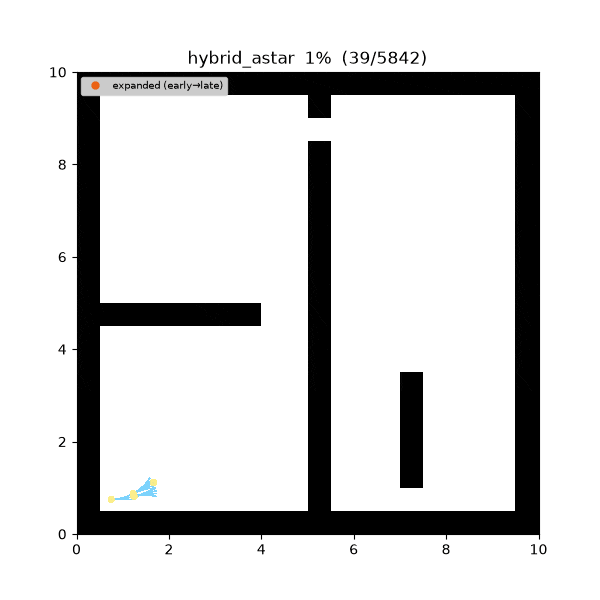
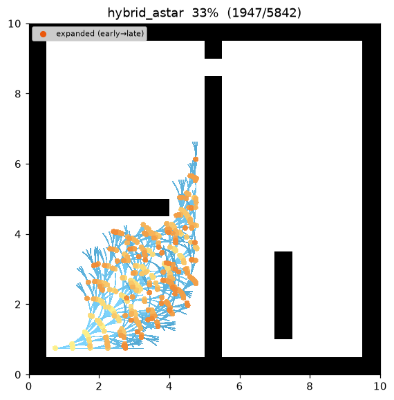
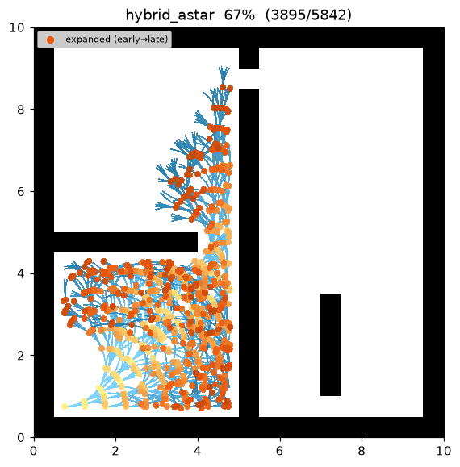
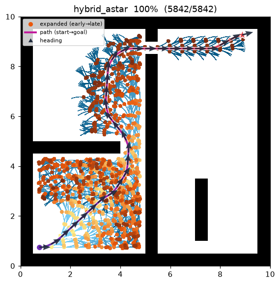
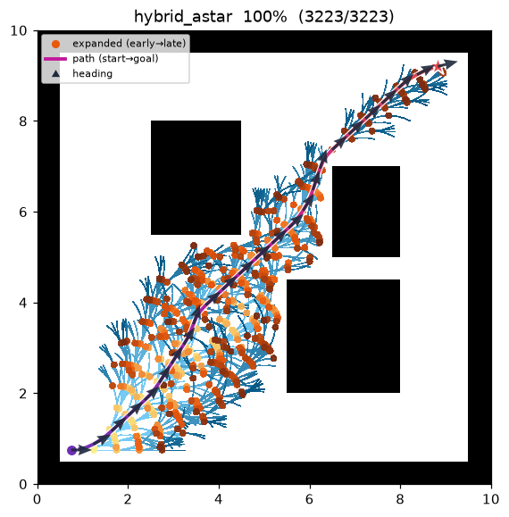

[🇰🇷 한국어](hybrid_astar.md) | [🇬🇧 English](../../en/algorithms/hybrid_astar.md)

# Hybrid A* (kinodynamic SE(2))
{: .no_toc }

| 항목 | 설명 |
|---|---|
| 분류 | kinodynamic 탐색 (연속 SE(2) pose) |
| 요구 capability | `SE2CollisionSpace` (`is_collision(footprint, pose)`) |
| 완전성 | resolution-complete (유한 bin 이산화) |
| 최적성 | resolution-suboptimal — feasible 하나 엄밀 최적은 아님 (Dolgov et al. 2008) |
| 복잡도 | 이산 bin 위 A\* × 노드당 상수곡률 모션 프리미티브 |
| 원 논문 | Dolgov, Thrun, Montemerlo & Diebel (2008) [^dolgov] |

1. TOC
{:toc}

## 배경

A\*[^hart] 는 격자 위에서 셀 단위로만 움직이므로 차량의 **방향(heading)과 회전반경**을 무시한다 — 자동차는
90° 계단 경로를 따라갈 수 없다. **Hybrid A\***[^dolgov] 는 대신 **연속 SE(2)** pose 공간 (x, y, θ) 을
탐색한다. 노드를 확장할 때 실제로 주행 가능한 **상수곡률 모션 프리미티브**(호)를 시뮬레이션하므로 모든
간선이 kinematically feasible 하다. 연속 탐색을 유한하게 유지하기 위해 **이산화된 (x, y, θ) bin 을
키로 하는 closed set** 을 둔다: 같은 bin 의 두 pose 는 같은 탐색 노드로 취급하되, 경로 자체는 연속으로
남는다.

이름이 "hybrid" 인 이유는 *상태*는 연속이고 *방문 집합*은 이산이기 때문이다.

## 동작 방식

```
HYBRID-A*(start, goal):
    g[bin(start)] ← 0 ; pose_of[bin(start)] ← start
    open ← f = g + h 우선순위 큐               # h = Euclidean 직선 거리
    while open 비어있지 않음:
        b ← open.pop_min() ; 이미 settle 됐으면 continue ; settle b
        p ← pose_of[b]                        # 그 bin 의 최선 연속 pose
        if reached_goal(p): return reconstruct(came_from)
        for (κ, L, reverse) in motion_primitives():  # 전진 fan, 그다음 후진 fan
            subs ← sample_arc(p, κ, L)         # 호를 따라 dense sub-pose
            if any is_collision(footprint, s) for s in subs: continue
            child ← subs[-1] ; b2 ← bin(child)
            cand ← g[b] + arc_cost(L, κ, reverse)
            if cand < g[b2]:
                g[b2] ← cand ; pose_of[b2] ← child ; came_from[b2] ← (b, subs)
                open.push(b2, cand + h(child))
    return failure
```

### 모션 프리미티브 — 차량 모델은 planner 에 있다

맵은 footprint 충돌만 답하고, **차량 모델은 전부 planner** 에 있으며 config 파라미터로 구동된다. 최대 곡률
`κ_max = 1 / min_turn_radius` 에 대해 planner 는 `[−κ_max, +κ_max]` 를 균등 분할한 `num_steering` 개
곡률을 부채꼴로 뻗고(홀수면 κ = 0 직진 포함), 각각을 `arc_step` 만큼 전진 — `allow_reverse` 면 후진도 —
시킨다. 프리미티브는 상수곡률 호를 적분한다 (θ 는 additive, heading 에 trig 불필요):

```
θ' = θ + κ·L
|κ| ≈ 0:  x' = x + L·cosθ ;            y' = y + L·sinθ
그 외:    x' = x + (sinθ' − sinθ)/κ ;  y' = y − (cosθ' − cosθ)/κ
cost = |L|·(reverse ? reverse_penalty : 1) + steer_penalty·|κ|·|L|
```

### Footprint 충돌 — 내접원(inscribed disc), 맵에서 판정

로봇은 반경 `footprint_radius` 의 **내접원**이다. 원은 방향 불변이라 충돌은 오직 `(x, y)` 에만 의존하므로
swept-polygon trig 이 없다. 맵은 원을 셀에 rasterize 하여 **occupied 또는 out-of-bounds** 셀이 원과
겹치면 충돌로 보고한다 — `sqrt`·trig 없는 정확한 disc-vs-cell **제곱거리** 판정. 각 호는 간격 ≤
`footprint_radius` 로 sub-sample 된다(`n_sub = max(2, ⌈arc_step / footprint_radius⌉)`). 그래서 연속
footprint 원들이 겹치고 얇은 벽이 두 충돌 검사 사이로 빠져나갈 수 없다(터널링 방지). 같은 sub-pose 들이
충돌 검사와 시각화에 함께 쓰인다.

### 이산화 bin — planner 내부, grid 인덱스 누출 없음

closed set 은 planner 가 world 좌표와 자신의 `xy_resolution` / `theta_bins` 만으로 계산한 bin 을 키로
쓴다 — `map.world_to_cell` 을 절대 호출하지 않는다(맵의 grid 프레임이 planner 로 새는 것을 막는다):

```
bin(p) = (⌊x / xy_resolution⌋, ⌊y / xy_resolution⌋, ⌊wrap(θ) / (2π / theta_bins)⌋ mod theta_bins)
```

### 휴리스틱 — Euclidean 단일

원 논문은 휴리스틱을 두 개 쌓는다(장애물을 무시하는 non-holonomic Reeds-Shepp/Dubins 거리, 차량을 무시하는
holonomic grid-Dijkstra 거리). 본 스터디는 의도적으로 **admissible Euclidean 직선 휴리스틱 단일**
`h = √(Δx² + Δy²)` 만 구현한다(`hypot` 아님, `sqrt`): Reeds-Shepp shot 은 `atan2`/`acos` 와 분기 로직이
많아 결정성에 부담이고, grid-Dijkstra 는 맵의 `neighbors()` 가 필요하지만 standalone `SE2CollisionSpace`
는 이를 의도적으로 노출하지 않는다. 둘 다 향후 확장 옵션으로만 남긴다. goal 로의 **analytic (Reeds-Shepp)
expansion 도 없으며**, 목표는 위치 + heading 허용오차 이내로 도달한다.

## 성질

- **완전성**: resolution-complete — 선택한 bin 해상도에서 해가 존재하면 찾는다.
- **최적성**: resolution-**suboptimal**. 이산화된 closed set 과 유한 프리미티브 집합 때문에 반환 경로는
  feasible·저비용이나 엄밀 최적은 아니다(Dolgov et al. 2008). analytic expansion 이 없어 최종 heading 은
  `goal_heading_tolerance` 이내로만 맞춘다.
- **feasibility**: 모든 간선이 `min_turn_radius` 이내 상수곡률 호이므로 전체 경로가 주행 가능하다 — 각
  스텝은 프리미티브 하나 이내이고 각 heading 변화는 곡률 한계를 지킨다.
- **복잡도**: (x, y, θ) bin 위 A\*, 노드당 `num_steering`(후진 시 ×2) 분기.

## 파라미터

| 이름 | 타입 | 기본 | 범위 | 설명 |
|---|---|---|---|---|
| `min_turn_radius` | float | 1.0 | [0.1, 50.0] | 최소 회전반경 (m). `κ_max = 1 / min_turn_radius` |
| `arc_step` | float | 0.5 | [0.05, 20.0] | 모션 프리미티브 1개 호 길이 (m); g 비용 단위 증분 |
| `num_steering` | int | 5 | [2, 51] | `[−κ_max, +κ_max]` 이산 곡률 수; 홀수면 직진 포함 |
| `theta_bins` | int | 72 | [4, 360] | closed-set bin 의 heading 버킷 수 |
| `xy_resolution` | float | 0.5 | [0.01, 10.0] | closed-set 위치 해상도 (m/bin); planner 전용, 맵과 무관 |
| `footprint_radius` | float | 0.2 | [0.01, 20.0] | 내접원 footprint 반경 (m) |
| `allow_reverse` | bool | false | — | 후진 프리미티브 허용 |
| `reverse_penalty` | float | 2.0 | [1.0, 100.0] | 후진 호 비용 배수(후진 억제) |
| `steer_penalty` | float | 0.1 | [0.0, 100.0] | 곡률 사용 페널티: `cost += steer_penalty·|κ|·|L|` |
| `goal_pos_tolerance` | float | 0.5 | [0.01, 20.0] | goal 위치 허용오차 (m) |
| `goal_heading_tolerance` | float | 0.26 | [0.01, 3.1416] | goal heading 허용오차 (rad) |

## 구현 노트

- C++: `cpp/src/global_planning/search/hybrid_astar.cpp`, Python: `python/navigation/global_planning/search/hybrid_astar.py`
- **결정성 (same-libm, IEEE cross-platform 아님)**: 순수 산술인 격자 탐색과 달리 Hybrid A\* 의 `x, y` 는
  `sin`/`cos` 에서 나오는데, IEEE-754 는 이들의 correctly-rounded 를 **요구하지 않는다**. CPython `math`
  와 C++ `std` 는 **같은 C libm** 을 감싸므로 한 머신에서 두 trace 와 `path_cost`/`expanded_nodes` 는
  bit-identical 이지만, 이는 shared-libm 가정이지 IEEE 보장이 아니다. `hypot` 대신 correctly-rounded
  `sqrt`, `numpy` 대신 `math` 스칼라, 고정된 프리미티브 방출 순서 + `(f, 삽입순서)` tie-break 를 쓴다 —
  maze01 확장 순서와 비용이 C++/Python 간 셀 단위로 일치한다.
- 반환 경로는 **dense sub-pose polyline**(모든 호의 sub-pose 연결)이라 sparse 노드 목록이 아니라 매끄러운
  주행 곡선이다.

## 방출 Trace 이벤트

`planning_started` → (`node_expanded`, `candidate_evaluated`, `edge_added`)* → `path_found` → `planning_finished`

Hybrid A\* 는 **새 trace 이벤트도, 스키마 변경도 없다**. 채택된 호마다 dense sub-pose 위 **`edge_added`
chord chain** 으로 방출하므로, `replay.py` 는 호 전용 로직 없이 직선 조각들로 매끄러운 곡선을 그린다. 상태는
3-요소 `[x, y, θ]`(스키마가 이미 heading 을 허용)이고, `replay.py` 는 상태에 세 번째 요소가 있으면
**heading 화살표**를 오버레이한다 — 기존 2-요소 planner 는 byte-identical 로 렌더되도록 gate 된다.

## 데모

`maze01` 탐색. frontier 는 bin 을 따라 자라지만 최종 경로는 **매끄러운 곡선**이고, heading 화살표가 차량이
회전반경 이내로 돌며 gap 을 통과하는 모습을 보여준다.



탐색 중간 과정 (좌 → 우: 초반 / 중반 / 최종 경로):

| | | |
|:---:|:---:|:---:|
|  |  |  |

`open01` 최종 결과:



재현:

```bash
python python/demos/demo_hybrid_astar.py \
  --map maps/grid/maze01.yaml --scenario maps/scenarios/maze01_s1.yaml \
  --params configs/global_planning/hybrid_astar.yaml --trace out/hybrid_astar.jsonl
python tools/viz/replay.py out/hybrid_astar.jsonl --gif out/hybrid_astar.gif --snapshots out/hy_snaps/
```

## 참고 문헌

[^dolgov]: Dolgov, D., Thrun, S., Montemerlo, M., & Diebel, J. (2008). "Practical Search Techniques in Path Planning for Autonomous Driving." *Proc. STAIR (AAAI Workshop)*. [PDF](https://ai.stanford.edu/~ddolgov/papers/dolgov_gpp_stair08.pdf)
[^hart]: Hart, P. E., Nilsson, N. J., & Raphael, B. (1968). "A Formal Basis for the Heuristic Determination of Minimum Cost Paths." *IEEE Transactions on Systems Science and Cybernetics*, 4(2), 100–107. [doi:10.1109/TSSC.1968.300136](https://doi.org/10.1109/TSSC.1968.300136)
