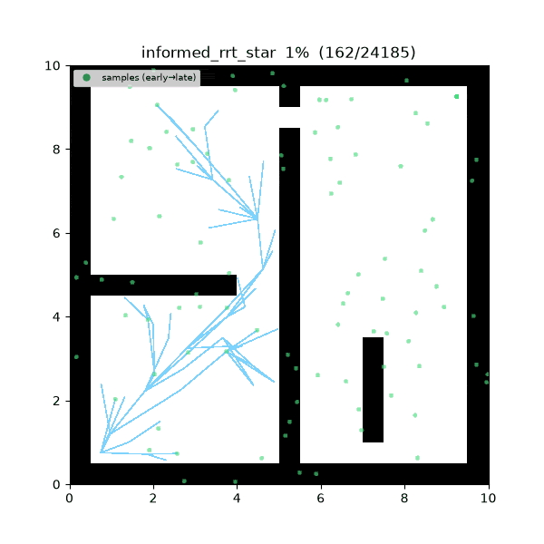
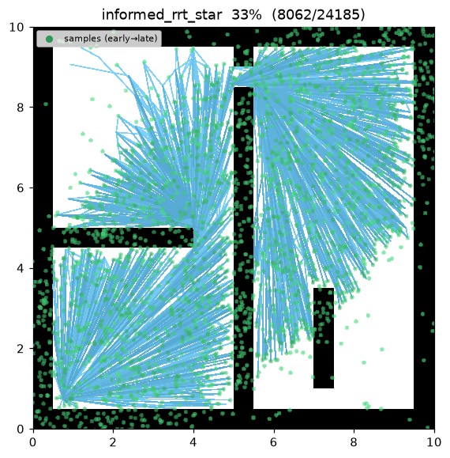
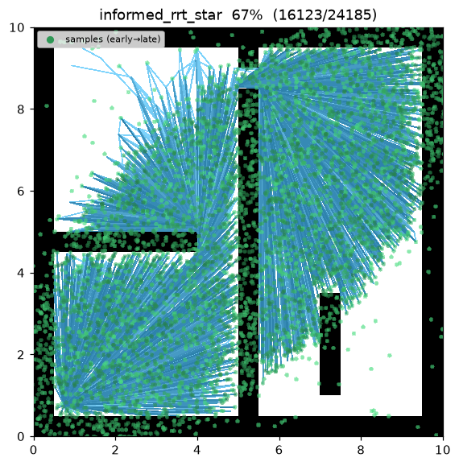
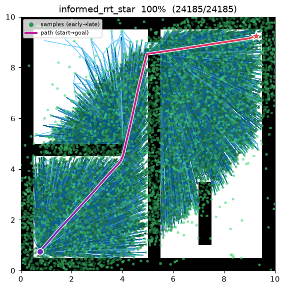
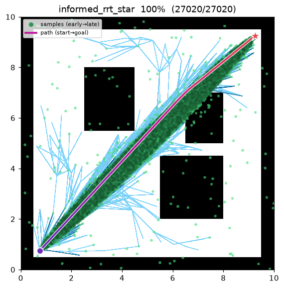

[🇰🇷 한국어](informed_rrt_star.md) | [🇬🇧 English](../../en/algorithms/informed_rrt_star.md)

# Informed RRT\* (Informed RRT-star)
{: .no_toc }

| 항목 | 내용 |
|---|---|
| 분류 | sampling-based, single-query, anytime, asymptotically optimal |
| 요구 capability | `SamplingSpace` |
| 완전성 | probabilistically complete |
| 최적성 | **asymptotically optimal** ([RRT\*](rrt_star.md) 와 동일 보장, 통상 더 빠르게 수렴) |
| 복잡도 | 반복당 near-neighbor 질의 지배 (RRT\* 와 동일) |
| 원 논문 | Gammell, Srinivasa & Barfoot (2014) [^gammell] |

1. TOC
{:toc}

## 배경

Gammell 등[^gammell] 은 [RRT\*](rrt_star.md)[^karaman] 의 **트리 성장 방식은 그대로 두고**,
해가 하나 생긴 뒤의 **표본 분포만** 바꾼 Informed RRT\* 를 제안했다. RRT\* 는 해를 찾은 뒤에도
전체 공간에서 균등하게 표본을 뽑는데, 그 대부분은 현재 최선 해(incumbent)를 개선할 수 없는
영역에 떨어진다. Informed RRT\* 는 해가 존재하면 표본을 **informed ellipse** — 초점이 start·goal,
횡단 지름이 현재 해 비용 $c_{\text{best}}$ 인 타원 — 안에서만 뽑아, 개선 가능 영역에 표본을 집중시킨다.

이 논문의 기여는 **표본 분포 하나**다. choose-parent·rewire·anytime incumbent 추적 등
트리 성장 mechanics 는 [RRT\*](rrt_star.md) 와 완전히 동일하다.

## 동작 원리

`maze01` 에서의 탐색. 해가 나오기 전까지는 순수 RRT\* 와 표본화가 동일하지만, 첫 경로가 발견되는
순간 파면이 informed ellipse 안으로 눈에 띄게 수축하고, incumbent 가 개선될 때마다 더 조여진다.



탐색 중간 과정 (좌 → 우: 초반 / 중반 / 최종 경로):

| | | |
|:---:|:---:|:---:|
|  |  |  |

`open01` 최종 결과 — 타원이 start-goal 직선에 거의 밀착할 만큼 줄어들어, 해를 찾은 이후 표본
대부분이 직선 경로 주변에 떨어진다:



RRT\* 와 딱 한 줄만 다르다 — 표본을 뽑는 방식이다:

```
INFORMED_RRT_STAR(start, goal):
    T ← {start};  c_best ← ∞
    for i in 1..max_iterations:                       # anytime — 끝까지 돈다
        if c_best < ∞:
            x_rand ← informed_sample(start, goal, c_best)   # 개선 가능한 타원 안에서만
        else:
            x_rand ← (goal with prob. goal_bias) else sample()   # 해 이전: RRT* 와 동일
        x_near ← nearest(T, x_rand)
        x_new  ← steer(x_near, x_rand, step_size)
        if not is_motion_valid(x_near, x_new): continue
        N ← near(T, x_new, neighbor_radius)
        parent ← argmin_{x ∈ N ∪ {x_near}} cost(x) + c(x, x_new)   # choose-parent
        T.add(x_new, parent)
        for x ∈ N:                                                 # rewire
            if cost(x_new) + c(x_new, x) < cost(x) and is_motion_valid(x_new, x):
                x.parent ← x_new
        if distance(x_new, goal) ≤ goal_tolerance:
            c_best ← min(c_best, path through x_new)   # incumbent 갱신하며 계속 탐색
    return best
```

해를 찾기 전에는 [RRT\*](rrt_star.md) 와 완전히 같은 goal-biased 균등 표본화를 쓴다. 첫 해가
나오는 순간부터 표본이 타원 안으로 조여지고, incumbent 가 줄 때마다 타원이 더 조여져
표본이 해가 있을 수 있는 영역에만 집중된다.

재현:

```bash
python python/demos/demo_informed_rrt_star.py \
  --map maps/grid/maze01.yaml --scenario maps/scenarios/maze01_s1.yaml \
  --params configs/global_planning/informed_rrt_star.yaml --trace out/informed_rrt_star.jsonl
python tools/viz/replay.py out/informed_rrt_star.jsonl --gif out/informed_rrt_star.gif
```

## 성질

- **완전성**: probabilistically complete ([RRT\*](rrt_star.md) 와 동일)[^gammell].
- **최적성**: asymptotically optimal. 표본이 타원 안에 집중돼도 타원은 최적 경로를 항상 포함하므로
  RRT\* 의 거의 확실한 최적성 보장이 그대로 유지된다[^gammell].
- **수렴 속도**: 해 이후 표본이 개선 가능 영역에만 떨어지므로, 같은 반복 예산에서 RRT\* 보다
  경로를 **빠르게·더 조밀하게** 조인다. 균등 표본화가 넓은 자유 공간에서 개선 불가 영역을
  헛되이 채우는 낭비를 없앤다[^gammell].
- **비용**: 반복당 비용은 RRT\* 와 사실상 같다 (타원 표본은 균등 표본을 한 번 변환할 뿐).

## Informed sampling — 도출

**Informed ellipse (Gammell et al. 2014).** 해 비용 $c_{\text{best}}$ 가 존재할 때, start·goal 을
초점으로 하는 타원 안에서만 표본을 뽑는다. $c_{\min}=\lVert\text{start}-\text{goal}\rVert$ 에 대해

$$
r_1=\frac{c_{\text{best}}}{2},\qquad
r_2=\frac{\sqrt{c_{\text{best}}^{\,2}-c_{\min}^{\,2}}}{2},
$$

중심은 두 점의 중점, 회전은 start→goal 축이다. $x^2/r_1^2+y^2/r_2^2\le1$ 밖의 점은 어떤 경로도
$c_{\text{best}}$ 를 개선할 수 없으므로 표본에서 배제된다.

*도출.* 점 $x$ 를 지나는 어떤 경로도 길이 $\ge f(x)=\lVert\text{start}-x\rVert+\lVert x-\text{goal}\rVert$
(삼각부등식)이다. $f(x)>c_{\text{best}}$ 이면 $x$ 경유로는 incumbent 를 못 줄이니 버려도 안전하고,
남는 집합 $\{x:f(x)\le c_{\text{best}}\}$ 은 **두 초점까지 거리의 합이 일정 이하**라는 타원의 정의
그 자체다(장축 $=c_{\text{best}}$). 초점 간 거리 $c_{\min}$ 에서 반장축 $r_1=c_{\text{best}}/2$,
반단축 $r_2=\tfrac12\sqrt{c_{\text{best}}^{\,2}-c_{\min}^{\,2}}$ 가 곧바로 나온다. incumbent 가 줄면
타원이 조여 표본을 해가 있을 수 있는 영역에만 집중시킨다. ∎

{: .note }
> 타원은 항상 최적 경로를 포함한다 (최적 비용 $c^\* \le c_{\text{best}}$ 이므로 최적 경로 위 모든 점이
> $f(x)\le c^\*\le c_{\text{best}}$ 를 만족한다). 따라서 표본을 타원으로 제한해도 RRT\* 의 최적성은
> 깨지지 않고, 헛된 표본만 제거된다 — 이것이 informed sampling 이 "공짜 가속"인 이유다.

이 프로젝트에서 타원 표본화는 `informed_sample` 하나로 구현되어 있고, [BIT\*](bit_star.md) 를
비롯한 informed 계열 planner 가 모두 같은 함수를 공유한다.

## 파라미터

| 이름 | 타입 | 기본값 | 범위 | 설명 |
|---|---|---|---|---|
| `max_iterations` | int | 8000 | [1, 200000] | 반복 예산 (anytime — 소진 시 현재 best 반환) |
| `step_size` | float | 0.5 | [0.01, 100.0] | steer 확장 거리 η (m) |
| `goal_bias` | float | 0.05 | [0.0, 1.0] | 해 이전 goal 을 직접 sample 할 확률 |
| `goal_tolerance` | float | 0.3 | [0.0, 100.0] | goal 도달 판정 반경 (m) |
| `neighbor_radius` | float | 1.5 | [0.01, 100.0] | choose-parent / rewire 근방 반경 (m) |
| `seed` | int | 1 | [0, 2^31−1] | 난수 시드 (재현성) |

## 방출 trace 이벤트

`planning_started` → (`sample_drawn`, `edge_added`, `rewire`\*)\* → `path_found`\* → `planning_finished`

[RRT\*](rrt_star.md) 와 동일한 이벤트를 방출한다. `path_found` 는 incumbent 가 개선될 때마다
여러 번 방출될 수 있으며, 첫 `path_found` 이후의 `sample_drawn` 은 타원 내부 표본이다.

## References

[^gammell]: Gammell, J. D., Srinivasa, S. S., & Barfoot, T. D. (2014). "Informed RRT\*: Optimal sampling-based path planning focused via direct sampling of an admissible ellipsoidal heuristic." *Proc. IEEE/RSJ IROS*, 2997–3004. [doi:10.1109/IROS.2014.6942976](https://doi.org/10.1109/IROS.2014.6942976) · [PDF (arXiv)](https://arxiv.org/abs/1404.2334)
[^karaman]: Karaman, S., & Frazzoli, E. (2011). "Sampling-based algorithms for optimal motion planning." *The International Journal of Robotics Research*, 30(7), 846–894. [doi:10.1177/0278364911406761](https://doi.org/10.1177/0278364911406761) · [PDF (arXiv)](https://arxiv.org/abs/1105.1186)
