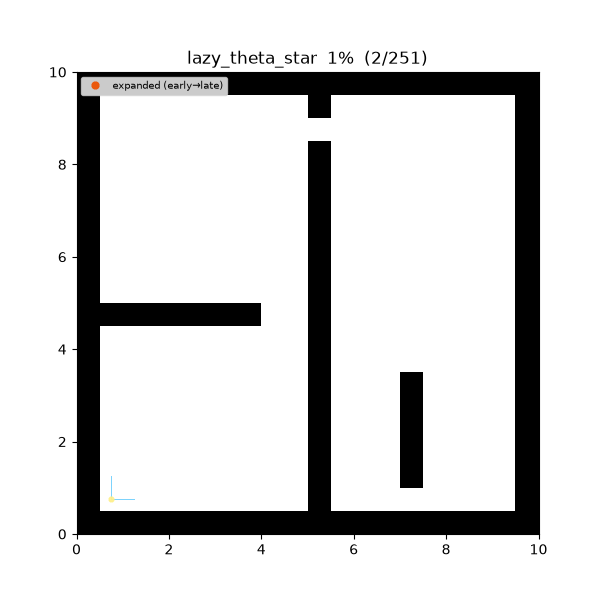
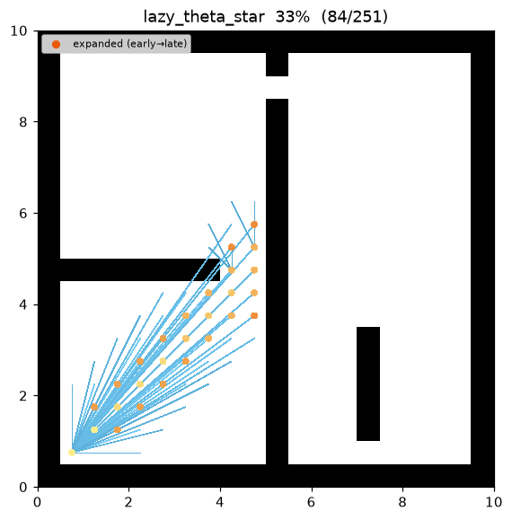
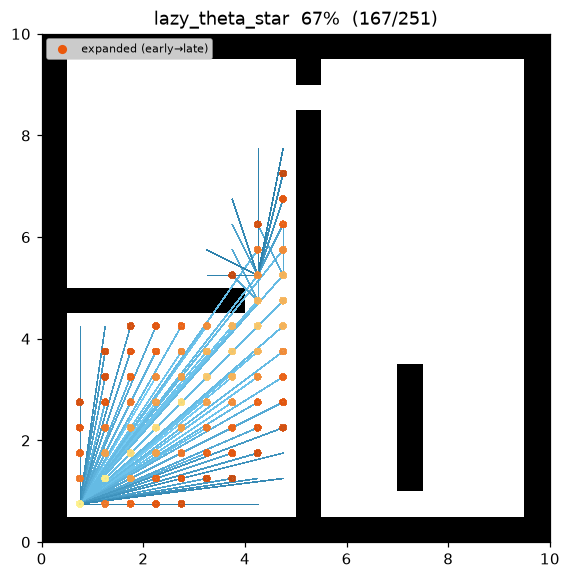
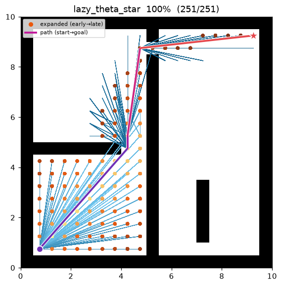
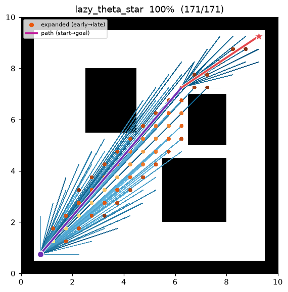

[🇰🇷 한국어](lazy_theta_star.md) | [🇬🇧 English](../../en/algorithms/lazy_theta_star.md)

# Lazy Theta* (지연 line-of-sight)
{: .no_toc }

| 항목 | 내용 |
|---|---|
| 분류 | any-angle graph search |
| 요구 capability | `LineOfSightSpace` (`neighbors` + `heuristic` + `line_of_sight`) |
| 완전성 | complete (유한 그래프, 비음수 비용) |
| 최적성 | any-angle 경로 — **grid-optimal 은 보장하지 않음** (Nash & Koenig 2010) |
| 복잡도 | A* 수준 + **확장 정점당** line-of-sight 검사 1회 (relaxation 당이 아님) |
| 원 논문 | Nash & Koenig (2010) [^nk10] · 원조 Theta\*: Nash et al. (2007) [^nash] · LOS: Amanatides & Woo (1987) [^aw] · weighted: Pohl (1970) [^pohl] |

1. TOC
{:toc}

## 배경

**Theta\***[^nash] 는 **매 relaxation 마다** 현재 노드의 부모가 후보 후속자를 볼 수 있는지
(`line_of_sight`)를 물어 grid 경로를 곧게 편다. 이 LOS 질의가 알고리즘에서 가장 비싼 부분인데,
Theta\* 는 간선마다 한 번씩 — 대부분 나중에 버려지는 간선까지 — 이 비용을 치른다.

**Lazy Theta\***[^nk10] 는 any-angle 규칙은 그대로 두고 검사 **시점**만 바꾼다. 후속자를 생성할 때
조부모가 보인다고(Path 2) **낙관적으로 가정**하여 `parent(s2) = parent(s)`,
`g(s2) = g(parent(s)) + euclid` 를 **검사 없이** 기록한다. 단 한 번의 LOS 질의는 `s2` 가 확장을 위해
pop 되는 순간(`SetVertex`)으로 미룬다: 그때서야 `line_of_sight(parent(s2), s2)` 를 확인하고, 낙관적
가정이 틀렸으면 부모를 이미 settle 된 가장 값싼 grid 이웃으로 **수리(repair)** 한다. 결과적으로
간선당이 아니라 **확장 정점당 LOS 검사 1회** — 같은 any-angle 경로를 훨씬 적은 검사로 얻는다.

이 저장소의 demo 에서 `maze01` 은 Lazy Theta\* **cost 27.76 · waypoint 5개** 로 수렴한다 — eager
Theta\*(27.75)와 사실상 같은 경로를 더 가벼운 검사 예산으로 만든다.

## 동작 원리

`maze01` 에서의 탐색. 파면은 Theta\* 와 똑같이 goal 쪽으로 자라지만, 최종 경로는 장애물 모서리만
스치는 **성근 직선 다각선**이다. 지연 검사가 낙관적 부모를 기각한 지점에서는 정점이 확장되기 전에
보이는 grid 이웃으로 재부모화된다.



탐색 중간 과정 (좌 → 우: 초반 / 중반 / 최종 경로):

| | | |
|:---:|:---:|:---:|
|  |  |  |

`open01` 최종 결과 — 장애물이 적으면 start→goal 가 거의 단일 직선으로 연결된다:



```
LAZY-THETASTAR(start, goal):
    g[start] ← 0; parent[start] ← start
    open ← priority queue keyed by f = g + w·h        # h = 유클리드 직선거리
    while open is not empty:
        s ← open.pop_min()
        if s already settled: continue                # lazy deletion
        SET-VERTEX(s)                                 # 지연 LOS 검사 + 수리
        settle(s)
        if s == goal: return reconstruct(parent, s)
        for (s2, _) in neighbors(s):
            if s2 not settled:
                UPDATE-VERTEX(s, s2)
    return failure

UPDATE-VERTEX(s, s2):                                 # 낙관적 — 여기서 LOS 검사 안 함
    p ← parent[s]
    cand ← g[p] + euclid(p, s2)                       # line_of_sight(p, s2) 가 성립한다고 가정
    if cand < g[s2]:
        g[s2] ← cand; parent[s2] ← p
        open.push(s2, cand + w·h(s2, goal))

SET-VERTEX(s):                                        # s 가 pop 될 때 1회 실행
    p ← parent[s]
    if p ≠ s and NOT line_of_sight(p, s):             # 낙관이 틀림 → 수리
        parent[s] ← argmin_{s' ∈ neighbors(s) ∩ settled} ( g[s'] + euclid(s', s) )
        g[s]      ← min   _{s' ∈ neighbors(s) ∩ settled} ( g[s'] + euclid(s', s) )
```

Theta\* 와의 유일한 차이는 `line_of_sight` 호출의 **위치**다: `UPDATE-VERTEX` 는 이를 빼고(낙관),
`SET-VERTEX` 는 pop 시점에 정확히 하나를 더한다. 낙관적 가정이 항상 성립하면 수리는 한 번도
발동하지 않고 반환 경로는 Theta\* 와 동일하다. 실패하면 수리가 **가시성이 보장된** grid 이웃으로
되돌린다(인접 셀 사이 Path 1 은 항상 합법적 이동이고, 정점의 생성자가 바로 그런 settle 된
이웃이다). 따라서 방출되는 경로는 언제나 실행 가능하다.

### 낙관이 안전한 이유 — settle 된 이웃으로의 수리

수리 후보를 **이미 settle 된** grid 이웃으로 제한하는 것은 의도된 설계다: 그들의 `g` 값은
확정이므로 `min(g[s'] + euclid(s', s))` 는 실재하는 달성 가능 비용이다. 정점은 어떤 확장된(즉
settle 된) 이웃이 생성했으므로 이 집합은 결코 비지 않는다 — 항상 최소 하나의 보이는 fallback 이
있고, `SET-VERTEX` 는 보이지 않는 부모를 남긴 채 정점을 settle 할 수 없다.

### Line of sight — grid 충돌 모델과 일치

`line_of_sight(a, b)` 는 두 셀 중심을 잇는 선분이 지나갈 수 있는지를 `neighbors()` 와 **동일한
corner-cut 금지 규칙**으로 판정한다. 이 저장소는 선분이 닿는 모든 셀을 방문하는 **supercover**[^aw]
(맵의 `is_motion_valid` 위임)를 쓰므로 "LOS 로 보이는 쌍" ⇔ "합법적 직선 이동" 이 되어, Lazy
Theta\* 와 grid A* 가 **하나의 충돌 모델**을 공유한다. 이는 Theta\* 에서 그대로 물려받았고, Lazy
Theta\* 는 그저 이를 덜 부를 뿐이다.

### Heuristic — 유클리드 (octile 아님)

Lazy Theta\* 의 g 값은 직선(유클리드) 거리이므로 heuristic 도 **유클리드**를 쓴다:

```
h(a, b) = √((Δrow)² + (Δcol)²)
```

맵이 A* 용으로 제공하는 octile heuristic 은 octile ≥ 유클리드 이므로 any-angle 비용에 대해
**inadmissible**(과대평가)이라 쓰지 않는다. 유클리드는 임의 각도 이동에 대한 admissible 하한이다.

측정치 (Python, w = 1.0, trace on · 같은 인스턴스의 eager Theta\* 비교):

| map | Lazy Theta\* cost | Theta\* cost | Lazy expanded | Theta\* expanded | Lazy waypoints |
|---|---|---|---|---|---|
| maze01 | 27.757 | 27.748 | 105 | 104 | 5 |
| open01 | **24.241** | 24.241 | **57** | 66 | 3 |

비용은 eager Theta\* 를 1% 미만으로 따라가면서, LOS 검사 예산은 relaxation 당에서 확장 정점당으로
줄어든다(`open01` 에서는 지연 방식이 오히려 더 적은 노드를 settle 한다).

재현:

```bash
python python/demos/demo_lazy_theta_star.py \
  --map maps/grid/maze01.yaml --scenario maps/scenarios/maze01_s1.yaml \
  --params configs/global_planning/lazy_theta_star.yaml --trace out/lazy_theta_star.jsonl
python tools/viz/replay.py out/lazy_theta_star.jsonl --gif out/lazy_theta_star.gif --snapshots out/lts_snaps/
```

## 성질

- **완전성**: 유한 grid + 비음수 비용에서 완전 (A* / Theta\* 와 동일).
- **최적성**: basic Theta\* 와 마찬가지로 Lazy Theta\* 도 **grid-optimal 도 true-optimal 도 보장하지
  않는다**[^nk10]. 부모 후보가 여전히 (가정된) 조부모 또는 국소 grid 이웃뿐이라, 진짜 최단
  any-angle 경로를 놓칠 수 있다(대신 매우 근접).
- **품질**: 반환 경로는 grid 경로를 any-angle 로 곧게 편 것으로 비용이 eager Theta\* 를 가깝게
  따라간다. 지연 검사는 *어떤* 지름길을 취하는지를 바꾸지 않고, 가시성을 확인하는 *시점*만 바꾼다.
- **복잡도**: A* 와 같은 탐색에 **확장 정점당** LOS 검사 1회 — Theta\* 의 relaxation 당 1회와 대비된다.
  LOS 검사가 지배적일 때(긴 선분, 밀집 grid) 실전 이득이 여기서 나온다.
- w > 1 (weighted, Pohl 1970[^pohl]): heuristic 을 부풀려 확장 노드를 줄이되 경로 품질을 완화 —
  weighted A*/Theta\* 와 동일.

## Lazy vs. Eager — 검사가 어디로 가는가

**기호.** 격자 셀 중심을 $\mathbb{R}^2$ 위의 점으로 본다. any-angle 경로 $P=(v_0,\dots,v_k)$ 는
LOS-clear 선분의 꺾은선이며 비용은 $\operatorname{cost}(P)=\sum_i\lVert v_{i+1}-v_i\rVert_2$,
$h(n)=\lVert n-\text{goal}\rVert_2$ 이다. $h$ 의 admissibility·consistency 와 "grid A* 이하" 논거는
[Theta\*](theta_star.md) 에서 그대로 이어지므로, 이 절은 *lazy* 방식이 바꾸는 것만 짚는다.

**보조정리 (settle 된 정점은 항상 보이는 부모로 끝난다).** `SET-VERTEX(s)` 가 반환할 때, 낙관적
$\text{parent}(s)=p$ 가 이미 LOS$(p,s)$ 를 만족했거나, 수리가 어떤 settle 된 grid 이웃 $s'$ 로
$\text{parent}(s)=s'$ 를 재배정했다.

*증명.* $s$ 를 pop 시키고 (현재 $g$ 로 relax 하여) 생성한 정점을 $u$ 라 하자. relaxation 은 확장
중인 정점에서만 일어나므로 $u$ 는 settle 되어 있고, $s$ 는 $\text{neighbors}(u)$ 에 열거되었으므로
$u\in\text{neighbors}(s)$(grid 인접은 대칭). 따라서 $\text{neighbors}(s)\cap\text{settled}\neq\varnothing$.
인접 셀은 항상 LOS 를 가지므로(Path 1 은 합법적 이동) $\arg\min$ 은 비지 않은 **보이는** 후보들
위에서 계산되어 보이는 부모를 배정한다. 낙관적 $p$ 가 이미 보였다면 분기를 건너뛰고 보이는 $p$ 가
유지된다. ∎

**따름정리 (feasibility).** settle 된 임의의 $s$ 의 부모 사슬을 start 까지 펼치면 정확히 $g[s]$
길이의 충돌 없는 꺾은선이 된다 — 보조정리에 의해 모든 링크 $\text{parent}(x)\to x$ 가 LOS-clear
이기 때문. 특히 반환된 $g[\text{goal}]$ 는 달성 가능한 상계다 — Lazy Theta\* 가 내놓는 경로는 항상
실행 가능하다. ∎

**검사 횟수.** Theta\* 는 **모든** relaxation $(s\to s_2)$ 마다 `line_of_sight` 를 평가하고, Lazy
Theta\* 는 `SET-VERTEX` 안에서 **settle 된 정점당 1회** 평가한다. 정점은 최대 한 번 settle 되지만
인접 간선마다 relax 되므로, LOS 검사 수는 탐색된 부분그래프에서 $\Theta(|E|)$ 에서 $\Theta(|V|)$ 로
줄어든다. 낙관은 이따금 약간 다른 (동등하게 feasible 한) 꺾은선으로 재부모화할 수 있어, 방출 경로가
eager Theta\* 와 *근접하지만* bit-identical 은 아닌 이유가 된다 — **검사를 줄이는 대가로 미세하게
다른 any-angle 경로**를 얻는 교환이다[^nk10].

## 파라미터

| 이름 | 타입 | 기본값 | 범위 | 설명 |
|---|---|---|---|---|
| `heuristic_weight` | float | 1.0 | [1.0, 5.0] | f = g + w·h 의 w (h 는 유클리드). 1.0 = 표준 Lazy Theta\*, 초과 = weighted |

## 방출 trace 이벤트

`planning_started` → (`node_expanded`, `candidate_evaluated`, `edge_added`)* → `path_found` → `planning_finished`

새 이벤트 타입을 도입하지 않는다. 낙관적 relaxation 은 Theta\* 와 똑같이 **비인접 조부모**를
`parent` 로 하는 `candidate_evaluated` + `edge_added` 를 방출한다(Path 2). `SET-VERTEX` 가 정점을
수리하면 그 정점을 `candidate_evaluated` + `edge_added(state=s, parent=s')`(여기서 `s'` 는 보이는
grid 이웃)로 **재방출**하므로, `replay.py` 가 수정된 직선 구간을 다시 그려 lazy-repair 가 애니메이션에
드러난다. 스키마는 `parent` 에 인접 제약을 두지 않는다.

## References

[^nk10]: Nash, A., Koenig, S., & Tovey, C. (2010). "Lazy Theta\*: Any-Angle Path Planning and Path Length Analysis in 3D." *Proc. AAAI Conference on Artificial Intelligence*, 147–154. [PDF](http://idm-lab.org/bib/abstracts/papers/aaai10b.pdf)
[^nash]: Nash, A., Daniel, K., Koenig, S., & Felner, A. (2007). "Theta\*: Any-Angle Path Planning on Grids." *Proc. AAAI Conference on Artificial Intelligence*, 1177–1183. [PDF](https://ojs.aaai.org/index.php/AAAI/article/view/11009)
[^aw]: Amanatides, J., & Woo, A. (1987). "A Fast Voxel Traversal Algorithm for Ray Tracing." *Proc. Eurographics*, 3–10. [PDF](https://www.cse.yorku.ca/~amana/research/grid.pdf)
[^pohl]: Pohl, I. (1970). "Heuristic search viewed as path finding in a graph." *Artificial Intelligence*, 1(3–4), 193–204. [doi:10.1016/0004-3702(70)90007-X](https://doi.org/10.1016/0004-3702%2870%2990007-X)
