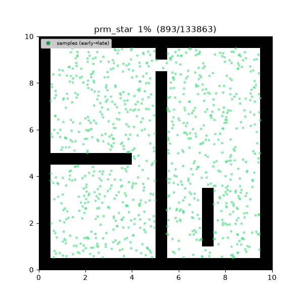
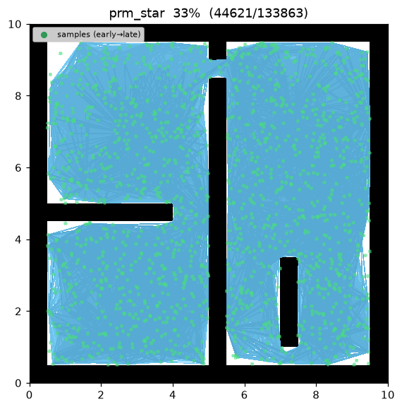
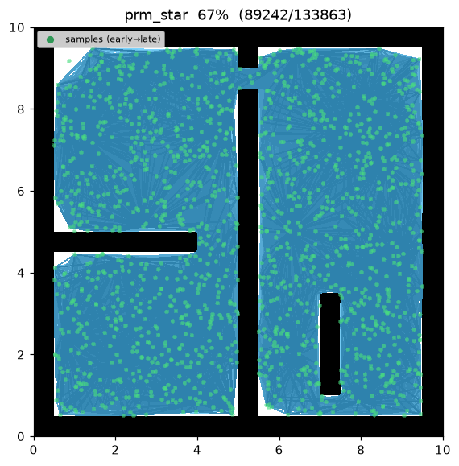
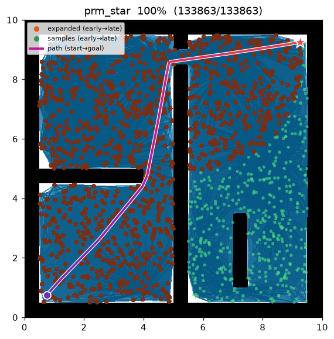
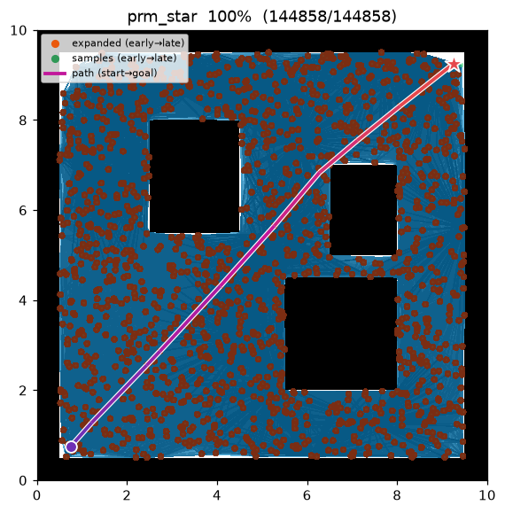

[🇰🇷 한국어](prm_star.md) | [🇬🇧 English](../../en/algorithms/prm_star.md)

# PRM\* (PRM-star)
{: .no_toc }

| 항목 | 내용 |
|---|---|
| 분류 | sampling-based, roadmap, asymptotically optimal |
| 요구 capability | `SamplingSpace` |
| 완전성 | probabilistically complete |
| 최적성 | **asymptotically optimal** — 표본 수 → ∞ 에서 최적 경로에 확률 1 로 수렴 |
| 복잡도 | 기대 이웃 수 Θ(log n) → 간선 수 near-linear, 반경 그래프 구성이 지배 |
| 원 논문 | Karaman & Frazzoli (2011) [^karaman] |

1. TOC
{:toc}

## 배경

[PRM](prm.md) 은 고정 반경을 써서 극한에서도 최적으로 수렴하지 않는다. Karaman & Frazzoli[^karaman]
는 로드맵의 연결 반경을 표본 수에 따라 **줄이는** 하나의 정책만 바꾸면 PRM 이 점근 최적이 됨을
보였다 — 이것이 PRM\* 다. 알고리즘 골격(표본화 → 반경 연결 → Dijkstra 질의)은 PRM 과 완전히 같고,
차이는 반경 하나뿐이다.

핵심 아이디어: 반경을

$$
r_n=\gamma\left(\frac{\log n}{n}\right)^{1/d},\qquad d=2
$$

로 두면 각 노드의 **기대 이웃 수가 $\Theta(\log n)$** 로 유지된다. 이 밀도가 극한에서 최적 경로를
복원하기에 딱 충분하면서도 간선 수를 near-linear 로 억제한다. 고정 반경은 (너무 크면) $O(n^2)$
간선을 만들거나 (너무 작으면) 연결성이 끊겨 최적성을 잃는다.

## 동작 원리

`maze01` — 표본이 흩뿌려지고, 줄어든 반경으로 각 노드가 기대상 로그 개의 이웃과 이어져 로드맵이
형성된 뒤 Dijkstra 가 최단 경로를 뽑는다.



탐색 중간 과정 (좌 → 우: 표본/간선 초반 / 로드맵 형성 / 최종 경로):

| | | |
|:---:|:---:|:---:|
|  |  |  |

`open01` 최종 결과 — 거의 직선에 가깝다:



```
PRM_STAR(start, goal):
    R ← roadmap()
    R.add(start); R.add(goal)
    for i in 1..num_samples:                       # 학습: 자유 노드 표본화
        q ← sample()
        if is_state_valid(q): R.add(q)
    r ← gamma · sqrt(log n / n)                     # 표본 수에 따라 줄어드는 반경 (d = 2)
    for v in R.nodes:                               # 학습: r 이내 연결
        for u in R.nodes within r of v (u before v):
            if is_motion_valid(u, v):
                R.add_edge(u, v, distance(u, v))
    return DIJKSTRA(R, start, goal)                 # 질의
```

반경은 최종 노드 수 $n$ 이 정해진 뒤 **한 번** 계산해 모든 노드에 같은 값을 쓴다. 이것이
PRM 과의 유일한 코드 차이다.

측정치 (Python, seed = 1, trace on):

| map | path cost | roadmap 노드 | expanded (Dijkstra pop) |
|---|---|---|---|
| maze01 | 13.595 | 1,502 | 1,092 |
| open01 | 12.053 | — | — |

C++ 구현도 동일 시나리오를 미러링하며, 언어 간 난수 스트림 차이 범위 안에서 같은 결과를 낸다.

재현:

```bash
python python/demos/demo_prm_star.py \
  --map maps/grid/maze01.yaml --scenario maps/scenarios/maze01_s1.yaml \
  --params configs/global_planning/prm_star.yaml --trace out/prm_star.jsonl
python tools/viz/replay.py out/prm_star.jsonl --gif out/prm_star.gif
```

## 성질

- **완전성**: probabilistically complete[^karaman].
- **최적성**: **asymptotically optimal.** 줄어드는 반경이 기대 이웃 수를 $\Theta(\log n)$ 로 유지해
  극한에서 최적 비용 $c^*$ 로 확률 1 수렴한다[^karaman].
- **비용**: 기대 이웃 수가 로그로 억제되므로 간선 수가 PRM 의 고정 반경 대비 near-linear 다.
  같은 표본 수에서 PRM 과 유사한 해를 내되, 최적성 보장이 붙는다.

## 점근적 최적성 근거

**연결 반경.** $n$ 개 표본에 대해

$$
r_n=\gamma_{\mathrm{PRM}^*}\left(\frac{\log n}{n}\right)^{1/d},\qquad
\gamma_{\mathrm{PRM}^*}>2\left(1+\frac1d\right)^{1/d}\left(\frac{\mu(X_{\text{free}})}{\zeta_d}\right)^{1/d}
$$

($d$: 공간 차원, 여기서 $d=2$; $\mu(X_{\text{free}})$: 자유 공간 부피; $\zeta_d$: 단위 $d$-볼 부피).

**정리 (점근적 최적성, Karaman & Frazzoli 2011).** 위 반경 하에서 로드맵의 최단 경로 비용 $Y_n$ 은

$$
P\!\left[\lim_{n\to\infty}Y_n=c^*\right]=1.
$$

*직관.* 반경을 $(\log n/n)^{1/d}$ 로 줄이되 계수 $\gamma$ 를 임계값 위로 두면 각 노드가 기대상
$\Theta(\log n)$ 개 이웃을 가진다 — 최적 경로와 같은 homotopy 류의 경로를 극한에서 복원하기에
충분한 연결성이다. 반경이 이보다 빨리 줄면 그래프가 끊겨 최적성이 깨지고, 상수로 두면 간선이
$O(n^2)$ 로 폭증한다. $r_n$ 은 이 둘 사이의 최소 밀도다.

**간선 수 도출.** 표본 밀도 $n/\mu(X_{\text{free}})$ 에서 반경 $r$ 공 안의 기대 이웃 수는
$\approx\zeta_d\,r^d\,n/\mu(X_{\text{free}})$. $r=r_n=\gamma(\log n/n)^{1/d}$ 를 대입하면

$$
\mathbb{E}[\deg]\;\approx\;\frac{\gamma^d\zeta_d}{\mu(X_{\text{free}})}\,\log n\;=\;\Theta(\log n),
\qquad |E|=\Theta(n\log n).
$$

상수 반경이면 $\mathbb{E}[\deg]=\Theta(n)$·$|E|=\Theta(n^2)$ 로 폭증하고(그게 [PRM](prm.md)), 반대로
이웃 수를 $k=O(1)$ 로 고정하면 random geometric graph 연결 임계 $\Theta(\log n)$ 미만이라 그래프가
조각나 최적성이 깨진다. $r_n$ 은 연결성을 지키는 **최소 밀도**를 정확히 집는다.

## 파라미터

| 이름 | 타입 | 기본값 | 범위 | 설명 |
|---|---|---|---|---|
| `num_samples` | int | 1500 | [1, 200000] | 로드맵에 배치할 충돌 없는 샘플 수 (start/goal 제외) |
| `gamma` | float | 30.0 | [0.01, 1000.0] | 연결 반경 계수 γ. r_n = γ·(log n / n)^(1/2) |
| `seed` | int | 1 | [0, 2^31−1] | 난수 시드 (재현성) |

## 방출 trace 이벤트

`planning_started` → `sample_drawn`\* → `edge_added`\* → `node_expanded`\* → `path_found` → `planning_finished`

이벤트 목록은 [PRM](prm.md) 과 동일하다 — 차이는 `edge_added` 를 부르는 반경 정책뿐이다.

## References

[^kavraki]: Kavraki, L. E., Švestka, P., Latombe, J.-C., & Overmars, M. H. (1996). "Probabilistic roadmaps for path planning in high-dimensional configuration spaces." *IEEE Transactions on Robotics and Automation*, 12(4), 566–580. [doi:10.1109/70.508439](https://doi.org/10.1109/70.508439)
[^karaman]: Karaman, S., & Frazzoli, E. (2011). "Sampling-based algorithms for optimal motion planning." *The International Journal of Robotics Research*, 30(7), 846–894. [doi:10.1177/0278364911406761](https://doi.org/10.1177/0278364911406761) · [PDF (arXiv)](https://arxiv.org/abs/1105.1186)
