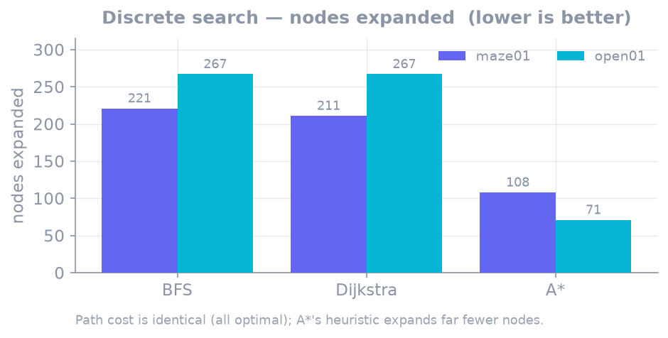
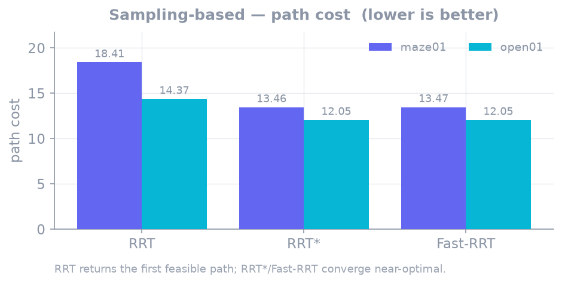
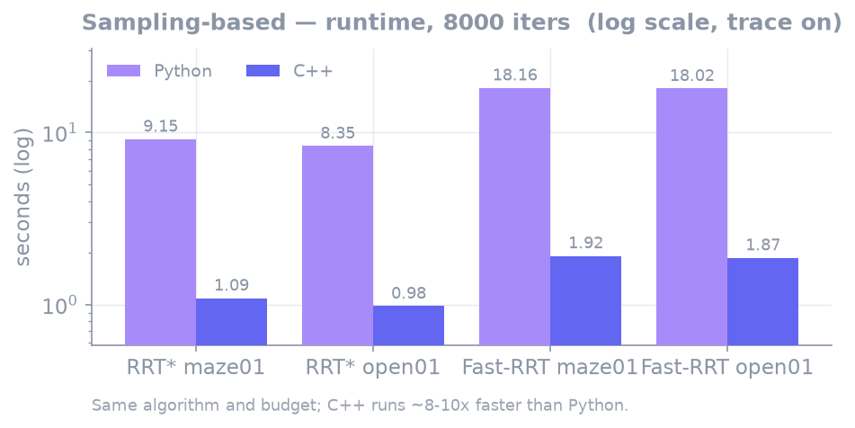

# 벤치마크

`tools/bench/run_matrix.py` 가 (scenario × algorithm) 조합을 각 언어 demo subprocess 로 실행해
성공 여부·path cost·expanded/samples·runtime 을 수집하고 리포트를 쓴다.

```bash
python tools/bench/run_matrix.py --out out/report.md
```

환경: Apple Silicon macOS, Python 3 / C++20 Release. seed = 1, 파라미터는
`configs/global_planning/` 기본값. 맵은 `maze01`(좁은 통로 미로)·`open01`(열린 필드).

{: .note }
> runtime 은 **trace 방출을 켠 채**(demo 모드) 측정했다. 이벤트가 수십만 건인 sampling 계열은
> trace I/O 비중이 크므로 절대값이 아니라 **알고리즘·언어 간 상대 비교**로 읽는다.

## 그룹별 비교

같은 카테고리라도 비교 축이 다르다. **discrete 탐색**(BFS·Dijkstra·A\*)은 grid 를 최적 탐색하므로
경로 비용이 모두 같고 관건은 **얼마나 적게 확장하느냐**다. **sampling**(RRT·RRT\*·Fast-RRT)은 연속
공간을 확률적으로 탐색하므로 관건은 **경로 품질(cost)과 수렴 속도**다. 그래서 그룹별로 다른 metric 으로
비교한다. (Local planning·Multi-agent 는 예정 — 구현 시 이 페이지에 그룹이 추가된다.)

### Discrete search — BFS vs Dijkstra vs A\*

세 알고리즘 모두 **동일한 최적 경로**를 낸다 (maze01 28.728, open01 25.213). 차이는 목표를 찾기까지
확장한 노드 수다.



| algorithm | maze01 expanded | open01 expanded | path cost | Python / C++ runtime |
|---|---:|---:|---|---|
| BFS | 221 | 267 | 최적 (동일) | 1.7 / 1.0 ms |
| Dijkstra | 211 | 267 | 최적 (동일) | 2.4 / 1.0 ms |
| **A\*** | **108** | **71** | 최적 (동일) | 1.7 / 0.8 ms |

- **A\*** 의 heuristic 효과가 뚜렷하다 — Dijkstra 대비 확장 노드가 maze01 절반(108 vs 211),
  open01 1/4 미만(71 vs 267)이다. 같은 최적해를 훨씬 적은 탐색으로 찾는다.
- BFS 와 Dijkstra 는 heuristic 이 없어 파면을 균등하게 넓히므로 확장량이 비슷하다. (BFS 경로가 최적과
  같은 건 이 맵 구조에서의 우연 — [BFS](algorithms/bfs.md) 참고.)

### Sampling-based — RRT vs RRT\* vs Fast-RRT

RRT 는 첫 feasible 해에서 멈추고, RRT\*/Fast-RRT 는 8,000 반복 예산을 소진하며 경로를 개선한다.
관건은 최종 **경로 비용**과 형태다.



| algorithm | maze01 cost | open01 cost | 예산 | maze01 waypoints |
|---|---:|---:|---|---:|
| RRT | 18.41 | 14.37 | first solution | 39 |
| RRT\* | **13.46** | **12.05** | 8,000 iters | 18 |
| Fast-RRT | 13.47 | 12.05 | 8,000 iters | **5** |

- **RRT** 는 수백 샘플·수 ms 로 가장 빠르지만 경로가 [RRT\*](algorithms/rrt_star.md) 대비 19–37% 길다
  (feasible-but-suboptimal).
- **RRT\*** 와 **Fast-RRT** 는 near-optimal 로 수렴해 비용이 사실상 동일하다. 차이는 경로 형태 —
  Fast-RRT 의 shortcut 이 waypoint 를 1/3 이하로 줄여, 후처리 없이 추종하기 좋은 경로를 만든다.

### 언어 성능 — C++ vs Python

같은 알고리즘·예산에서 결과 품질은 동등한데(난수 스트림 차이로 sampling 비용은 0.1–0.6% 차이) 속도는
C++ 이 **8–10× 빠르다**. discrete 계열은 결정적이라 두 언어 결과가 완전히 일치한다.



## 전체 매트릭스 (raw)

### maze01

| algorithm | path cost | expanded / samples | Python runtime | C++ runtime |
|---|---|---|---|---|
| BFS | 28.728 | 221 expanded | 1.7 ms | 1.0 ms |
| Dijkstra | 28.728 | 211 expanded | 2.4 ms | 1.0 ms |
| A\* | 28.728 | 108 expanded | 1.7 ms | 0.8 ms |
| RRT | 18.414 (py) / 16.888 (cpp) | 229 / 246 samples | 3.4 ms | 0.4 ms |
| RRT\* | 13.458 / 13.471 | 8,000 samples | 9.15 s | 1.09 s |
| Fast-RRT | 13.467 / 13.544 | 8,000 samples | 18.16 s | 1.92 s |

### open01

| algorithm | path cost | expanded / samples | Python runtime | C++ runtime |
|---|---|---|---|---|
| BFS | 25.213 | 267 expanded | 2.0 ms | 0.4 ms |
| Dijkstra | 25.213 | 267 expanded | 2.9 ms | 0.6 ms |
| A\* | 25.213 | 71 expanded | 1.3 ms | 0.3 ms |
| RRT | 14.371 / 13.920 | 177 / 229 samples | 2.6 ms | 0.4 ms |
| RRT\* | 12.047 / 12.048 | 8,000 samples | 8.35 s | 0.98 s |
| Fast-RRT | 12.048 / 12.049 | 8,000 samples | 18.02 s | 1.87 s |

## 매트릭스 러너 동작

- `maps/scenarios/` 의 모든 yaml × 알고리즘 조합을 실행한다. 새 맵/시나리오를 추가하면 자동 포함된다.
- planner 의 `required_capabilities()` 와 맵 capability 를 대조해 **비호환 조합은 에러가 아니라
  "incompatible"** 로 기록한다 (예: `GraphMap` × RRT).
- 각 언어 demo CLI 를 subprocess 로 호출하고 stdout 의 한 줄 JSON metric 을 공용 포맷으로 수집하므로,
  언어가 늘어도 러너는 그대로다.
